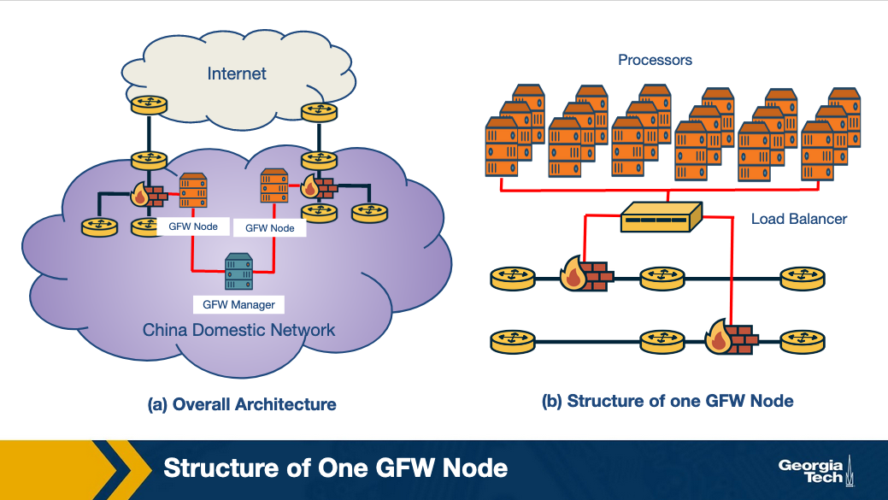
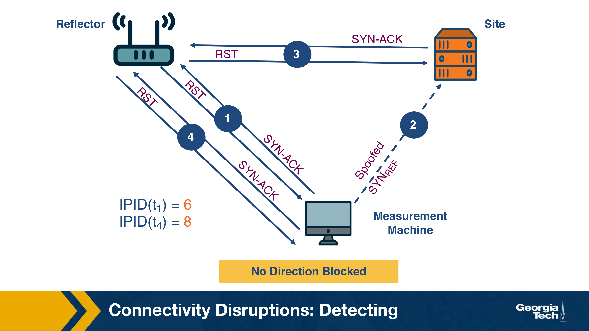
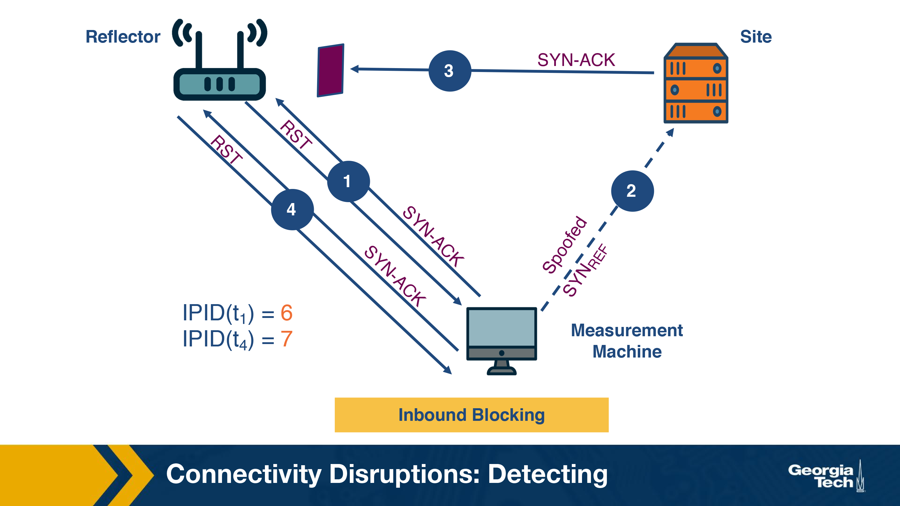
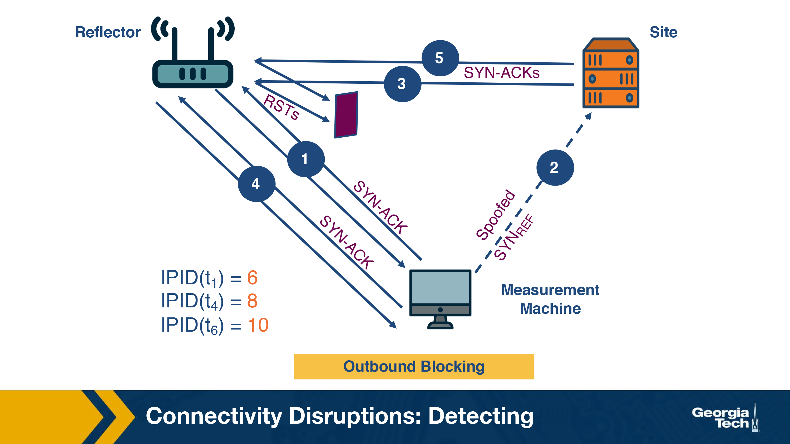

# Internet Surveillance and Censorship

3 main types of censorship: 
- internet connectivity
- DNS censorship
- social media based censorship

# DNS Censorship

### What is DNS Censorship?

DNS censorship is a method of control on the infrastructure and traffic 
on large scale networks.
The network admin can suppress material they find objectionable.

**Example:** China. They use a Firewall, coined "The Great Firewall" (GFW).
Which censors the Chinese internet and blocks access to various foreign 
websites.



The GFW is shown above.

Works by injecting fake DNS record responses so that access to a domain name 
is blocked. GFW is **an opaque system**, several different studies have been 
performed to deduce the nature of the systems and functionality.

Researchers have attempted to reverse engineer the GFW. They have identified 
various properties:

1. Locality of GFW Nodes: There are two differing notions on whether the 
GFW nodes are present only at the edge ISPs or whether they are also in
non bordering Chinese ASes.
  - Majority of Researchers think that the nodes are at the edge.

2. Centralized Management: High probability since blocklists are from 
two distinct GFW locations

3. Load Balancing: GFW load balances between processes based on source and 
destination IP addresses. The processes are clustered together to collectively
send injected DNS responses.

### Organizations that track the GFW

There are multiple organizations that monitor Chinese censorship for censored domains on a continuous basis, some of which are listed below: 

    greatfire.org (since 2011)
    hikinggfw.org (since 2012)

# Example DNS Censorship Techniques

Researchers have identified (using active probing techniques and measurements) 
that one main censorship technique the GFW uses is based on DNS injection.

### How does DNS Injection Work?

DNS injection is one of the most common censorship techniques employed by GFW.

The GFW uses a rule set to determine when to inject DNS replies to censor 
network traffic.

Researchers must identify and isolate the network that use DNS 
injection for censorship.

When tested against probes for restricted and benign domains, the accuracy of 
DNS open resolvers to accurately pollute the response is 99.9% The steps are:

1. DNS probe is sent to the open DNS resolvers
2. The probe is checked against the blocklist of domains and keywords
3. Domain level blocking: A fake DNS A record response is sent back. There are
two levels of domain blocking: 
  A. Directly blocking the domain
  B. Blocking it based on keywords present in the domain

### What are the Different DNS Censorship Techniques?

#### Packet Dropping

All network traffic going to a set of specific IP addresses is discarded. The 
censor identifies undesirable traffic and chooses to not properly forward
any packets it sees associated with the traversing undesirable traffic instead 
of following a normal routing protocol.

##### Strengths
- Easy to implement
- Low cost

##### Weaknesses
- Maintenance of blocklist 
  - It is challenging to stay up to date with the list of IP addresses to block 
- Overblocking
  - If two websites share the same IP address and the intention is to block site A
  site B will also be blocked

#### DNS Poisoning

When a DNS receives a query for resolving the hostname to an IP address.

If there is no answer returned or an incorrect answer is sent to redirected
or mislead the user request, this is called DNS poisoning

##### Strength

No Overblocking
  - There is an extra layer of hostname translation, access to specific hostnames 
  can be blocked whereas blanket IP address blocking cannot differentiate 
  two hostnames from the same IP address.

##### Weakness 

Blocks the entire domain
  - It is not possible to allow email contact while blocking the website

#### Content Inspection

AKA: Proxy based content inspection.

This censorship is more sophisticated in that it allows for all network traffic to 
pass through a proxy where the traffic is examined for content, the proxy rejects 
that serve objectionable content.

##### Strengths

- Precise Censorship
  - Very precise level of censorship
  - Granular control down to the level of a single web page and or DOM object 
  on the webpage.
- Flexible
  - works well with hybrid security systems
  - EX: with a combination of other censorship techniques like packet dropping 
  and DNS poisoning.

##### Weakness 
- Not scalable
  - Expensive to implement on large scale networks 
  - huge processing overhead (all traffic needs to pass and be examined in 
  a proxy)

- Intrusion Detection System (IDS) based content inspection
  - Alternative approach to use parts of an IDS to inspect network traffic.
  - IDS is easier and ore cost effective to implement than a proxy based system
  as it is more responsive than reactive in nature in that it informs the 
  firewall rules for future censorship

#### Blocking with Resets

GFW employs this where is sends a TCP request (RST) to block individual 
connections that contain requests with objectionable content.

We can see this packet capturing of requests. There are normal requests that 
contain potentially flaggable keywords. 

##### [Example] 

**Request 1: Request benign Web Page**

Here we see a packet trace from a client in Cambridge to a Chinese based 
website.
```
cam(53382)  → china(http) [SYN] 
china(http) → cam(53382) [SYN, ACK] 
cam(53382)  → china(http) [ACK] 
cam(53382)  → china(http) GET / HTTP/1.0 
china(http) → cam(53382) HTTP/1.1 200 OK (text/html) etc...
china(http) → cam(53382) ...more of the web page 
cam(53382)  → china(http) [ACK]
```
The website was served successfully.

**Request 2: Requesting with potentially flaggable text within the 
HTTP GET request**

Packet trace with flagged text: 
```
cam(54190)  → china(http) [SYN] 
china(http) → cam(54190) [SYN, ACK] TTL=39 
cam(54190)  → china(http) [ACK] 
cam(54190)  → china(http) GET /?falun HTTP/1.0 
china(http) → cam(54190) [RST] TTL=47, seq=1, ack=1
china(http) → cam(54190) [RST] TTL=47, seq=1461, ack=1 
china(http) → cam(54190) [RST] TTL=47, seq=4381, ack=1 
china(http) → cam(54190) HTTP/1.1 200 OK (text/html) etc...
cam(54190)  → china(http) [RST] TTL=64, seq=25, ack zeroed 
china(http) → cam(54190) ...more of the web page 
cam(54190)  → china(http) [RST] TTL=64, seq=25, ack zeroed 
china(http) → cam(54190) [RST] TTL=47, seq=2921, ack=25
```
After client (`cam54190`) sends the request containing flaggable keywords, 
it receives 3 TCP RSTs corresponding to the one request. Possible to ensure 
that the sender receives a reset. The RST Packets received correspond to the 
sequence number of `1460` sent in the GET Request.

#### Immediate Reset Connections

Censorship systems like GFW have blocking rules, in addition to inspecting 
content to suspend traffic coming from a source immediately for a short 
period of time.

After sending a request with flaggable keywords we see a series of packet trace:
```
cam(54191)  → china(http) [SYN]
china(http) → cam(54191) [SYN, ACK] TTL=41
cam(54191)  → china(http) [ACK]
china(http) → cam(54191) [RST] TTL=49, seq=1
```
Reset packet received by client is from the firewall. It does not matter 
that the client sends out legit GET requests following one "questionable" 
request. It will continue to receive RST resets from the firewall for a 
particular duration.

Running different experiments have suggested that this is blocking period 
is variable for the "questionable" content/request

# Quiz 1 

### Question 1
The Great Firewall of China injects fake DNS A records to block 
individual connections. 

- True
- False
### Answer
- False

### Question 2
The Great Firewall of China is likely managed by a single entity. 

- True
- False
### Answer 
- True

### Question 3 
The Great Firewall of China may block content based on which of 
the following characteristics?

- Keywords within the URL
- Images on webpage
- Destination IP
- All of the above
### Answer
- All of the above

### Question 4
Packet dropping is a scheme used to censor content. Which of 
the following statements characterize packet dropping? \
Select all that apply. 

- Low cost to implement.
- Scales easily.
- Might block content otherwise deemed appropriate.
- Able to block a part of a webpage.
### Answer
- Low cost to implement.
- Might block content otherwise deemed appropriate.

### Question 5
The GFW can block a portion of a website using DNS poisoning. 

- True
- False

### Answer
- False

### Question 6
Suppose a client in Cambridge makes a request to a website based 
in China. When does the GFW reset the connection? 

- After the first SYN sent by the client in Cambridge
- After the SYN, ACK sent by the Chinese host
- After the ACK sent by the client in Cambridge
- It depends on the connection
### Answer
- After the ACK sent by the client in Cambridge

# Why is DNS Manipulation Difficult to Measure?

Anecdotal evidence suggests that more than 60 countries are currently impacted by control of access to information through the Internet’s Domain Name System (DNS) manipulation. However, our understanding of censorship around the world is relatively limited.

## Challenges?

### Diverse Measurements

Such understanding would need a diverse set of measurements spanning different geographic regions, ISPs, countries, and regions within a single country. Since political dynamics can vary so different ISPs can use various filtering techniques and different organizations may implement censorship at multiple layers of the Internet protocol stack and using different techniques. For example, an ISP may be blocking traffic based on IP address, but another ISP may be blocking individual web requests based on keywords. 

Therefore, we need widespread longitudinal measurements to understand global Internet manipulation and the heterogeneity of DNS manipulation, across countries, resolvers, and domains.

### Need for Scale

At first, the methods to measure Internet censorship were relying on volunteers who were running measurement software on their own devices. Since this requires them to actually install software and do measurements, we can see that this method is unlikely to reach the scale required. There is a need for methods and tools that are independent of human intervention and participation.

### Identifying the Intent to Restrict Content Access

While identifying inconsistent or anomalous DNS responses can help to detect a variety of underlying causes such as misconfigurations, identifying DNS manipulation is different and it requires that we detect the intent to block access to content. It poses its own challenges.

So we need to rely on identifying multiple indications to infer DNS manipulation.

### Ethics and Minimizing Risks

Obviously, there are risks associated with involving citizens in censorship measurement studies, based on how different countries maybe penalizing access to censored material. Therefore, it is safer to stay away from using DNS resolvers or DNS forwarders in the home networks of individual users. Instead, it is safer to rely on open DNS resolvers that are hosted in Internet infrastructure, for example, within Internet service providers or cloud hosting providers.

# Example Censorship Detection Systems and Their Limitations

Global censorship measurement tools were created by efforts to measure
censorship by running experiments from diverse vantage points. For example,
CensMon used PlanetLab nodes in different countries. However, many such methods
are no longer in use. One the most common systems/approaches is the OpenNet
Initiative where volunteers perform measurements on their home networks at
different times since the past decade. Relying on volunteer efforts make
continuous and diverse measurements very difficult.

In addition, Augur is a new system created to perform longitudinal global
measurements using TCP/IP side channels (more on Augur soon). However, this
system focuses on identifying IP-based disruptions as opposed to DNS-based
manipulations.

# Quiz 2 

### Question 1
Consider the variance of censorship methods used. Select the statement which correctly describes the situation. 
- Censorship methods are consistent across ISPs making it easy 
to measure DNS manipulation.
- Censorship methods are inconsistent across ISPs making 
it easy to measure DNS manipulation.
- Censorship methods are consistent across ISPs making 
it difficult to measure DNS manipulation.
- Censorship methods are inconsistent across ISPs making 
wit difficult to measure DNS manipulation.

### Answer 
- Censorship methods are inconsistent across ISPs making 
wit difficult to measure DNS manipulation.

### Question 2
Current research methods for understanding DNS methods are scalable due to the number of volunteers participating. 

True
False

### Answer 
False

### Question 3
The use of Open DNS resolvers resolves some of the ethical concerns associated with Internet censorship studies. 

True
False

### Answer
True

# DNS Censorship: A Global Measurement Methodology

In this section, we explore a method to identify DNS manipulation with a system called Iris. The figure below shows an overview of the identification process.

[Overview of DNS resolution, annotation, filtering, and classification](./ImagesLesson10/2.png)

In previous sections, we discussed how the lack of diversity is an issue while studying DNS manipulation. In order to counter that, Iris uses open DNS resolvers located all over the globe. In order to avoid using home routers (which are usually open due to configuration issues), this dataset is then restricted to a few thousand that are part of the Internet infrastructure. There are two main steps associated with this process:

1. Scanning the Internet’s IPv4 space for open DNS resolvers
2. Identifying Infrastructure DNS resolvers

Now that we’ve obtained a global set of open DNS resolvers, we need to perform the measurements. The figure above shows the overall measurement process. The steps involved in this measurement process are:

1. Performing global DNS queries – Iris queries thousands of domains across thousands of open DNS resolvers. To establish a baseline for comparison, the creators included 3 DNS domains that were under their control to help calculate metrics used for evaluation DNS manipulation.
2. Annotating DNS responses with auxiliary information – To enable the classification, Iris annotates the IP addresses with additional information such as their geo-location, AS, port 80 HTTP responses, etc. This information is available from the Censys dataset.
3. Additional PTR and TLS scanning – One IP address could host several websites via virtual hosting. So, when Censys retrieves certificates from port 443, it could differ from one retrieved via TLS’s Server Name Indication (SNI) extension. This results in discrepancies that could cause Iris to label virtual hosting as DNS inconsistencies. To avoid this, Iris adds PTR and SNI certificates.

After annotating the dataset, techniques are performed to clean the dataset and identify whether DNS manipulation is taking place or not. Iris uses two types of metrics to identify this manipulation:

### 1. Consistency Metrics 

Domain access should have some consistency, in terms of network properties, infrastructure, or content, even when accessed from different global vantage points. Using one of the domains Iris controls gives a set of high-confidence consistency baselines. Some consistency metrics used are IP address, Autonomous System, HTTP Content, HTTPS Certificate, PTRs for CDN.

### 2. Independent Verifiability metrics

In addition to the consistency metrics, they also use metrics that could be externally verified using external data sources. Some of the independent verifiability metrics used are HTTPS certificate (whether the IP address presents a valid, browser-trusted certificate for the correct domain name when queried without SNI) and HTTPS Certificate with SNI.  

If any consistency metric or independent verifiability metric is satisfied, the response is correct. Otherwise, the response is classified as manipulated.

# Quiz 3 

### Question 1 
Iris uses _______________ obtain a dataset for machine learning. 

Open DNS Resolvers
Volunteer networks
Misconfigured home routers
All of the above

### Answer 
Open DNS Resolvers


### Question 2 
Suppose Iris is being used to detect DNS manipulation. Iris queries a global resolver for an IP addresses (consistency metric) and receives a DNS A record with a different IP address than the ones stored. Which of the follow statements are true? 

The response is inconsistent, and therefore will be classified as manipulated.
The response is inconsistent, but might not be classified as manipulated.
The response is consistent, and therefore will be classified as correct.
The response is consistent, but might still be classified as manipulated.

### Answer
The response is inconsistent, but might not be classified as manipulated.

# Censorship Through Connectivity disruptions

In this topic we are talking about a different class of approach to censorship that is based on connectivity disruptions. 

The highest level of Internet censorship is to completely block access to the Internet. Intuitively, this can be done by manually disconnecting the hardware that are critical to connect to the Internet. Although this seems simple, it may not be feasible as the infrastructure could be distributed over a wide area. 

A more subtle approach is to use software to interrupt the routing or packet forwarding mechanisms. Let’s look at how these mechanisms would work: 

### 1. Routing disruption
A routing mechanism decides which part of the network can be reachable. Routers use BGP to communicate updates to other routers in the network. The routers share which destinations it can reach and continuously update its forwarding tables to select the best path for an incoming packet. If this communication is disrupted or disabled on critical routers, it could result in unreachability of the large parts of a network. Using this approach can be easily detectable, as it involves withdrawing previously advertised prefixes or re-advertising them with different properties and therefore modifying the global routing state of the network, which is the control plane. 

### 2. Packet filtering
Typically, packet filtering is used as a security mechanism in firewalls and switches. But to disrupt a network’s connectivity, packet filtering can be used to block packets matching a certain criteria disrupting the normal forwarding action. This approach can be harder to detect and might require active probing of the forwarding path or monitoring traffic of the impacted network.

Connectivity disruption can include multiple layers apart from the two methods described above. It can include DNS-based blocking, deep packet inspection by an ISP or the client software blocking the traffic, to list a few.

# Connectivity Disruptions: Detection

As we saw in a previous section, obtaining a view of global censorship can be challenging due to a variety of reasons. In this section, we focus on a system, Augur, which uses a measurement machine to detect filtering between hosts. 

The system aims to detect if filtering exists between two hosts, a reflector and a site. A reflector is a host which maintains a global IP ID. A site is a host that may be potentially blocked. To identify if filtering exists, it makes use of a third machine called the measurement machine. 

### IP ID

The strategy used by Augur takes advantage of the fact that any packet that is sent by a host is assigned a unique 16-bit IP identifier (“IP ID”), which the destination host can use to reassemble a fragmented packet. This IP ID should be different for the packets that are generated by the same host. Although there are multiple methods available to determine the IP ID of a packet (randomly, per-connection counter, etc.), maintaining a single global counter is the most commonly used approach. The global counter is incremented for each packet that is generated and helps in keeping track of the total number of packets generated by that host. Using this counter, we can determine if and how many packets are generated by a host. 

In addition to the IP ID counter, the approach also leverages the fact that when an unexpected TCP packet is sent to a host, it sends back a RST (TCP Reset) packet. It also assumes there is no complex factors involved such as cross-traffic or packet loss.  Let’s look at two important mechanisms used by the approach: 

### Probing

Probing is a mechanism to monitor the IP ID of a host over time. We use the measurement machine to observe the IP ID generated by the reflector. To do so, the measurement machine sends a TCP SYN-ACK to the reflector and receives a TCP RST packet as the response. The RST packet received would contain the latest IP ID that was generated by the reflector. Thus, the measurement machine can track the IP ID counter of the reflector at any given point. 

### Perturbation

This is a mechanism which forces a host to increment its IP ID counter by sending traffic from different sources such that the host generates a response packet. The flow here is as follows: 

1. The measurement machine sends a spoofed TCP SYN packet to the site with source address set to the reflector’s IP address. 
2. The site responds to the reflector with a TCP SYN-ACK packet. 
3. The reflector returns a TCP RST packet to the site while also incrementing its global IP ID counter by 1. 

Now that we know how to probe and perturb the IP ID values at a host, let’s analyze the different possible scenarios. Let the initial IP ID counter of the reflector be 5.

### Now Filtering



The sequence of events is as follows:

1. The measurement machine probes the IP ID of the reflector by sending a TCP SYN-ACK packet. It receives a RST response packet with IP ID set to 6 (IP ID (t1)). 
2. Now, the measurement machine performs perturbation by sending a spoofed TCP SYN to the site. 
3. The site sends a TCP SYN-ACK packet to the reflector and receives a RST packet as a response. The IP ID of the reflector is now incremented to 7. 
4. The measurement machine again probes the IP ID of the reflector and receives a response with the IP ID value set to 8 (IP ID (t4)). 

The measurement machine thus observes that the difference in IP IDs between steps 1 and 4 is two and infers that communication has occurred between the two hosts.

### Inbound Blocking

The scenario where filtering occurs on the path from the site to the reflector is termed as inbound blocking. In this case, the SYN-ACK packet sent from the site in step 3 does not reach the reflector. Hence, there is no response generated and the IP ID of the reflector does not increase. The returned IP ID in step 4 will be 7 (IP ID(t4)) as shown in the figure. Since the measurement machine observes the increment in IP ID value as 1, it detects filtering on the path from the site to the reflector. 



### Outbound Blocking

Outbound blocking is the filtering imposed on the outgoing path from the reflector. Here, the reflector receives the SYN-ACK packet and generates a RST packet. As per our example, in step 3, the IP ID increments to 7. However, the RST packet does not reach the site. When the site doesn’t receive a RST packet, it continues to resend the SYN-ACK packets at regular intervals depending on the site’s OS and its configuration. This is shown in step 5 of the figure. It results in further increment of the IP ID value of the reflector. In step 6, the probe by the measurement machine reveals the IP ID has again increased by 2, which shows that retransmission of packets has occurred. In this way, outbound blocking can be detected.



# Quiz 4 

### Question 1
Augur is used to identify DNS-based manipulations. 

True
False

### Answer
False

### Question 2
Suppose we are using Augur to detect filtering between two host, and that we have a scenario where no blocking occurs. The measurement machine sends a SYN-ACK to the reflector. What should happen?  

The return IP ID from the reflector to the measurement machine should increase by 2.
The return IP ID from the reflector to the measurement machine should increase by 1.
The return IP ID from the reflector to the measurement machine should remain the same.

### Answer
The return IP ID from the reflector to the measurement machine should increase by 2.


