# Lesson 12 CDNs

## Introduction

In the previous lecture, we took a close look at multimedia applications, specifically, video. Video applications are among the most popular applications today since video-related traffic accounts for the majority of Internet traffic. In this lecture, we will focus on the architectures and mechanisms we have in place to support the delivery of video and content in general. More specifically, we will talk about Content Delivery Networks and their placement in the Internet ecosystem, the challenges they face around distribution of the content, and the techniques that have been developed to work around the challenges, such as CDN server selection. 

Finally, we talk about DNS, which is a very important application on its own but it also plays a role in techniques and algorithms used for content distribution.

## Introduction to Content Distribution Networks

The classic way of providing content on the Internet was to put the content on a single, publicly accessible web server. This traditional method is pretty straightforward - even at scale, having a single, massive data center to service all the requests for one Internet video company is a simple design. However, this traditional approach has three significant drawbacks when discussing the modern Internet and usage patterns.

**First**, with the modern Internet, users are located all over the globe. No matter where a single, massive data center is placed, there’s a potentially vast geographic distance between the users and the data center. That’s a problem because the server-to-client packets must traverse many communication links between many ISPs. If just one of those links has a throughput lower than the video playout rate, there will be annoying interruptions and delays for the user.

**Second**, what happens when a video goes viral? Think of popular movie trailers or important breaking news clips. Popular videos result in a spike in demand and many requests for the exact same video clip and, thus, the same data. It’s wasteful for a single massive data center to repeatedly be sending the exact same data over the same communication link over and over again. Not only does this waste bandwidth, but the Internet video company also loses a lot of money, as they have to pay their ISP for every byte of data transmitted.

The third major drawback to using a single, massive data center is that it is also a single point of failure. If there is a natural disaster or a massive power outage in the area, the entire data center could be taken temporarily or permanently offline. Likewise, if the data center’s links to the Internet are disrupted, it will not be able to distribute video content.

The traditional solution is obviously insufficient, so almost all major video-streaming companies use ***CDNs (Content Distribution Networks)***. CDNs are networks of multiple, geographically distributed servers and/or data centers, with copies of content (videos, but also many other types of Web content), that direct users to a server or server cluster that can best serve the user’s request. CDNs address all of the issues we just discussed, but new challenges come with this approach, and we will be discussing these as well as the methods CDNs use to handle these challenges.

## Content Delivery challenges

There are the normal challenges that come from networking. Still, when we talk about the Internet, which is thousands and thousands of different networks, there are more challenges that impact all distributed applications (such as CDNs) directly. 

Here are six major challenges that Internet applications face:

- **Peering point congestion**. There’s the business and financial motivation to upgrade the “first mile” (like web hosts) and the “last mile” (end users), but not for the “middle mile” where expensive peering points between networks and no revenue happens. These points end up being bottlenecks causing packet loss and increased latency. 

- **Inefficient routing protocols**. BGP has worked well over the decades and the massive growth of the best-effort Internet, but it was never designed for modern demands. Between the algorithm only using AS hop count and not taking into account other factors (like congestion, latencies, etc.) and BGP’s well-documented vulnerabilities to malicious actions - it’s not an efficient interdomain routing protocol for the modern Internet.

- **Unreliable networks**. Outages happen all the time. Some are accidents - like misconfigured routers, power outages in an area, and accidental severing of undersea fiber cables. Others are malicious, such as DDoS attacks or BGP hijacking. And others yet are from natural disasters.

- **Inefficient communication protocols**. Like BGP, TCP was not designed for the demands of the modern Internet. Although it provides reliability and congestion avoidance, there’s a lot of overhead. Because it requires an ACK for each window of data packets sent, the distance between the server and the end user becomes the overriding bottleneck. Despite all the research into ways to improve TCP, enhancements are slow to actually get implemented across the whole Internet.

- **Scalability**. Scalable internet applications can respond to current demand by changing resource usage, whether it be a video unexpectedly going viral or a planned event (like Black Friday shopping traffic peaks). Scaling up infrastructure is expensive and takes time, and it is hard to forecast capacity needs. 

- **Application** limitations and slow rate of change adoption. As mentioned with TCP, even if better protocols are developed to meet the needs of the modern Internet, especially with video streaming, it can take a long time for better protocols to get adopted. For instance, old browsers, like Internet Explorer 6, do not support newer protocols. So even if the server side is upgraded, there’s no benefit unless the end users also upgrade to client software that also supports the newer protocols.

## CDNs and the Internet Ecosystem 

Two major shifts have impacted the evolution of the Internet ecosystem. 

As we already mentioned, the Internet was not designed for large-scale content delivery (it was just a research network originally!), but it has evolved into that. There is an increased demand for online content, especially videos. Content and video account for the largest fraction of today’s Internet traffic. This demand has spurred the development and growth of CDNs, in place of traditional single, massive data centers. 

The second shift is a “topological flattening” - the traditional topology (hierarchical) has transitioned to more flat. Originally and traditionally, tier-1 ISPs formed the backbone of the Internet and connected at relatively few points directly to each other. But if you recall from one of our earlier lectures, IXPs are infrastructures offering interconnections between networks. They have been increasing in number and popularity due to the services they offer and the lower network operations costs for the ISPs and interconnection costs. In fact, they’ve grown so large and complex that we need more research in order to update our understanding of AS-level topology. 

Both of these shifts mean that, in general, we are seeing more traffic being generated and exchanged locally instead of traversing the complete hierarchy. This process has also been driven by major players (e.g., Google, Facebook), which have shifted the focus from traditional tier-1 ISPs to the edge and the end users. So in this new ecosystem, the spotlight is on the access networks and the end users rather than the large tier-1 ISPs. 

For example, a figure from the linked paper below illustrates the locations and number of Netflix servers in their Open Connect infrastructure as of January 2018. The servers are strategically located around the world to be able to serve the end users locally, bypassing the tier-1 networks for content distribution.  

Each marker denotes a location; the marker sizes are scaled by deployment size.

Of course, operating a CDN comes with its own challenges. There is the factor of cost. Also, they take up real estate, use physical devices, consume a lot of power, and must be well-connected to the greater Internet to be useful. We haven’t even mentioned the challenge of performing maintenance and upgrades on these systems. 

Some CDNs are private, such as Google’s CDN, which distributes YouTube videos and other content. Private CDNs are CDNs that are owned by the content provider.

Other CDNs are third-party, such as Akamai and Limelight. Third-party CDNs distribute content on behalf of multiple content providers.

## CDNs Server Placement Approaches

CDNs have lots of server clusters, and they replicate content, whether their own or another provider’s content, across these clusters. But where should a CDN place its server clusters in the overall Internet topology? Of course, the actual geographic locations will highly depend on where its users are located around the world, but there are two different philosophies to speak of: deploying lots of small clusters to get as close as possible to the users, or deploying fewer but larger clusters to critical areas. 

As you can imagine, there’s a tradeoff between these approaches.

- **Enter Deep** *is the phrase used to describe the first approach. With this philosophy, the CDNs place many smaller server clusters “deep” into the access networks around the world. Akamai is a good example of a third party CDN with the “enter deep” philosophy, as they have clusters in over 1700 locations. With this philosophy, the goal is to make the distance between a user and the closest server cluster as small as possible, which reduces the delay and increases the available throughput for each user. However, the downside to this highly distributed approach is that it is much more difficult to manage and maintain so many clusters.*

- **Bring Home** *is the phrase used to describe the second approach. With this philosophy, CDNs place fewer larger server clusters at key points (typically in IXPs, not in access networks), “bringing the ISPs home.” There’s not as many server clusters to manage or maintain, so those tasks are easier, but the downside is that the users will experience higher delay and lower throughput.*

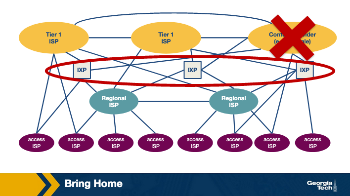

*As you might guess, CDNs also employ a hybrid of these approaches. For instance, Google has 16 “mega data centers”, ~50 clusters of hundreds of servers at IXPs, and many hundreds of clusters of tens of servers at access ISPs. These different server clusters deliver different types of content (like the ones at the access networks store the static portions of search result web pages). So they use a hybrid of both the enter deep and bring home approaches.*

## How a CDN Operates

When a user requested some content (like a funny video of a cat barking), with the old traditional approach, it was pretty straightforward to figure out which server cluster should service the request – because with the traditional approach, there was only one server cluster that could service the request. 

With CDNs, there’s now an extra step where somehow the CDN will need to intercept the request in order to be able to decide (given the location of the user, the load on the servers, current traffic, etc.) which server cluster should service the request. (We’ll discuss how that decision is made next.) DNS ends up playing a large role in this process.

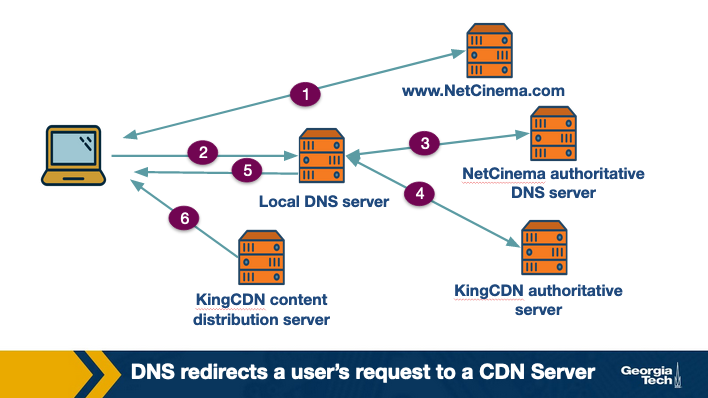

Let’s consider a simple scenario: a content provider, ExampleMovies, pays ExampleCDN to distribute their content. ExampleMovies has URLs with “video” and an ID for the video (so Star Wars 37 might have a URL of http://video.examplemovies.com/R2D2C3PO37). Let’s walk through the six steps that occur when a user requests to watch Star Wars 37 on ExampleMovies.

1. The user visits examplemovies.com and navigates to the web page with Star Wars 37. 

2. The user clicks on the link http://video.examplemovies.com/R2D2C3PO37 and the user’s host sends a DNS query for the domain “video.examplemovies.com”.

3. The DNS query goes to the user’s local DNS server (LDNS), which in many cases is a DNS server in their access ISP’s network. This DNS server issues an iterative DNS query for “video” to the authoritative DNS server for examplemovies.com, which is ExampleMovies’s DNS server. ExampleMovies’s DNS server knows that the “video” domain is stored on ExampleCDN, so it sends back a hostname in ExampleCDN’s domain, like a1130.examplecdn.com.

4. The user’s LDNS performs an iterative DNS query to ExampleCDN’s name server for a1130.examplecdn.com. ExampleCDN’s name server system (eventually) returns an IP address of an appropriate ExampleCDN content server to the user’s LDNS. (Which content server? We’ll talk about that in the next section.) 

5. The user’s LDNS returns the ExampleCDN IP address to the user. Notice - from the user’s perspective, all that happened was they asked for an IP address for “video.examplemovies.com”, and then they got an IP address back.

6. The user’s client directly connects via TCP to the IP address provided by the user’s LDNS, and then sends an HTTP GET request for the video. 

Notice the interplay of the DNS request/responses, and what the user’s perspective of the whole exchange is. By intercepting the requests with DNS, CDNs have the opportunity to choose where to direct users, based on location and/or current conditions.

## CDN Server selection

Recall that the content in CDN can be served from multiple servers that are geographically distributed. The first thing that needs to be done in order to serve the content to an end-user is to select the server to serve the content from. This process is quite important as it significantly impacts the end-user performance. If we end up picking a cluster that’s too far away or overwhelmed, the user’s video playback will end up freezing (and if the user is too frustrated by the experience, they’ll navigate to somewhere else on the internet = lost business!). 

There are two main steps in this process. The first step consists of mapping the client to a cluster. Recall that a CDN constitutes of geographically distributed clusters with each cluster containing a set of servers. In the next step, a server is selected from the cluster. Let us now look at the policies and mechanisms for this server selection process in detail.

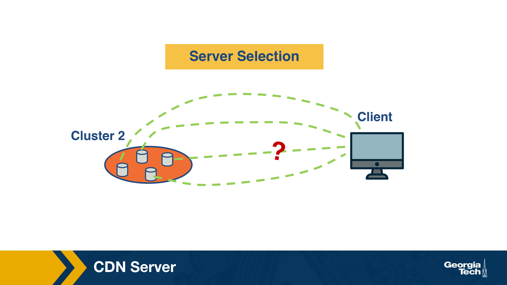

## Cluster Selection Strategies

Let us first understand how a CDN server selects a cluster. 

The simplest strategy is to pick the geographically closest cluster “as the crow flies.” For instance, assume I am watching a video from Georgia Tech campus in Atlanta, and there are three clusters located at Charlotte, Boston, and Los Angeles in the US. Using this strategy, the content will be served from the Charlotte cluster. This simple strategy can work well in a lot of cases.

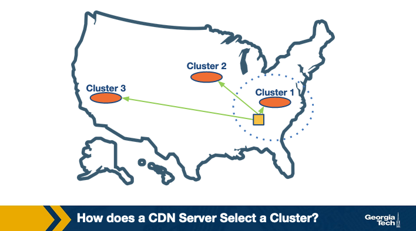

However, it has some limitations. 

- Recall from our example scenario in the previous section - ExampleCDN name server system (which is where the server selection happens) didn’t directly interact with the user, but rather with the user’s Local Domain Name Server (LDNS). So, picking the geographically closest cluster is really “picking the cluster closest to the LDNS” and not “closest to the user.” Most of the time, that works ok, but some customers use a remote LDNS. To overcome this, there have been suggestions made to include the client IP in the interaction between the ExampleCDN name server system and the LDNS. This allows the ExampleCDN name server system to know where the client is located. 
- Another very important limitation is that the cluster which is geographically closest may not be the best choice in terms of actual end-to-end network performance. This can happen because of multiple reasons. One, due to routing inefficiencies in routing protocols such as BGP, the actual network path to the geographically closest server might actually be longer than the path to an alternative cluster. This can lead to a higher RTT, even though the server is closest geographically. Another important reason could be that the path to the geographically closest cluster or the cluster itself could be congested. 

The second limitation suggests that relying on a static cluster selection policy (liked based on the geographical distance) can be sub-optimal as the underlying network conditions are dynamic. Instead, cluster selection can be based on more real-time measurements of end-to-end performance metrics such as delay to get a better picture of the current traffic conditions.

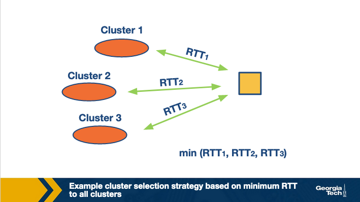

There are two key aspects to note here. The first aspect is to decide which end-to-end performance metrics to consider while selecting the cluster.

There are various e2e metrics that can be used here. For instance, one could use network-layer metrics such as delay, available bandwidth or both. A better strategy could be to use application-layer metrics. For instance, if the content to be delivered is video, metrics such as re-buffering ratio and average bitrate can be used in cluster selection. Similarly, for web-browsing, application-layer performance indicators such as page load time can be used.  

The second aspect is how to obtain real-time measurements? 

Active measurements: One way would be to use active measurements. Thus, the LDNS could probe multiple clusters, such as by sending a ping request to multiple clusters for monitoring the RTT and then use the “closest” server. However, most of the LDNS are not equipped to perform such active measurements. Furthermore, this would also create a lot of traffic.

Passive measurements: Another strategy could be that the CDN’s name server system uses passive measurements to keep track of the network conditions. The figure below shows an example. 

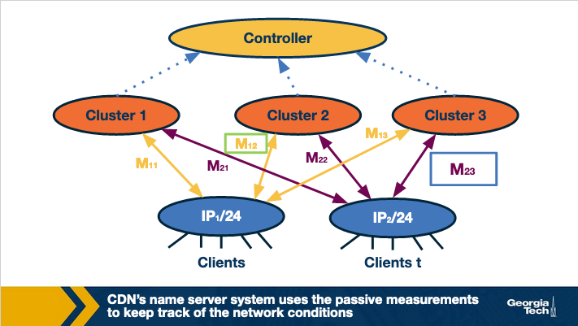

The name server system in the CDN could keep a track of the performance metrics based on the current traffic conditions. Note that this information can be kept at an aggregate level. For instance, by clubbing IPs from the same subnet together. This is because IPs under the same subnet are most likely to have similar paths to different clusters, thus experiencing similar end-to-end performance. Thus, the best cluster for same subnet can be noted down based on the performance existing sessions are observing. Next time, a new client requests for content, it can be routed to the best performing cluster based on the existing session information. 

Limitations: Note that this kind of cluster selection strategy requires a centralized controller which has a real-time view of the network conditions between all client-cluster pairs. Given the scale of today’s networks, it can be challenging to design a purely centralized system. 

Researchers have proposed the design of a distributed system that uses a two-layered system.

- A coarse-grained global layer operates at larger time scales (timescale of a few tens of seconds (or minutes)). This layer has a global view of client quality measurements. It builds a data-driven prediction model of video quality. 

- A fine-grained per-client decision layer that operates at the millisecond timescale. It makes actual decisions upon a client request. This is based on the latest (but possibly stale) pre-computed global model and up-to-date per-client state.

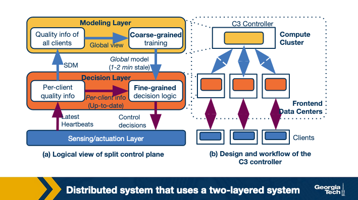

A second challenge in the above approach is that it needs to have data for different subnet-cluster pairs. Thus, some of the clients deliberately need to be routed to sub-optimal clusters. 

More details about such a cluster-selection system are given in the paper https://www.usenix.org/system/files/conference/nsdi15/nsdi15-paper-ganjam.pdf. 

## Policy for Server selection

Once the cluster has been selected, the next step is to select a server within the cluster. Let us understand what could be the intuition behind selecting a server. 

The simplest strategy could be to assign a server randomly. While this strategy is simple, it is not optimal. Why? One reason is that the workload for different servers and a random assignment might end up selecting a highly loaded server whereas a less loaded server was available. 

One solution to this can be to do some load-balancing and route a client to the least-loaded server. While this solves the above mentioned problem, it is still not optimal. 

To understand why this is the case, let us look at how a server in the CDN cluster serves the content to a client. 

Recall that a CDN server is responsible for distributing content for a variety of content providers. Thus, the same cluster could be serving video content and also web content. Similarly, it could also be serving the same type of content for a variety of content providers. E.g. serve video from different video providers. Thus, not all the servers have all the content at a time. This is because the servers have limited disk space and proactively fetching all the content to the servers is simply not feasible.

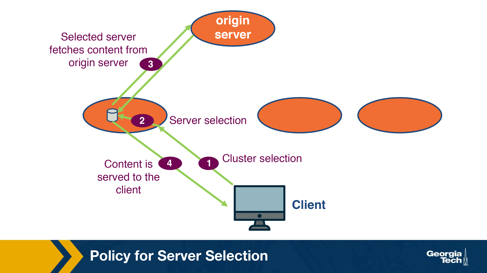

Instead, the data is fetched to these servers from an origin server in a lazy manner. Essentially, when a request for a new content arrives, it is routed to a server (step 2) within the selected cluster (step 1) and this server requests the content from an origin server (step 3). This step usually takes additional time. Once the content has been fetched, it is served to the client (step 4). Note that the server can cache this content for any future request and does not need to go to the origin server. 

Now, if this is the case, let us see what happens if we just use a simple load balancing technique for server selection. It could happen that another server already had the content requested, but it was not selected because the client was loaded to a less-loaded server. Thus, a client unnecessarily had to see a higher delay. Furthermore, there are unnecessary requests from the CDN servers to the origin server. 

How to handle this problem? A simple solution is then to map the requests based on the content. Essentially, requests for the same piece of content can be mapped to the same machine by using some sort of content-based hashing. E.g. Assume a request for exampleCDN.com/contentFoo. A hash function calculates hash of contentFoo and returns a server. And the client can be mapped to that server. Thus, all the requests for contentFoo will be mapped to the same server. 

While this idea is fairly simple, it has some challenges. One of the challenge arises from the fact that the cluster environment is quite dynamic and is characterized by frequent machine failures and load changes. Now, when there is a change in the cluster environment such as when a machine fails, the hash table used to map the content to servers needs to be recomputed. 

One way to handle this is to recompute the hash function for all the objects. However, that is simply expensive and sub-optimal. An ideal solution would be to only move the objects that were assigned to the server. Now, the question is how do we achieve this using a hash table.

## Consistent Hashing

In order to achieve this, consistent hashing, which is an example of distributed hash table has been developed. Consistent hashing tends to balance load, by assigning roughly the same number of content IDs, and requires relatively little movement of these content IDs when nodes join and leave the system. 

The main idea behind consistent hashing is that servers and the content objects are mapped to the same ID space. For instance, imagine we map the servers to the edge of a circle (say uniformly). 

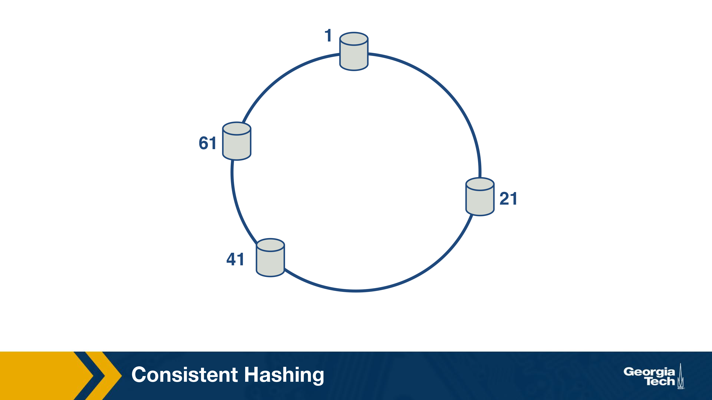

In the next step, we can also map the object to the circle.

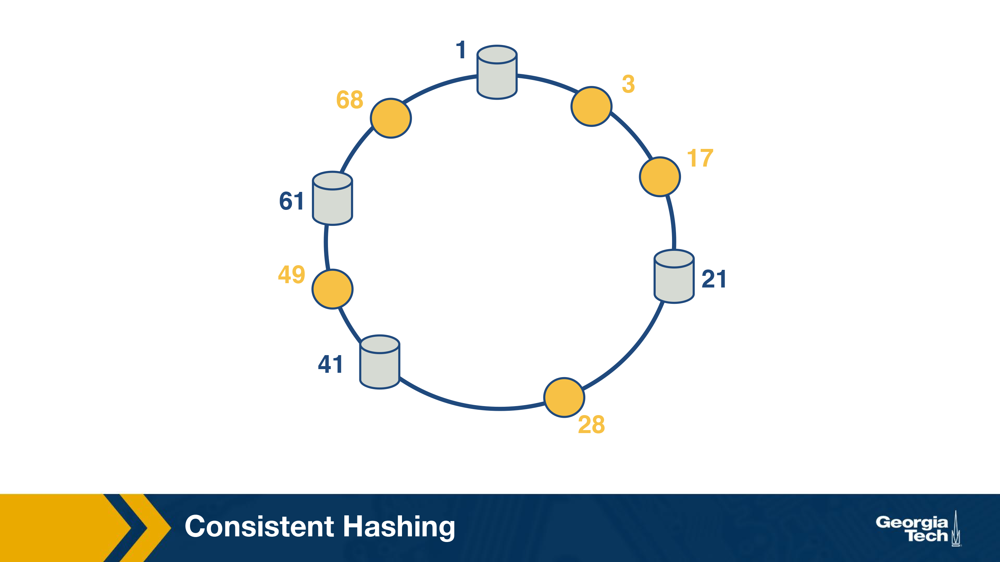

Now, the successor server for an object ID can be responsible for serving the object.

Let us see, what happens when a server (#41 in this case) leaves. The objects that the server was responsible for can now be served by the next server.

It can be proved that the solution is optimal, which means that least number of keys need to be remapped to maintain load-balance on an average. On a side note, this algorithm was proposed as a part of a popular distributed lookup protocol, known as Chord and was also used for content lookup in peer-to-peer applications such as BitTorrent, Napster.

## Network Protocols Used for Cluster/Server Selections

So far, we have mainly looked at the policies used for selecting a CDN server. Let us now look at the actual network protocol (i.e. the mechanisms that are used for this purpose).

Specifically, we will look at three different network protocols that can be used for server selection. 

- DNS 
- HTTP redirection
- IP Anycast

Let us start by looking at the DNS protocol.

## Server Selection Strategies: The DNS Protocol 

**Why do we need DNS?** The identifiers we have for an Internet host is the IP address and the hostname. The advantage of using hostnames, such as www.gatech.edu, cnn.com, etc is that they can be easily remembered by humans. The main disadvantage of hostnames is that they are consisting of variable characters and thus it’s difficult for routers to process them. This is where the Domain Name System (DNS) comes in. It help us translate hostnames to IP addresses. The DNS is implemented using a hierarchical pattern. 

### How does DNS work? 

First, DNS provides a distributed database implemented over a hierarchy of servers. Second, **DNS is an application layer protocol that allows hosts to query this database and provide the translation of hostnames to IP addresses.** Here are the main steps that a host takes to use DNS: 

1. The user host runs the client side of the DNS application

2. The browser extracts the hostname www.someschool.edu and passes it to client side of the DNS application.  

3. DNS Client sends a query containing the hostname of DNS

4. DNS Client eventually receives a reply which included IP address for the hostname

5. As soon as the host receives the IP addresses, it can initiate a TCP connection to the HTTP server located at that port at that IP

There are other service offered by DNS:

1. **Mail server/Host aliasing:** Email servers have to have simple and mnemonic names. Eg @hotmail.com. However, the canonical hostname can be difficult to remember eg relay2.west-coast.hotmail.com. DNS is used to get the canonical hostname (and IP address) for an alias hostname. Also, a host can have one or more names.  If there are two hostnames then this usually is a combination of canonical and mnemonic hostnames. DNS can be used to find the canonical hostname for a given host and also obtain an IP for that host.

2. **Load distribution:** Busy websites may be replicated over multiple servers. When a client makes a DNS query, the DNS server responds with the entire set of addresses but rotates the address ordering with each reply. This helps in distributing the traffic across servers.

### The DNS hierarchy

A simple design for DNS would have been based on a centralized model where we have a single DNS server that contains all the hostnames-to-IP mappings, and clients simply direct all their queries to this single DNS server, and this server responds directly to the querying clients.

This model, though very simplistic, would not be the best option for multiple reasons. 
1. **It introduces a single point of failure.** If that single server collapses then the entire Internet would not be able to work either! 
2. **It would be very difficult for a single server to handle all the volume of the querying traffic.** A single DNS server would have to process a very large number of DNS queries. 
3. **This model is based on a centralized database which cannot be close to all querying clients.** This model would cause significant delays and slow performance for the clients which are geographically distant and thus they might have to communicate over slow or congested links. And finally, maintaining this centralized database would be a big problem as we would have to update a huge database with updates for every single host in the Internet.

**Because of the above reasons we have a distributed hierarchical database for DNS. The DNS uses a hierarchical scheme to solve the scalability problem. A portion of the hierarchy of the DNS servers is shown in the following diagram:**

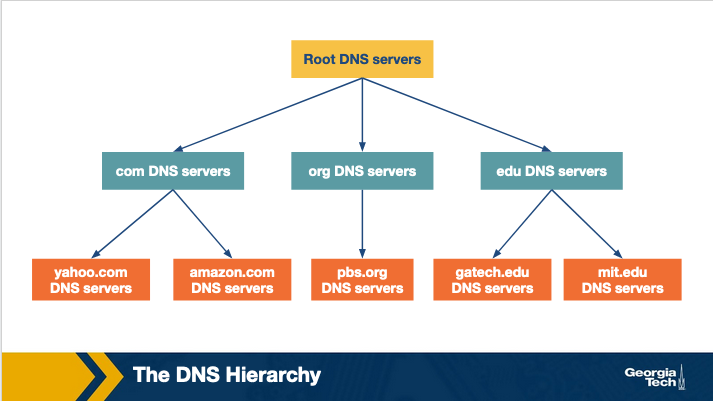

When a client requests the IP address for a specific domain name, as for example gatech.edu or amazon.com, the client will finally know this mapping with the help of this server hierarchy. In a nutshell, it works as follows: Let’s suppose that a client requests the IP address for amazon.com. The client will first contact the **root server**, which will return the IP address of a **top level domain server**. Then the client will contact that top level domain server to receive a referral to the **authoritative server for amazon.com.** Finally, the client will make a query to that authoritative server to receive the domain-to-IP mapping and to finally reach amazon.com. 

The DNS hierarchy consists of the following types of servers: 

#### Root DNS servers: 
There are 13 servers, each of which is a network of replicated servers mostly located in North America. As of May 2019, the total number of server instances is 984. 

#### Top level domain (TLD)  Servers: 
These servers are responsible for the top level domains such as .com, .org, .edu, etc and also all of the country top level domains such as .uk, .fr, .jp. 

#### Authoritative servers: 
An organization’s authoritative DNS server keeps the DNS records that need to be publicly accessible, such as the domain name - IP mappings for web serves and mail servers of that organization.

#### Local DNS servers. 
Even though this type of servers is not considered as strictly belonging to the DNS hierarchy, nevertheless it is considered central to the overall DNS architecture. Each Internet Service Provider (ISP), such as a university, a company or a small residential ISP, has one or more local DNS servers. Hosts that connect to an ISP are provided with the IP addresses of one or more local DNS servers. So, when a host makes a DNS query, the query is sent to the provided local DNS server, which in turn acts as a proxy, and it forwards the query into the DNS hierarchy.                 

### How DNS works: Recursive and Iterative DNS queries

Let’s consider the example below:

The host requests the IP address of gaia.cs.umass.edu. The local DNS server of the requesting host is dns.poly.edu. The authoritative DNS server of the requested domain name is dns.umass.edu.

1. The host sends a query to the local DNS (dns.poly.edu) (step marked 1). This query is a message that contains the hostname to be translated which is gaia.cs.umass.edu.
2. This local DNS server forwards this query to root level server which notices that this is a query for .edu TLD servers
3. And it returns back to the local DNS server a list of TLD servers responsible for .edu
4. The local DNS server queries one of the TLD servers 
5. The TLD server notes the umass.edu suffix and returns the IP address of the authoritative DNS server for the University of Massachusetts to the local server 
6. Finally, the local server queries the authoritative DNS server
7. Receives the IP address of gaia.cs.umass.edu.

The process of obtaining the mapping of a hostname to an IP address is known as name-address resolution. We observe that through the name address resolution process the host interacts with the DNS hierarchy using two types of queries: iterative and recursive.

***In the iterative query process***, **the querying host is referred to a different DNS server in the chain, until it can fully resolve the request.**

Whereas in the recursive query, the querying host, and each DNS server in the chain queries the next server and delegates the query to it. We note that the usual pattern is for the first query from the requesting host to the local DNS server to be recursive, and the remaining queries to be iterative.

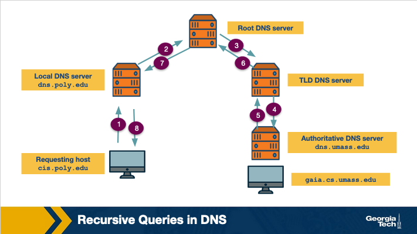

In the above figure, we can see an example of a recursive query.

## More on DNS: Making Responses Faster with Caching

### What is DNS caching?

One way to make the DNS resolution faster, is to cache the responses. This will help in reducing the performance delay and make it more efficient.

The idea of DNS Caching is that, in both iterative and recursive queries, after a server receives the DNS reply of mapping from any host to IP address,  it stores this information in the Cache memory before sending it to the client.

### An Example of DNS Caching

Consider a host A (apricot.poly.edu) that queries a local DNS server dns.poly.edu for the IP of cnn.com. After some time another host B (kiwi.poly.fr) queries a local DNS server dns.poly.edu for the IP for the same hostname (cnn.com). Because of caching local DNS will be able to immediately send the response for cnn.com.

## More on DNS: Resource Records and Messages

DNS Records

The DNS servers store the mappings between hostnames and IP addresses as resource records (RRs). These resource records are contained inside the DNS reply messages. A DNS resource record has four fields: (name, value, Type, TTL). The TTL specifies the time (in sec) a record should remain in the cache. The name and the value depend on the type of the resource record. 

The most common types are four:

- **TYPE=A:** the name is a domain name and value is the IP address of the hostname. (abc.com, 190.191.192.193, A)

- **TYPE=NS:** the name is the domain name, and the value is the appropriate authoritative DNS server that can obtain the IP addresses for hosts in that domain. (abc.com, dns.abc.com, NS)

- **TYPE=CNAME:** the name is the alias hostname, and the value is the canonical name, (abc.com, relay1.dnsserver.abc.com, CNAME)

- **TYPE=MX:** the name is the alias hostname of a mail server, and the Value is the canonical name of the email server. (abc.com, mail.dnsserver.abc.com, MX)

### DNS Message Format

The first field is an ID that is an identifier for the query and it allows the client to match queries with responses. 

The flags section have multiple fields. For example, a field allows to specify if the DNS message is a query or response. Another field specifies if a query is recursive or not.  

The question section contains information about the query that is being made for example the hostname that is being queried, the type of the query (A, MX, etc). 

In the answer section, and if the message is a reply, we will have the resource records for the hostname that was originally queried.

In the authority section, we have resource records for more authoritative servers.

The additional section contains other helpful records. For example, if the original query was for an MX record, then the answer section will contain the resource record for the canonical hostname of the mail server, and the additional section will contain the IP address for the canonical hostname.

## Server Selection Strategies: IP Anycast

One interesting network protocol that can sometimes be used for server selection is IP Anycast. 

Let us first understand what is IP anycast? The main goal of IP anycast is to route a client to the “closest” server, as determined by BGP (Border Gateway Protocol), a routing protocol used for inter-AS routing. This is achieved by assigning the same IP address to multiple servers belonging to different clusters. Now, each of these servers will use the standard BGP to advertise this IP address. Thus multiple BGP routes for the same IP address corresponding to different cluster locations will propagate in the public Internet. Now when a BGP router receives multiple route advertisements for this IP address, it would treat them as multiple paths to the same locations, although, in reality these routes correspond to different physical locations. In the end, the shortest path will be stored and used for routing packets.  

Using this strategy can enable CDNs to deliver content using the “closest” server to a client. Figure below shows an example.

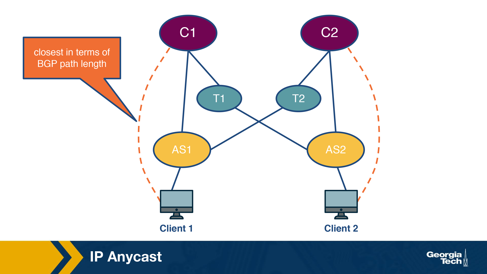

Now a client from AS1 will be routed to the cluster C1, which is only 1 AS hop away from it. For a client belonging to different cluster, AS2, it will be routed to a different cluster as it is the “closest” cluster. 

Clearly, this strategy is useful as typically you would expect that the path “closest” to the server in terms of BGP route provides the best end-to-end performance. However, this is not always the case because of the dynamic nature of the Internet. For instance, it could happen that the link is congested and thus for a new client it was actually better to go to cluster C2. Clearly, server selection using anycast routing does not take this into account. Thus, it is not commonly used in practice by CDNs.

One particular instance, though not of content delivery, where IP anycasting is used is in routing to the DNS server. For instance, Google provides public DNS servers that can be used for resolving domain names to IP address. In order to serve clients from multiple locations, it has multiple DNS servers distributed geographically with all of the servers being assigned the same address. Now, a client that is using public Google DNS servers for domain name resolution, will be routed to the “closest” server in terms of the BGP path, thus making the DNS query faster.

## Server Selection Strategies: HTTP Redirection 

The next protocol which we look at is the HTTP redirection protocol. As the name suggests, the protocol works at the HTTP-layer in the network stack. Essentially, when a client sends a GET request to a server, say A, it can redirect the client to another server, say B, by sending an HTTP response with a code 3xx and the name of the new server. 

This essentially means that the client should now fetch the content from this new server. Note that this would incur at least an additional HTTP request, which can correspond to one or more RTTs, for the client to fetch the content. While this makes this protocol inefficient, it can be still useful in certain cases.

One particular case is for load-balancing, especially that caused by a combination of video popularity and spontaneous video demands. For instance, it could happen that a popular video is requested by a large number of clients from the same region. As we read in the server selection policies before, a majority of these requests might end up going to the same server, thus overwhelming the server. 

In that case, the server can send HTTP redirects to some of the clients. One benefit of this method is that it does not require any central coordination. A recent measurement study reports that YouTube uses this kind of mechanism for load balancing. According to the study, YouTube first tries to use HTTP redirection for sharing the load within a cluster, and then can also use it to redirect clients to a different cluster if the former is not enough.
