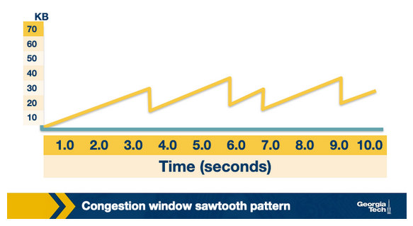

# Lesson 2 Transport and Application Layers

This lesson will focus on the Transport Layer and TCP protocol

## IP Protocol

The IP protocol has multiple versions: IPv4 and IPv6, due to limits on the 
possible address spaces of IPv4 created in 1983 and the demand for unique
address spaces on the Internet.

IP sends packets of information from a source to a distination. Each packet consits of: 

- Header length
- Packet length
- Time to live (TTL), or the number o fnetwork hops a packet can make before its discarded
- Which transport protocol is being used: TCP, UDP

There are 14 fields total of an IP packet.

### IP Routing

The internet is made up of interconnected large networks that are responsible for
certain blocks of IP addresses. These **blocks** are known as **Autonomous Systems (AS)**

**Boarder Gateway Protocol (BGP)** is a protocol that helps IP packets cross these **ASes**
based on their destination IP addresses.

Routers have routing tables that indicate which ASes the packets should travel through
in order to reach the desired destination

## Introduction

This lesson will focus on the logical end-to-end connection between two hosts
on the internet to send and receive data.

The logical connection happens throught he transport layer, the TCP protocol.
This protocol provides reliability, flow control, and congetstion conrol when 
sending data.

There are other versions of TCP that provide improved efficiency/performance.

## Transport Layer and Network Layer Relationship

*Transport layer* provides End-to-End connection between two applications running on 
separate hosts, regardless if they're within the same network.

The *Transport Layer* on the sending host receives a message from the *Application Layer*
and appends its own header. This combined message is a **segment**.

The layer segment is sent to the network layer which **appends/envapsulates** the segment
with its own header information. Then it will send the message to the receiveing host via
routers, bridges, switches, etc.

#### Why is the Transport Layer needed between the Application and Network Layers?

The Network Layer offers a best-effor delivery service model. Data integrity is not
guaranteed. The Transport Layer ccomes to resolve this problem. 

The Transport Layer allows application programmers to develop applications assuming a
standard set of functionalities. This allows any application designed for the Transport
Layer to run on a diverse set of network interfaces.

The two most common are: 
- **User Datagram Protocol** (UDP)
- **Tramsmission Control Protocol** (TCP)

The two protocols offer different functionalities to application developers.

**UDP** provides basic functionality and relies on the application layer to implement the 
remaning complexity. 

**TCP** provides strong primitives that make end-to-end communication more reliable and
cost-effective.

Due to the reliability and cost effectiveness, TCP is used for most applicatoins.

## Multiplexing: Why do we need it?

A desired functionality of the Transport Layer is the ability for a host to run
multiple application to use hte network sumultaneously, know as **multiplexing**

#### Multiplexing Example

Consider a user who is browsing Facebook and streaming Spotify. Each of these online
applications require communication to different applicaiton servers.

***How do we ensure that the incomine packets are delivered to the correct application?***
The network layers only uses IP address. Thus, IP address allone does not account for
which packets are from their respective applications on the single host. We need a 
mechanism to distinguish the many processes sharing the same IP from a single host.

The transport layer solves this problem by using an additional identifier known as 
**ports**. Each application binds itself to a unique port number by opening a socket and
listening for any data from a remote application. Therefore, the transport layer can do
**multiplexing** by using ports.

There are two ways we can use **multiplexing**:
1. Connectionless
2. Connection-oriented multiplexing

It depends weather ot not we have a connection established btween the sender and receiver
host.

## Connection Oriented and Connectionless Multiplexing and Demultiplexing

In the diagram above, it depicts 3 hosts running an application. A *receiver* host
that receives an incoming trasnport layer segment will forward it to the appropriate **socket**.
The *receiver*, identifies the socket by examing a set of fields in the **segment**.

***Demultiplexing***: the job of delivering the data included in the transport layer segment
to the approppriate socket, defined in segmentation fields.

***Multiplexing***: the job of gathering data from different sockets and encapsulating
each data chunck with header information (that is used for demultiplexing), to create
segments and forward to the *Network Layer*

*Look at the host in the middle of the diagram*, The *Transport Layer* running in the middle
host will need to demultiplex the data arriving from the *Network Layer* to the correct *socket*
The *Transport Layer* in the middle host will need to perform *multiplexing* by collecting
data from sockets P1 or P2. Generating Transport Layer segments, thenforward segments to 
the Network Layer below.

***Socket Identifiers***: based on special fields in the segment, **source port number** and 
**destination port number** as illustrated in the diagram below

### Connectionless and Connection Oriented Service

Two types of ***multiplexing/demultiplexing***

1. Connectionless
2. Connection Oriented

#### Connectionless

The identifier of a UDP socket is a "two-tuple" that has: 
1. Destination IP address
2. Destination Port number

***Example***: 
Two hosts: [**A** and **B**], running two processes at UDP ports [**a** and **b**]
respectively. **A** sends data to **B**, the Transport Layer in **A** creates
a Transport-Layer *segment* with:

- application data
- source port
- destination port

**A** forwards the *segment* to the Network Layer. The network Layer *encapsulates* the segment
into a Network-layer *datagram* and sends it to **B** with best effort delivery

**B** may receive the message. The Transport Layer at **B** identifies the correct socket
by looking at the field of the destination port. If **B** is *running multiple processes/
applications*, each process will have its own ODP socket and therefore a distinct port.

**B** will use this information (port gathered from header of *datagram*) and will
*demultiplex* the receiving data to the correct socket.

#### Connection Oriented

The TCP socket is a "for-tuple" that consists of: 
1. Source IP
2. Source Port
3. Destination IP
4. Destination Port

***Example***:
Consider a TCP client server shown in the figure above.  The TCP server
has a listening socket that waits for connection requests from clients.

A [TCP] client creates a socket and sends a *connection request*. a TCP 
segment has:
- a source port number chosen by the client
- a destination port 12000
- a special connection-established bit set in TCP header

The TCP server receives the connection reqeust and creates a socket identified by the "four-tuple"
infomration. The *server* uses the socket identifier to *demultiplex* incoming data and forward
it to the socket. *The TCP connection has been established as shown in the diagram below:*

***Example***:

3 hosts: A, B, C

C initiates two HTTP sessions to server B. A initiates one HTTP session to B.

C and A assign port numbers to their connections (independently from eachother).

Even if A and C somehow choose the same port for the connection, B can still 
differentiate the data from A and C by demuliplxing the incoming data because
they will have difference *source IP addresses*

***Another Example***:
Assume we have a web server listening on port 80. Clients send their initial connection
requests and data with destination port 80.

The web server demultiplexes incoming data based on unique source IP addresses and source port
numbers.

Client/Server may use persistent HTTP sessions. they exchange HTTP messages on the same 
server socket.

Client may use non-ersistent HTTP session, every request and response, a new TCp connection and 
associated server socket is established, then closed.

In the latter example, this can be problematic for high traffic applications.

## QUIZ 1:

***Question***
As we have seen, UDP and TCP use port numbers to identify the sending application and 
destination application. Why don’t UDP and TCP just use process IDs rather than define 
port numbers? 

---

***My Answer***:

The message received contains both a Source IP address from the segment and Source Port 
number from the datagram so that during demultiplexing on the server/receiver, we can 
distinguish two packets that may share ports based on their distinct IP address.

The protocol that uses 2 values of information allows for the receiver to always identify 
a host distinctly. There is no need to worry about extra overhead of generating distinct 
IDs for requests.

Furthermore, this would be a problem if two sources send data with the same ID, since they 
are independent this is possible. It wouldn't allow for sources to instantiate a connection 
with a host/receiver.

---

***Answer***:

Process IDs are specific to operating systems and therefore using process IDs rather 
than a specially defined port would make the protocol operating system dependent. Also, a 
single process can set up multiple channels of communications and so using the process ID 
as the destination identifier wouldn’t be able to properly demultiplex, Finally, having 
processes listen on well-known ports (like 80 for http) is an important convention.

---

## A Word About UDP Protocol

UDP is unreliable, it lacks overhead that TCP has to ensure messages are received.

UDP is connectionless, does not requre the 3-way handshake before sending packets.

#### Why is UDP Used?

The "shortcomings" of UDP are actually seen as **positives** in some cases.

1. No congestion control or similar overhead
	- As soon as the application passes data to the Transport Layer, UDP
	encapsulates it and sends it over the Network Layer. Whereas, TCP
	needs to do stuff for congestion control or retransmission. This
	requires additional overhead == more delays.

2. No connectio management overhead
	- TCP uses a 3-way handshake before it begins transferring data.
	UDP skips this and starts sending data immediately. The lack of
	connection establishment and maintanance will result in less
	delays.

There are many Real-Time production systems that rely on UDP despite having 
significantly higher *packet-loss* percentages. 

DNS is an application layer protocol, that typically uses UDP. Here are more
applications that prefer UDp over TCP or vice versa:

#### UDP Packet Structure

1. Source Port Number
2. Destination Port Number
3. Length of UDP Segment 
	- Header and Data
4. Checksum
	- Error checking mechanism

The checksum provides basic **error checking** since there is no guarantee for 
link-by-link reliability. 

## Quiz 2

***Question***:

 UDP and TCP use 1’s complement for their checksums. But why is it that UDP takes 
the 1’s complement of the sum – why not just use the sum? Exploring this further, 
using 1’s complement, how does the receiver compute and detect errors? Using 1’s 
complement, is it possible that a 1-bit error will go undetected? What about a 2-bit error?

---

***My Answer***:

I'm not sure.

If the packet is received, the 1's compliment will be able to distinguish 
the packet's integrity via the 1's complement only.

---

***Answer***:

To detect errors, the receiver adds the four words (the three original words 
and the checksum). If the sum contains a zero, the receiver knows there has been 
an error. While all one-bit errors will be detected, but two-bit errors can be 
undetected (e.g., if the last digit of the first word is converted to a 0 and 
the last digit of the second word is converted to a 1).

---

## The TCP 3 Way Handshake

1. TCP client sends a SYN packet
	- This is a special segment (containing no data) with the SYN bit set to 1
	- The client also generates an initial sequence nubmber *client_isn* and includes
	as special TCP syn segment.

2. The server, upon receiving SYN packet, allocates the required resources to establish
the connection. Then sends back a SYNACK segment.
	- This is a special "connection-granted" segment
	- The packet has the SYN bit set to 1
	- The acknowledment field of the TCP segment header set to *client_isn+1* and a 
	randomly chosen initial sequence number *server_isn*

3. The client receives SYNACK segment, it allocates a buffer and resources for the connection
and sends an acknowledgement with SYN bit set as 0.

### Connection Teardown

1. When the client wants to end the connection, it sends a segment with FIN bit set to 1

2. The server ackknowledges this connection close request and works to close connection

3. The server sends a segment with FIN bit set to 1, indicating that connection is closed
on the server's side

4. The client sends an ACK to the server. waits to make sure ACK segment is not lost.

## Reliable Transmission

The Network Layer is unreliable. This leads to packets being lost or arriving out of order.
This is a problem for many applications. **Example:** downloading a file.

**Solution:** allow the application developers to take care of the network losses, as 
done in UDP. However, this is a common requirement for most applicaitons. TCP developers
decided to implement this in the Transport Layer. 

***TCP guaranetees in-order delivery of the Application-Layer data without any loss
or corruption***

### How does TCP Implement Reliability?

We need to know which segments were received by the remote host and which are lost.

#### Automatic Repeat Request ARQ

Have the receiver send acknowledgements indicating that it successfully received a specific
segment of data.

If no ACK is sent, client assumes that this segment was lost in transmission. The packet is
automatically resent

#### Stop and Wait ARQ

When the sender stops and waits for the ACK message from the receiver

The algorithm typically figures out the average waiting time for a given connection. 
and waits to resend the packet. The *estimation can be tricky to get right* a small 
timeout during the connection can make a large impact on the average/skewing the data.

Large timeouts result in unecessary delays.

Typeically the timeout value is a function of estimated **round trip time (RTT)**

This method has significantly lower performance. To solve this problem, the sender
can send multiple packets wihout waiting for acknowledgements.

It basically takes a certain **Window size** of packets to send and then wait to 
see which ones were received/lost.

- Receiver needs to identify and notify sender of missing packet
	- each packet is tagged with unique byte sequence number.
	- increased for subsequent packets in flow based on size of packet
- Both sender and receiver would need buffer size for more than 1 packet
	- sender would need buffer packets that have been transmitted but not acknowledged
	- receiver needs nuffer packets because the rate of consuming (writing to disk)
	can be slower thatn the rate of arriving packets.

### Go Back N

Receiver sends an ACK for the most recently received in-rder packet. The sender
sends packets from the most recent ACK-ed packet, even if some have been sent before.

In this implementation, a single packet error can cause a lot of retransmissions. 

**Solution:** TCP uses ***Selective ACKing*** 

The sender retransmits only the packets that are suspected to have been dropped.

The receiver would only acknoeledge a correctly recieived packet even if its not
in order.

Out-of-order packets are buffered until any missing packets have been receive. 
once all received, they can be delivered to the Application-Layer.

***PROBLEM***: TCP still needs a timeout as there are possible ACKs getting lost on the network.

### Fast Retransmit 

In addition to using a timout to detect loss packets, TCP uses duplicate acknowledgements
as a means to detect packet loss. Duplicate ACK is an additional acknowledgment of segment
for which the sender has already received acknowledgement earlier.

When sender receives 3 duplicate ACKs for a packet, it considers the packet to be lost and will
retransmit instead of waiting for timeout.

## Transmission Control

### Transmission Control Rate

*Consider:* 1 Gb file needs to be sent to Host B on a 100 Mbps link **What rate should 
it send the file?** 

Perhaps 100 Mbps, but

- How does user A determine link capacity
- What about other users that also are using the same link?
- What happens to the sending rate if receiver B is also receiving files from other Hosts?

**Which layer in the network decides data transmission rate?**

**Where should the tranmsission control function reside in the network stack?**

Let application developers figure out implement mechanims for tranmission control: hence
*UDP*. However, transmission control is a fundemental function for most applications.

Thus, implementation at the **Transport Layer** is more suited.

When considering fairness in using the network, it makes it more convinient to handle 
it at the **Transport Layer**. This is why TCp provides mechanisms for transmission control
(has been subject of interest since computer applications have first sent data).

## Flow Control

Transmission control is to protect the receiver buffer from overflowing. 

Receiver might be involved with multiple applications transmitting data, it also
does not read data instantly. This can cause data accumulation in the receiver buffer.

TCP provides rate control mechanism known as **Flow Control**. Helps match the sender's 
rate against the receiver's rate of reading/consuming data. It helps the sender maintain
a variable **receive window: (rwnd)**

**Example:** Host A and B are communicating via TCP. B allocates a receive buffer of size
`RcvBuffer` for the connection. It maintains to variables:

- `LastByteRead` the number of last bytes in the data stream read from the buffer
by the application process in B

- `LastByteRcvd` the number of last bytes in the data stream that has arrived from the network
and has been placed in the receiver buffer at B

***In order to not overflow receiver B's buffer:***

`LastByteRcvd  -  LastByteRead  <=  RcvBuffer`

The extra space that receiver buffer has specified using a parameter termed as receive
window: 

`rwnd  =  RcvBuffer  -  [LastByteRcvd  -  LastByteRead]`

Receiver advertises `rwnd` in every segment/ACK it sends back to the sender.

The sender also keeps track of `LastByteSend` and `LastByteAcked`

`UnACKed Data Send  =  LastByteSend  -  LastByteACKed`

In order to not overflow the receiver's buffer, the sender must ensure that the maximum
number of unacknowledged bytes it sends is no more than the `rwnd`, thus we also need:

`LastByteSend  -  LastByteACKed  <=  rwnd`

***Caveat***: consider, receiver had informed the sender that `rwnd = 0`, sender stops
sending data. Assume B has nothing to send to A. The application processes the data
at the receiver, the receiver bugger is cleared. Still, the sender may never know that the
new buffer space is available and will be blocked from sending data (even when buffer is 
empty).

***Solution*** TCP solves this by making the sender continue to send segments of 
size 1 byte even after `rwnd  =  0`. When receiver acknowledges these segments, 
it will spcify the `rwnd` value and sender will know when the buffer has room again.

# Congestion Control Introduction

Controlling transmission rate to protect network from congestion

**NOTE** networks are dynamic, users joining and leaving, initiating data transmissions, 
terminating existing flows.

Thus, mechanissms for congestion control need to be dynamic enough to adapt to 
changes in the network conditions.

## Goals of Congestion Control

- Efficiency
	- high throughput
	- high utilization of the network's resources
- Fairness
	- each user should have fair share of network bandwidth
	- fairness is dependent on network policy
- Low delay
	- theoretically, consider an infinite buffer, we could send all data at once
	but, queuing times would be very high leading to delays.
	- applications sensitive to network delays (video streaming) will suffer
- Fast convergence
	- flow should converge to its fair allocation fast
	- a typical network's workload is composed of many short flows and few long flows
	if convergence isn't fast enough, network performance will suffer with short flows.

## Congestion Control Types: E2E vs Network Assisted

Network Assisted congestion control:

- Network Assisted Congestion Control:
	- Rely on network layer to provide feedback to the sender about congestion in network.

**Example**: routers could use ICMP source quence to notify source that network is congested.
but these notifications could further clog the network and make their purpose meaningless.

- End-to-End congestion control
	- The network does not provide any explicit feedback about congestion
	to the end hosts. 
	- Instead, hosts infer confestion from entwork behavior and adapt the 
	transmission rate

TCP ended up using **End-to-End** approach.

Congestion control is a primitive provided in the transport layer. 

Routers do not have this since they are on the network layer. (Although some 
moder routers have this in their protocols like ECN and QCN but this is out of 
scope for our class).

## Host Inferring Congestion?

How can hosts on a network infer congestion on the network?

- Packet Delay
	- as the network becomes congested, queues in the router buffers build up
	- this leads to increased packet delays
	- increased RTT
	- this can be estimated via ACKs, which indicate congestion in the network
	- packet delays in networks are usually variable
	- this makes this variable/parameter unreliable as a true indicator

- Packet Loss
	- as a network gets congested, routers start dropping packets
	- packets can be lost due to other reasons like routing errors, hardware failures,
	TTL expiration, error in links, flow control problems, etc.
	- all of these ***are quite rare making it a solid indicator of network performance***

Early TCP implementations used Packet Loss

## How does TCP Sender Limit Sending Rate

TCP congestion control was introducted so that each source can:
1. Determine the network's available capacity
2. Choose how many packets to send without adding to the network's congestion level

Each source uses ACKs as probing. If receiving host received a packet send
earlier, it would release more packets into the network.

TCP uses congestion window similar to receive window used for **flow control**. Which 
represents the maximum number of unacknowledged data that sending host can transit
*send but not yet ACKed*

TCP uses **probe-and-adapt** approach in adapting the congestion window.
Under normal cases, TCP increases *congestion window* when trying to achieve the 
available throughput. 

Once TCP **detects congestion**, the *congestion window* is decreased.

Unacknowledged data that a sender can have is the *minimum between the congestion
window and receive window*

`LastByteSend  -  LastByteACKed  <=  min{cwnd, rwnd}`

***BASICALLY*** TCP sender cannot send faster than the slowest component: 
either network, or receiving host.

## Congestion Control at TCP AIMD

TCP controls congestion. It decreases the window when the level of congestion goes up.
TCP increases the window when the level of congestion goes down. This function is 
known as the ***additive increase/multiplicative decrease (AIMD)***

### Additive Increase

The connection starts with a constant initial window, usually 2, and increases
it **additively**.

**Additive** increase is to increase the window by one packet every *RTT*. So in 
additive increase part of the **AIMD**, every time the sending host successfully sends a 
`CongestionWindow`: `cwnd` the number of packets it adds 1 to `cwnd`.

**AIMD** happens incrementally. TCP does not wait for ACKs of all the packets form the 
previous RTT. Rather, it increases congestion window size as soon as each ACK arrives.

In bytes, this is a portion of **MSS: Maximum Segment Size**

`Increment  =  MSS * (MSS  /  CongestionWindow)`

`CongestionWindow  +=  Increment`

### Multiplicative Decrease

Once TCP detects congestion, it reduces the transmission rate.

If TCP detects a network drop/packet loss. It sends out `cwnd  /  2`

The decrease of `cwnd` for each timeout is the **multiplicative decrease** of **AIMD**.

***EXAMPLE:***

- `cwnd = 16`
- TCP detects loss on network
- `cwnd  /  2  =  8`

**NOTE:** `cwnd` cannot be reduced further than `1`

TCP constantly changes the congestion window value throughout a connection. As shown in 
diagram below:

### TCP Reno

Different implementations of TCP use variations for *congestion control* to maximize bandwidth
usage.

TCP Reno uses two types of loss events as a signal of *network congestion*: 
1. Triple Duplicate ACKs
	- considered mild congestion

2. Timeout
	- when no ACK is received within the specified amount of time
	- more sever congestion
	- **leads to a reset to initial window size**

## Slow Start in TCP 

AIMD approach reduces congestion window at a FASTER RATE than it INCREASES congestion window.

Reason: the `/ 2` or halfing has a larger impact than the Additive.

This can cause problems

**Example:**

Consider when the window is too large, more packets will be dropped and retransmitted. 
making the network congestion even worse. 

**it is crucial to reduce the number of packets being sent into the network as quickly as
possible**

Contrastly, when a new TCP connection is established, it can take a long time for the 
congestion window to become large. 

**We need a mechanism to reapildy increase congestion from TCP cold start**

**TCP Reno** has a slow start phase where congestion window is increased exponentially instead
of linearly. Source host starts by setting `cwnd` to `1`. When it receives the ACK for this 
packet, it adds 1 for each ACK it receives. so now it sends 4 packets. 

Once the *congestion window* becomes larger than a certain **thershold value: slow start
threashold** it starts abiding by the Additive of AIMD.

A bit more details on dying connections here: https://gatech.instructure.com/courses/356044/pages/slow-start-in-tcp?module_item_id=3650188

## TCP Fairness

Fairness is one of the main Goals of congestion control. 

Fairness: for k connections passing through one common link with capcity R, each connection gets
an average thorugh of `R/k`

#### Is TCP Fair?

*Consider example:* two TCP connections share a single link with bandwidth R. See image
as a graph of throughput of these two connections. The throughput for each should sum to R.

The goal is to get the throughput achieved for each link to fall somewhere near the intersection of 
**equal bandwidth share line** and the **full bandwidth utilization line**

Thus, using AIMD, leads to fairness in bandwith sharing

## Quiz 3

***Question***

TCP utilizes the Additive Increase Multiplicative Decrease (AIMD) policy for fairness. 
Other possible policies for fairness in congestion control would be Additive Increase 
Additive Decrease (AIAD), Multiplicative Increase Additive Decrease (MIAD), and 
Multiplicative Increase Multiplicative Decrease (MIMD). Would these other policies converge? 
If so, how would their convergence behavior differ from AIMD? 

---

***My Answer***

lsakdfj

---

***Answer***

In AIAD and MIMD, the plotted throughput line will oscillate over the full bandwidth 
utilization line but will not converge as was shown for AIMD. On the other hand, MIAD 
will converge.

None of the alternative policies are as stable. The decrease policy in AIAD and MIAD 
is not as aggressive as AIMD, so those will not effectively address congestion control. 
In contrast, the increase policy in MIAD and MIMD is too aggressive.

---

## Caution About Fairness

There can be cases where TCP is not fair

1. Due to the difference in RTT of different TCP connections.

TCP Reno uses ACK-based adaptation of congestion window. Thus, connections with smaller 
RTT values would increase their congestion window faster than those with longer RTT values.
This leads to unqueal sharing of bandwidth == not fair.

2. If a single application uses multuple parralel TCP connections

TCP connection sharing link of rate `R`, If a new application establishes a connection
on the spame link and also uses one TCp connection, each application will get assigned the 
same transmission rate of `R  /  10`.

BUT, if a new application had 11 parrallel TCP connections, it would get an unfair allocation
more than `R  /  2`

## Congestion Control in Modern Network Environments: TCP CUBIC

Network speeds have gone WAYYY up over the years. Poses a challenge for TCP
congestion control mechanisms, to improve link utilization.

TCP Reno has low network utilization. Especially when network bandwidth is high or delay is big.
**AKA High Bandwidth delay product networks**

Improvements to TCp congestion control have been proposed

### TCP CUBIC

Implemented in the Linux kernel, uses a CUBIC polynomial as the growth function. Show in
diagram below:

We know that optimal window size is between `WindowMin` and `WindowMax`. Instead of
increaseding window size by 1, it is okay to aggressively increase window size at the
beginning.

Once `WindowSize` approaches `WindowMax` slow the increase rate/speed.

`W(t)  =  C(t-K)^3  +  W_max`

`WindowMax` or `W_max` is the window when the packet loss was detected. `C` is scaling
constant. `K` is the time period that the above function takes to increase `W` to
`W_max` when there is no further loss event and is calculated by the following: 

`K  =  3_root(  W_max * Beta  /  C  )`

It is important to note that time here is the time elapsed since the last loss event, 
instead of the usual ACK-based timer in TCP Reno. This makes TCP CUBIC RTT-fair

## Quiz 4

***Question***

Explain how in TCP Cubic the congestion window growth becomes independent of RTTs. 

---

***My Answer***

Since TCP CUBIC uses the time elapsed from the previous loss event instead of 
ACK-based timer, it makes it RTT fair.

---

***Answer***

The key feature of CUBIC is that its window growth depends only on the time between two 
consecutive congestion events. One congestion event is the time when TCP undergoes fast 
recovery. This feature allows CUBIC flows competing in the same bottleneck to have 
approximately the same window size independent of their RTTs, achieving good RTT-fairness.

---

## TCP Protocol TCP Throughput

TCP Congestion Window follows a **swtooth** patern.

Given this behavior, it is possible to predict throughput for a given TCP connection.

`p  = probability_loss`

## OPTIONAL: Datacenter TCP

[Link to Slide](https://gatech.instructure.com/courses/356044/pages/optional-reading-datacenter-tcp?module_item_id=3650202)

#### References:
[Data Center TCP (DCTCP)](https://people.csail.mit.edu/alizadeh/papers/dctcp-sigcomm10.pdf)

[TIMELY: RTT-based Congestion Control for the Datacenter](https://conferences.sigcomm.org/sigcomm/2015/pdf/papers/p537.pdf)
