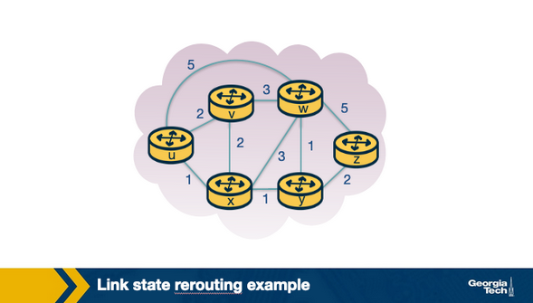

# Lesson 3: Intradomain Routing

This lesson will focus on the *Network Layer* and specific function of this layer: 
**routing within a single administrative domain**.

We will cover multiple types of routing algorithms: 
1. link-state
2. distance-vector

Protocols: 
1. OSPF (Open Shortest Path First)
2. RIP (Routing Information Protocol)

## Routing Algorithms

Assume a connection between hosts using either TCP or UDP.

Each hosts will know the default router (or first hop router). A host will first send 
a packet to the default router.
***What happens after that?***

As a packet is traveling to its destination, each intermediate router is responsible
for forwarding to the next router/hop.

When a packet arrives at a router, the router checks its **forwarding table** to determine
the outgoing link it should forward the packet over.

#### Forwarding

Transferring a packet from an incoming link to an outgoing link (within a single router)

#### Routing

The practice of routers leveraging their protocols, and working together to determine
efficient paths for packets. namely, the path from a source to destination node.

When a router belongs to the same administrative domain, we refer to this as **intradomain**
routing.

When routers belong to different administrative domains, this is known as **interdomain**
routing. 

We will focus on **intradomain routing algorithms** or Interior Gateway Protocols (IGPs)

The major classes of routing algorithms: 
1. Link-state
2. Distance-vector

A graph is used to represent these algorithms. Routers are nodes, links are edges. Each 
edge has a respective cost of travel.

## Quiz 1

***Question 1***

In this lecture, we discuss intradomain routing, where all the nodes and subnets are owned 
and managed by the same organization. (In contrast, interdomain routing is about routing 
between different organizations – such as between two ISPs.) Before we begin talking about 
intradomain routing algorithms, what could the weights on the graph edges represent in 
these diagrams, when we are seeking the least-cost path between two nodes?

Select all that apply:

-  Length of the cable
-  Time delay to traverse the link
-  Monetary cost
-  Business relationships
-  Link capacity
-  Current load on the link

---

***Answer***

-  Length of the cable
-  Time delay to traverse the link
-  Monetary cost
-  Link capacity
-  Current load on the link

---

***Question 2***

A packet is __________ when it is moved from a router’s input link to the
appropriate link. 

Select only 1 answer

-  Routed
-  Forwarded
-  Dropped
-  Acknowledged

---

***Answer***

- Forwarded

---

***Question 3***

Determine which action is network-wide (i.e. involves multiple routers). 

Select only 1 answer:

- Routing
- Forwarding

---

***Answer***

- Routing

---

***Question 4***

Intradomain routing must involves multiple administrative domains. 

- True
- False

---

***Answer***

- False

---

## Link State Routing Algorithm

Also known as the goat: ***Dijkstra's Algorithm***

In link-state algorithms, the link costs and network topology are known to all nodes.
This is possible with broadcasting.

`u`:		source node
`v`:		given node in network
`D(v)`:		the cost of current least cost path from `u` to `v`
`p(v)`: 	the previous node along the current least cost path from `u` to `v`
`c(u,v)`:	cost from `u` directly attached neighbor `v`
`N'`:		the seubset of nodes along the current least cost path from `u` to `v`

#### Initilization Step

Initialize all the currently known least cost paths from `u` to its directly 
attached neighbor.

These costs are known because they are immediate links, 1 hop away.

Nodes > 1 hop away from node `u` are initialized to `infinity` or `MAX_INTEGER`.

Initialize `N'` to include on the source node `u`.

./ImagesLesson3/1.png
./ImagesLesson3/2.png
#### Iterations

The algorithm will look for every destination node `v` in the network.

Choose a node `w` with the least cost path from the previous iteration. We add node `w` into
`N'`

For every neighbor `v` of `w` we update `D(v)` with the new cost, which is either:
- the old cost from `u` to `v` 
- the known least path cost from source node `u` to `w`

Plus the cost from `w` to `v` (*whichever between the two quantities is min*)

The algorithm terminates when finding the shortest path and their costs from the source
node `u` to every other node `v` in the network.

## Link State Routing Algorithm Example

[Course lecture video here](https://gatech.instructure.com/courses/356044/pages/linkstate-routing-algorithm-example?module_item_id=3650216)

Consider a graph shown in the diagram below

0. ***Initialization step***, where we set all **least cost paths** from source node
`u` to it's local neighbors e.g. `v`, `x`, `w`

1. Look at nodes not in `N'` select the node with the lowest cost path
from the previous iteration. 
  - In the current example, this is node `x`

2. Update `D` for all the immediate neighbors of `x`
  - In the current example, this is `v`, `w`, `y`
  - `D(w)` is the minimum between: the cost we had from the previous iteration: `5`
  and the cost from `u` to `x`: `1` + cost from `x` to `w`: `3`
  - The minimum between the two is `4`
  - Update the second row of the table.

**Loop 1 and 2**

This algorithm would terminate on the 5th iteration with the following memory 
structure:

## Link State Routing Algorithm Computational Complexity

***How many computations are required to find the least-cost paths from
source to all destinations in the network***

The first iteration requires traversal of all nodes in the network.
As the algorithm continues, this number decreases `(n - 1)`.

The total number of iterations is `n(n + 1) / 2`. 

Which results in a Big O complexity of `O(n^2)`.

## Quiz 2 

***Question 1***

In the previous example, node u was the source node, and distances 
were calculated from u to each other node. Consider the same example, 
but let x be the source node. Notice that node x has more direct 
neighbors than u does. Suppose x is executing the link-state algorithm 
as discussed, and has just finished the initialization step. 

Which of the following statements are true?

- Node x will execute fewer iterations than node u did, as there 
were fewer “infinity distance nodes” after initialization.

- Node x will execute the same number of iterations that node u did, 
as the number of immediate neighbors has no impact on the number of 
iterations the algorithm requires.

- Node x will execute more iterations than node u did, as there are 
more immediate neighbors to consider.

---

***Answer***

Node x will execute the same number of iterations that node u did,
as the number of immediate neighbors has no impact on the number 
of iterations the algorithm requires.

**Resoning**

Note that the algorithm continues iterating until

N’ = N – 1

that is, until every node is the graph is in N’. 
As there are 6 nodes, there will always be 5 
iterations after initialization.

---

***Question 2***

Upon termination of Dijkstra’s algorithm, all nodes in a network areawareaware of the entire network topology. 

- True
- False

***Answer***

- False

---

***Question 3***

Consider the following topology. Let b be the source node. Use Dijkstra’s 
algorithm to determine the cost of the least cost path from node b to all 
other nodes in the network upon termination of the algorithm.

What are the costs to each node? `a, c, d, e, f`?

***Answer***

`3, 4, 6, 8, 9`

---

## Distance Vector Routing

Iterative Algorithm, asynchronous, and distributive

Based on the Bellman Ford Algorithm. 
- Each node maintains its own distance Vector
- With the costs to reach every other node in the network
- Nodes will send their distance vector to its immediate neighbors
- Neighboring nodes receive these updates and use them to update their 
own distance vectors

Each node `x` updates its own distance vector using the Bellman Ford Equation: 

`Dx(y)  =  minv{  c(x,v)  }  +  Dv(y)`

For each destination node `y` in the network.

Node `x` would compute the least cost to reach destination node `y` by considering
the options that it has to reach `y` through each of its neighbors.

Node `x` considers the cost to reach neighbor `v` and then adds the least 
cost from neighbor `v` to the final destination `y`.

It calculates the quantity over all neighbors `v` and it chooses the min.

## Distance Vector Routing Algorithm Example

Consider the network: 

0. Each node has its own view of the network, stored in a distance vector table.
  - Every node's distance vector is the distance to each of it's neighbors.

1. In the next iteration, the nodes exchange their distance vectors and update
their view of the network.
  - Each node computes their distance vector using the Bellman Ford Equation
  for every distance node `y` and `z` (in the case of node `x`).

`dx(y)  =  min{ c(x,y) + dy(y), c(x,z) + dz(y) }  =  min{ 2+0, 7+1 }  =  2`

`dx(z)  =  min{ c(x,y) + dy(z), c(x,z) + dz(z) }  =  min{ 2+1, 7+0 }  =  3`

2. Node `x` will receive the distance vectors from `y` and `z` from 
the first iteration. It will update its view of the network topoology.
  - Node `y` and `z` will repeat this as well.

3. In the thrid iteration, the nodes process the distance vectors received
from the previous iteration (if they have changed) and they repear the
calculations.

Finally, each node has its own correct routing table.

Because the algorithm has completed, no further updates are sent from the nodes.
The nodes are waiting until there is a change to the link costs in the graph.

## Link Cost Changes and Failures in Distance Vector Algorithm (Count to Infinity Problem)

We will cover an example when a node identifies that a link which connecting
it to one of its neighbors has changed. Consider the topology:

In this example, the link cost from node `x` to node `y` goes from `4` go `1`.
Time is represented as `t`

1. `t0` - `y` detects that the cost to `x` has changed. It updates its
distance vector and sends the update to the neighbors.

2. `t1` - `z` receives the update from `y`. `z` thinks it can reach `x`
through `y` with cost of `2`, so it sends the new distance vector to it's 
neighbors.

3. `t2` - `y` receives the update from `z`. `y` does not change there
distance vector, so it does not send an update.

In this example, the node cost propagated throughout the network quickly and 
effectively.

Consider another scenario: 

1. `t0` - `y` detects cost change. Update its distance vector table. 
Node `y` thinks it can reach `x` through `z` with cost of `5 + 1 = 6`

2. `t1` - here comes a routing loop. `z` thinks it can reach `x` through `y`
and `y` thinks it can reach `x` through `z`. This loop causes the 
packets to bounce back and forth between `y` and `z` until their tables change.

3. Nodes `z` and `y` keep updating each other about their new costs to 
reach `x`.

**Example Computation**

`y` computes a new cost of `6` and then informs `z`. Then `z` computes its new
cost to be `7`, which informs `y`... looping...

In this example, it will loop for 44 iterations. Where `z` will compute a cost
larger than 50, where it will prefer to reach `x` directly than through `y`.

This looping problem is known as the **count-to-infinity** problem.

In this scenario, we note that there was a decrease in the link cost which propagated quickly among the nodes in only a few iterations.

***THIS IS IMPORTANT***

## Poison Reverse

A solution to the *count-to-infinity* problem is as known as **poison reverse**.
Since `z` reaches `x` though `y`, `z` will advertise this to `y` that then
distance to `x` is `infinity`: ` Dz(x) = infinity`.

However `z` knows that this is not true. `z` has "lied" to y. As long as 
`z` *knows* it can reach `x` by going through `y`. 

`y` assumes that `z` has no path to `x` except through itself. Thus, it will
never send packets to `x` through `z`.

So `z` ***poisons*** the path from `z` to `y`

This solution solves the problem for 2 nodes, however, it is not going to 
resolve the least-cost-path for all 3 nodes. One of the nodes will remain **poisoned**.

## Quiz 3 

***Question 1***

Select the words that can be used to describe the ***distance vector algorithm***.
Group of answer choices:

- Distributed
- Centralized
- Iterative
- Asynchronous
- Synchronous
- Non-terminating

***Answer***

- Distributed
- Iterative
- Asynchronous

---

***Question 2***

Determine which of the following can cause the ***count-to-infinity*** problem.

- Poison reversing
- Routing Loops
- Hot potato routing
- Dropped packets

***Answer***

- Routing Loops

---

## Distance Vector Routing Protocol Example: RIP

The **Routing Information Protocol (RIP)** is based on Distance Vector Protocol.

The first version was release as part of BSD version of Unix. It uses
a hop count metric:
- Shortest Distance
- Lowest Cost
- Load Balanced Path 

Routing updates are exchanged through neighbors periodically. In the form
of RIP response messages instead of Distance Vectors as in DVP.

These messages are called RIP advertisements, which contain information about
sender's distances to destination subnets.

Consider this simple example of RIP, `w, x, y, z` denote subnet masks.

Each router maintains a ***routing table*** which contains: 
- its own *distance vector*
- the router's *forwarding table*

Each *routing table* contains:
- Destination Subnet 
- Identification of the next router along the shortest path to the destination 
- The number of hops to get to the destination along the shortest path 

A routing table will have one row for each subnet in the **AS (Autonomous System)**

In our example, the table will indicate that it will send a datagram from 
router `D` to destination subnet `w`. The datagram should first be forwarded to 
neighbor router `A`

The table also indicates that destination subnet `w` is 2 hops away on the 
shortest path.

If router `D` receives from router `A`, the advertisement (which is the routing
table information from router `A`) will be merged within `D`'s routing table 

As routers update their routing tables, they advertise these updates to the 
rest of the network. These changes propagate throughout the topology until the 
network converges with shortest paths. These remain until link values drop or change.

[More information on RIP on the slide](https://gatech.instructure.com/courses/356044/pages/distance-vector-routing-protocol-example-rip?module_item_id=3650232)
## Link State Routing Protocol Example: OSPF 

**OSPF: Open Shortest Path First** is a routing protocol that uses *link state 
routing algorithm* to find the best path. This was an advancement to the RIP Protocol
designed for upper tier ISPs.

Improvements over RIP:
- Authentication of messages exchanged between routers
- Option to use multiple same cost paths 
- Support for hierarchy within a single routing domain 

**Hierarchy:** OSPF Autonomous System can be configured with hierarchies. Each
area manages it's own OSPF link state routing algorithm where each router in the 
area broadcasts its link-state to all other routers in the area. 

Within each area, one or more area border routers are responsible for routing 
packets outside the area/region.

One OSPF area in the **AS** is configured to be the *backbone* area. The purpose 
of the **Backbone Area** is to route traffic between other areas in the *AS*.

Packets traveling between areas much be sent through an **area border router**, 
through the **backbone area**, then to boarder router within the destination area 
before reaching its final destination node.

**Operation:**
- A graph of the entire **AS** is contracted
- Each router assumes itself as root node.
  - Each router computes the shortest path tree to all subnets (Djikstra's 
  Algorithm is ran locally)
- *(Link costs have been set by network administrators beforehand)*
- Whenever there is an update to a Link's cost, the router broadcasts routing
information to all other routers in the *AS*
- A link's state is also periodically broadcaster without updates to its costs.

**Link State Advertisements:** 
- Every router within the **Domain List** operates on OSPF using 
**LSAs: Link State Advertisements**.
- LSA communicates the local routing topology (internal data structure) to 
other local routers in the same OSPF area.

LSA is used for building a **link state database** which contains all link states.

This database is flooded to every router in the domain which helps to form a 
consistent network topology. And change in links require updates to the LSA.

**Refresh Rate for LSAs:** 
- OSPF normal refresh rate for LSAs is ~30 minutes
- IF a new link is added before the refresh, the routers connected initiate 
**LSA Flooding**
- Routers can receive multiple copies of refreshes/changes
- Routers store only the first LSA change, the rest are marked duplicate.

## Processing OSPF Messages in the Router 

The router has route processors and interface cards that receive data packets
which are forwarded via a switching fabric

1. The LS update packets which have LSAs from neighboring routers reach the 
current router's OSPF (*the route processor*). When the LS updates are received 
from each router, the topology is updated and stored in the link-state database.
2. Using information from the link state database, the current router calculates 
the shortest path using the Shortest Path First (SPF) Algortithm which is forwarded
to the Forwarding Information Base (FIB)
3. The information in the FIB us used when a data packets arrives at the 
interface card of the current router. The FIB determines which node the **next 
hop is**. The packet is forwarded to the outgoing interface card to send data.

- **T1** Processing tasks begin when it receives an LS update packet.
- For every LSA unpacked from the update packet, the OSPF checks if it is new 
or duplucate LSA.
- This is done by looking up the information in the **link state  database**
and checking for sequence numbers of the LSA to matching LSA instances 
in the database.
- For every new LSA, the database is updated. 
- **T2** SPF calculations are *scheduled* when an LSA is added to the database.
- **T3** The calculation determines which interface the LSA needs to be flooded
out of
- **T4** When all LSAs are processed from an LS packet, the LSAs are prepared
and flooded out as an LS Update Packet to the next router.
- **T5/T6** Then the actual eecution of SPF calculation within the router is 
performed.
- SPF calculations are CPU intensive. They are performed over a period of time,
typically when LSAs are changed to offset CPU costs
- **T7** After the SPF calculation is complete, the FIB is updated.

## Quiz 4 

***Question 1***

Dijkstra’s algorithm is a __ 1 __ routing algorithm, 
which is also referred to as a __ 2 __ algorithm.

1. 
- Decentralized
- Global

2. 
- Link State
- Vector Distance

***Answer***

- Global 
- Link State

---

***Question 2***

The Bellman Ford equation is used by the ______________ algorithm.

- Link State
- Distance Vector

***Answer***

- Distance Vector

---

***Question 3***

Select all statements that correctly complete the sentence.

The Routing Information Protocol (RIP) is an example of ______________. 

- a link-state algorithm
- a distance vector algorithm
- poison reverse
- an interdomain routing algorithm.
- an intradomain routing algorithm

***Answer***

- a distance vector algorithm 
- an intradomain routing algorithm

---

## Hot Potato Routing 

Routers in large networks rely on both *inter* and *intra* domain routing 
protocols to route traffic.

Intradomain routing is used to find the best path to route traffic within 
the network. 

When a packet's destination is outside the network, it will approach an **egress 
point** which is where data leaves a network. There can be mulitple **egress 
points** within a singular network. There may be muliple euqual distance 
**egress points** to route traffic through.

**Hot Potato Routing** is a pactice of choosing a path in the network based on 
the closest point of intradomain path cost (IGP: Interior Gateway Protocol cost)

The example diagram depicts a network located in Dallas TX, the router 
needs to forward traffic to an arbitrary destination: (SF, NY). 

We assume that both egress points offer BGP (Border Gateway Protocol) path costs, 
so are equally good egress points. 

In this case, the router has multiple egress points. 

We see that the IGP path cost for SF is 9, whil the path cost for NY is 10.

The router uses hot potator oruting to choose to send traffic to destination via SF.

### Why Hot Potato Routing? 

It simplifies computations for the routers if they are aware of IGP costs. 

It allows for paths to remain consistent because packets will choose the same 
egress point until IGP cost changes/updates.

Reduces network's recourse consumption by getting traffic out ASAP.

## Quiz 5 

***Question 1***

There may be multiple egress points from an administrative domain to an external destination.

- True
- False

***Answer***

True

---

***Question 2*** 

Hot potato routing always selects the egress point that is geographically closest to the ingress point.

- True
- False

***Answer***

False

***Explanation***

Hot potato routing is a technique/practice of choosing a path within the network, by choosing the closest egress point based on intradomain path cost (Interior Gateway Protocol/IGP cost).

## Optional Reading: An Example Traffic Engineering Framework

In this section we will see an example traffic engineering framework. It involves three main components: measure, model and control as shown in the below figure.

Traffic engineering

 

As a first step, the network operator measures the topology of the network and traffic demands. The next step involves predicting the effect of change in IGP parameters on the traffic flow to evaluate different link weights. Finally, once the weights are decided, the new values are updated on the routers.

 

Measure: The efficient assignment of link weights depends on the real time view of the network state which includes:

     - the operational routers and links,

    - the link capacity and IGP parameters configuration.

The status of the network elements can be obtained using Simple Network Management Protocol (SNMP) polling or via SNMP traps. The link capacity and the IGP parameters can be gathered from the configuration data of the routers or external databases that enable the provisioning of the network elements. Furthermore, a software router could act as an IGP route monitor by participating in OSPF/IS-IS with operational routers and reporting real time topology information. 

In addition to the current network state, the network operator also requires an estimate of the traffic in the network that can be acquired either by prior history or by using the following measurement techniques: 

    Directly from the SNMP Management Information Bases (MIBs) 
    By combining packet-level measurements at the network edge using the information in routing tables 
    Network tomography which involves observing the aggregate load on the links along with the routing data 
    Direct observation of the traffic using new packet sampling techniques 

 

Model: This involves predicting the traffic flow through the network based on the IGP configuration. The best path between two routers is selected by calculating the shortest path between them when all the links belong to the same OSPF/IS-IS area. In case of large networks consisting of multiple OSPF/IS-IS areas, the path selection among routers in different areas is dependent on the summary information passed across the area boundaries. If there are multiple shortest paths between two routers, it is leveraged for load balancing by splitting the traffic almost evenly over these paths. 

The routing model thus aims to compute a set of paths between each pair of routers, with each path representing the fraction of traffic that passes through each link. The volume of traffic on a link can now be estimated by combining the output of the routing model and the estimated traffic demands. 

 

Control: The new link weights are applied on the affected routers by connecting to the router using telnet or ssh. The exact commands are dependent on the operating systems of the router. These updates may be automated or done manually depending on the size of the network. 

Once a router receives a weight change, it updates its link-state database and floods the newly updated value to the entire network. On receiving the updated value, each router in turn updates its link-state database, recomputes the shortest paths and updates affected entries in its forwarding table.  Similar to when there is a topology change or a failure, this involves a transition period where there is a slightly inconsistent view of the shortest path for few destinations. Although the convergence after a weight change is faster than a failure scenario (as there is delay in detecting a failure), it still involves a transient period in the network. Hence, understandably, changing the link weights is not done frequently and only done in scenarios where there is new hardware, equipment failures or changes in traffic demands.

 
References:

Traffic Engineering With Traditional IP Routing Protocols

https://www.cs.princeton.edu/~jrex/teaching/spring2005/reading/fortz02.pdf

