# AS Relationships and Intradomain Routing

***How does data travel between networks?***

BGP provides the glue that holds networks together. Exchange Points 
also allow for two networks to directly exchange traffic

# Autonomous Systems and Internet Interconnection

## The Internet as an Ecosystem

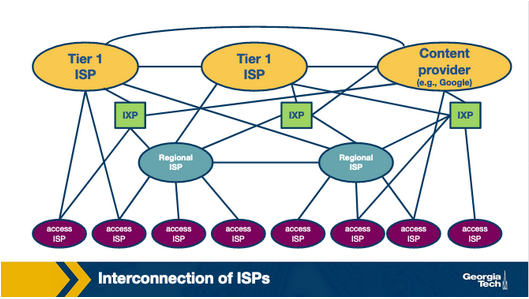

The internet is complex build with many networks. The major players in the 
system are: 
- Internet Service Providers (ISPs)
- Internet Exchange Points (IXPs)
- Content Delivery Networks (CDNs)

### ISPs

There are 3 types of ISPs: 
- Tier 3: Access ISPs
- Tier 2: Regional ISPs
- Tier 1: Global ISPs

There are around a dozen (12) Tier 1 ISPs which server as the "backbone" network 
smaller ISPs connect to. 

*Examples*: AT&T, NTT, Level3, Sprint

Connection Hierarchy/What do ISPs connect to: 
- Global ---> Global
- Regional ---> Global 
- Access ---> Regional 

### Competition and Cooperation Among Networks

The Internet has a hierarchical structure. Smaller networks connect to larger ones.
Large ISPs are a provider for smaller networks. 

This leads to competition at each level of the hierarchy. Each ISP Tier competes
with other ISPs within the same Tier. 

ISPs also need to cooperate to ensure they provide global connectivity and serve 
their customers.

ISPs leverage multiple interconnection strategies depending on the number of 
customers.

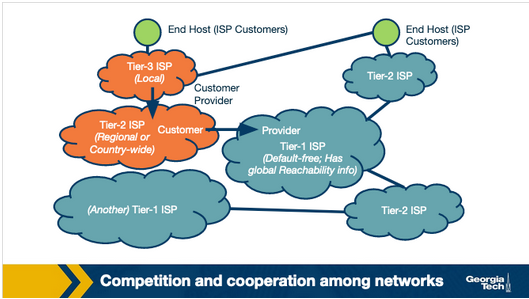

#### More Interconnection Options in the Internet Ecosystem

ISPs may also connect through **Points of Presence (PoPs), multi-homing, and peering**.

PoPs are one or more routers in a provider's network that a customer can use to 
connect with that provider. 

An ISP may choose to mulit-home by connecting to one 
or more provider networks. 

2 ISPs may choose to connect through a settlement free agreement where neither
networks pays the other to directly send traffic to another

#### The Internet Topology: Hierarchical vs Flat

In the early days of the internet, the strictness of the Hierarchy was more 
*pronounced*. Today, IXPs and CDNs have caused the structure to begin to morph 
from *Hierarchical* to *Flat*.

#### Autonomous Systems

Each networks discussed: ISPs CDNs, may operate as an **Autonomous System (AS)**

**Autonomous System (AS)**: a group of routers (including the links among them)
that operate under the same Administrative Authority.

*Example:* an ISP may operate as a single AS or multiple ASes. Each AS implements
its own policies, traffic engineering decisions, interconnection strategies, and 
determines how traffic leaves and enters the network.

#### Protocols for routing traffic between/within ASes

The border routers of ASes use Border Gateway Protocol (BGP) to exchange 
routing information with one another. In contrast, the Interior Gateway Protocol 
(IGPs) operate within an AS, and they are focused on "optimizing a path metric" 
within a network. Example IGPs:
- Open Shortest Paths First (OSPF)
- Intermediate System - Intermediate System (IS-IS)
- Routing Information protocol (RIP)
- E-IGRP

## Quiz 1 

### Question 1 

The internet topology has been evolving from a _________ 
structure into a _________ structure. 

- Hierarchical, flat
- Flat, hierarchical

### Answer 

- Hierarchical, Flat

### Question 2 

An Autonomous System is a group of routers that operate under 
_________ administrative _________. 

- Multiple, authorities
- The same, authority

### Answer 

- The same, authority

### Question 3 

Autonomous Systems implement their own set of policies, make their own 
traffic engineering decisions and interconnection strategies, and 
determine how traffic leaves and enters the network. 

- True
- False

### Answer 

- True

### Question 4 

The BGP protocol is used within an AS and focuses on optimizing a 
path metric within the network. Examples of BGP protocols are 
Open Shortest Paths First (OSPF) and Routing Information Protocol. 

- True
- False

### Answer 

- False

# AS Business Relationships

1. **Provider-Customer Relationship (transit)**
    - Based on financial settlement which determines how much the customer 
    will pay the provider
    - The provider forwards the customer's traffic to destinations found in 
    the provider's routing tables.

2. Peering Relationship 
    - Two ASes share access to a subnet of each other's routing tables.
    - The routes shared between peers are restricted to the respective customer 
    - The agreement holds as long as the traffic exchanged between the two peers is 
    not highly asymmetric.
    - Peering Relationships can form between Tier-1 ISPs as well as Tier-2 
    Tier-3
      - The peering relationships need to be within the same Tier 
      - Or be roughly the same size and have roughly the same amount of traffic
      - Otherwise, larger ISPs would lack incentive to enter peering relationships

### How do Providers Charge Customers 

While peering allows networks to have their traffic forwarded without cost, 
provider ASes have financial incentives to forward as much of their customer's 
traffic as possible. 

One major factor for determining a provider's revenue is the data rate of an 
interconnection. Changes can be: 
1. Based on fixed price
    - Customer is given the bandwidth used within a predefined range
2. Based on bandwidth used 
    - Bandwidth is calculated based on periodic measurements
      - 5 minute intervals  
    - Provider changes be taking the 95th percentile

# BGP Routing Policies: Importing and Exporting Routes 

We already talked about AS business relationships. AS business relationships drive 
AS's routing policies and influence which routes an AS needs to import or export. 

### Exporting Routes 

Deciding which routes to export is an important decision with business and 
financial implications. Advertising a route for a destination to neighboring 
AS means that this route may be selected by an AS and traffic will begin to 
flow.

Therefore, deciding which routes to advertise is a policy decision, which 
is implemented through route filters. **Route Filters** are rules that 
determine which routes an AS's routers should advertise to the routers of the 
neighboring ASes.

- **Routes learned from customers**
  - These are routes `X` receives as advertisements from its customers 
  - Since provider `x` is getting paid to provide reachability to customer AS 
  it makes sense for `X` wants to advertise these customers routes 
  to neighboring ASes as possible
- **Routes learned from providers**
  - Routes `X` receives as advertisements from its providers.
  - Advertising such routes is not financially viable for `X` to carry
  traffic for its provider's routes.
  - Routes are withheld from `X`'s peers and `X`'s other providers. But we 
  advertise to `X`'s customers
- **Routes learned from peers**
  - Routes that `X` receives as advertisements from its peers
  - It does not make sense for `X` to advertise to provider `A` the routes 
  it receives from provider `B`. 

### Importing Routes 

ASes are selective about which routes to Import.

Decisions based on which neighboring AS advertises them and the type of business 
relationship established. 

AS receives route advertisements from its customers, providers, and peers.

When AS receives multiple route advertisements towards the same destination from 
multiple ASes, it needs to rank the routes before selecting which one to import.

In precedence order: 
- customer routes
- peer routes 
- provider routes 

1. AS wants to ensure that routes towards customers do not traverse other ASes 
generating unnecessary costs

2. AS uses routes learned from peer since these are usually "free" (with a 
peering agreement)

3. AS resorts to importing routes learned from providers only when necessary 
for connectivity since these add costs

## Quiz 2 

### Question 1 

In a peering relationship, the traffic exchanged between the two peers must 
be highly asymmetric so that there is enough incentive for both parties to 
peer with each other. 

- True
- False

### Answer 

- False

### Question 2 

A customer-provider relationship between ASes is based on a financial settlement, 
which determines how much the customer will pay the provider. The provider takes 
care of connecting the customer network with destinations found in the provider's 
routing table. The customer pays regardless of the direction of the traffic.  

- True
- False

### Answer 

- True

### Question 3 

There is no incentive for smaller ISPs to peer with each other. 

- True
- False

### Answer 

- False

### Question 4 

Provider ASes have a financial incentive to forward as much of their 
customers’ traffic as possible. 

- True
- False

### Answer 

- True 

### Question 5 

Select the correct order for an AS to import its routes based on their incentive. 
(Select one)

- Routes learned from: customers -> providers -> peers
- Routes learned from: customers -> peers -> providers
- Routes learned from: peers -> customers -> providers
- Routes learned from: peers -> providers -> customers
- Routes learned from: providers -> customers -> peers
- Routes learned from: providers -> peers -> customers

### Answer 

- Routes learned from: customers -> peers -> providers

# BGP and Design Goals 

We talked about Importing and Exporting routes. Now we will learn about default 
routing protocol: Border Gateway Protocol (BGP)

### Scalability

As the size of the internet grows, ASes grow in size and numbers as well. 
The number of prefixes in routing tables, network churn, and BGP traffic 
exchanged between routers all increases over time. 

Design goal of BGP is to manage the complications of this growth while achieving 
convergence in reasonable timescales and providing loop-free paths.

### Express Routing Policies 

BGP has defined route attributes that allow ASes to implement policies (which 
routes to import and export) through route filtering and ranking. 

Each ES routing decisions can be kept confidential

Each AS can implement them independently 

### Allow Cooperation Among ASes 

Each AS can still make local decisions (which routes to import and export)
while keeping these decisions confidential from other ASes. 

### Security 

Original design goals for BGP did not consider security. 

As size and complexity of the internet demands security measures to be in-place.
We need: 
- Protection and detection of malicious attacks 
- Misconfiguration safeguards 
- Fault tolerance

Vulnerabilities still cause routing disruptions and connectivity issues for: 
- individual hosts
- networks 
- entire countries 

There are several efforts to increase security: 
- S-BGP
- Additional infrastructure
  - registries to maintain up-to-date information about ASes own which prefix ASes
- Public Keys for ASes
- and more 

There is extensive research and development in machine learning based approaches 
and systems. These solutions are not widely deployed/adopted. 

It is difficult to transition to new protocols with lack of incentives.

# BGP Basic

A pair of routes known as **BGP Peers** exchange routing information over a semi-
permanent TCP port connection called a ***BGP session***.

In order to begin a ***BGP Session*** a router will send an *OPEN* message 
to another router. Then the sending and receiving routers will send each other 
announcements from their routing tables. 

The time it takes to exchange information varies: seconds to minutes. 

A BGP Session between a pair of routers in different ASes is called: ***external 
BGP (eBGP)*** sessions. A BGP session between routers that belong to the same 
AS is called an ***internal BGP (iBGP)*** session. 

In the following diagram, we see three different ASes with have both iBGP and 
eBGP between their border routers.

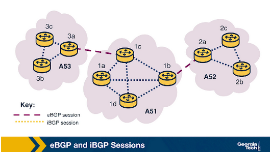

**BGP Messages:** after BGP peer establish a session, they can exchange 
BGP messages to provide reachability information and enforce routing policies 
There are two types: 

1. the **UPDATE** message contains information about the routes that have 
changed since the previous update. 
  - ***Announcements*** are messages that advertise new routes and updates 
  to existing routes. 
  - ***Withdraws*** are messages that announce that a route is no longer 
  available. 
    - Removal could be due to some failure or change in a policy.

2. The **KEEPALIVE** message are exchanged between peers to keep a current 
session alive

### BGP Prefix reachability

In BGP destinations are represented by IP prefixes. Each prefix represents 
a subnet or a collection of subnets that an AS can reach. Gateway routers 
running **eBGP** advertise the IP prefix they can reach according to the 
AS's specific export policy to routers in the neighboring ASes.

Using separate **iBGP** sessions, the gateway routers disseminate these routes 
for external destinations ot other internal routers according to the AS's 
import policy 

Internal routers run **iBGP** to propagate the external routes to other internal 
**iBGP** speaking routers.

### Path Attributes and BGP Routers 

In additional to reachable IP prefix fields, advertised **BGP Routers** consist 
of several **BGP Attributes** Two main ones are: 

#### ASPATH 

Each AS is identified by its **Autonomous System Number (ASN)** As an announcement 
passes through various ASes, their identifiers are included in the **ASPATH** 
attribute. This attribute prevents **loops** and is used to choose between multiple 
routes to the same destination, the route with shortest path. 

#### NEXT HOP 

This attribute refers to the next-hop router's IP Address along with the path 
towards the destination.

Internal Routers use the field to store the IP address of the border router. 

Internal BGP routers will forward all traffic bound for external destinations 
through the border router.

*Example:* suppose there is more than one path to the same external destination.
NEXT HOP allows the internal router to store in the forwarding table the best 
path according to the AS routing policy.

# iBGP and eBGP 

Both protocols disseminate routes for external destinations.
- eBGP 
  - For sessions that are between border routers of neighboring advertisements
- iBGP 
  - For sessions between internal routers of the same AS 

eBGP speaking routers learn routes to external prefixes and disseminate them 
to all routers within the AS. dissemination is happening with iBGP sessions.
Illustrated with figure: 

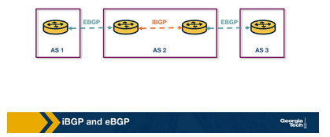

Dissemination of routes within AS is done by establishing a *full mesh* of 
iBGP sessions between internal routers. Each eBGP speaking router has an iBGP 
session with every other BGP router within the AS to send updates about the routes 
it learns over eBGP protocols. 

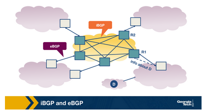

iBGP is not another IGP-like protocol (like RIP and OSPF). IGP-like protocols 
are used to establish paths between the internal routers of an AS based on 
specific sosts within the AS. 

Conversely, iBGP is only used to disseminate external routes within the AS.

## Quiz 4 

### Question 1 

What is the difference between iBGP and eBGP? 

### Answer

Both flavors (iBGP and eBGP) take care of disseminating *external* routes.
An eBGP session is established between two border routers that belong to 
different ASes. An iBGP session is established between routers that belong 
to the same AS. Once a router hears about a route that is learned through 
eBGP, then it disseminates that route to other internal routers in the same 
AS, using iBGP.

### Question 2 

What is the difference between iBGP and IGP? 

### Answer 

IGP-like protocols are used to establish paths between the internal routers 
of an AS based on specific costs within the AS. In contrast, iBGP is only 
used to disseminate external routes within the AS.

# BGP Decision Process: Selecting Routes at a Router 

ASes are operated and managed by different AS authorities. They can operate with 
different business goals and network conditions. they manage their BGP policies 
independently.

Despite all these differences, Routers follow the same processes to select routes.

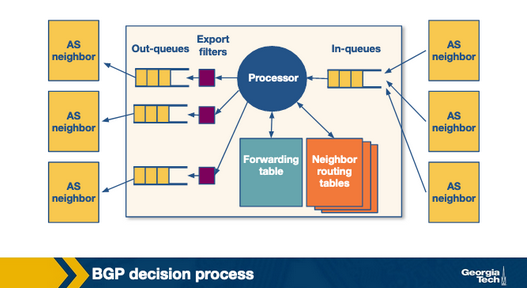

1. A router receives incoming BGP messages and processes them.

2. When a router receives an advertisement, it applied the import policies 
to exclude routes from further consideration. 

3. Then the router implements the decision process to select the best routes that 
reflect the policy in place. 

4. Next, the newly selected routes are installed in the forwarding table. 

5. Finally, the router decides which neighbors to export the route to by applying the export policy.

## The Router's Decision Process 

Suppose a router has multiple advertisements to the same destination.

***How does it choose which route to import?*** 

It goes through the list/options and looks at the attributes of the route 
advertisement. 

If no route policy is in place (RARE) the router chooses the advertisement 
with the lowest hop/distance to the destination. 

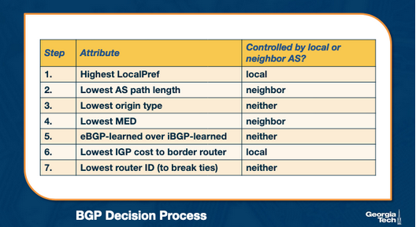

## Influencing the Route Decision Using the Local Pref 

**LocalPref and MED (Multi-Exit Discriminator)** are certain attributes. Let's 
look at how they influence the decision process.

**LocalPref** attribute is used to prefer routes learned through a specific AS 
over other ASes. [exmample here](https://gatech.instructure.com/courses/356044/pages/bgp-decision-process-selecting-routes-at-a-router?module_item_id=3650270)
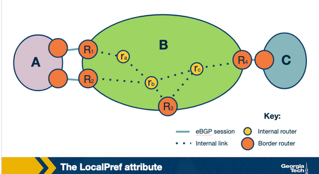

AS ranks the routes it learns by preferring first the routes learned from 
- customers 
- peers 
- providers 

An operator can assign a non-overlapping range of values to the LocalPref 
attribute according to the type of relationship. LocalPref can influence 
which routes are imported.

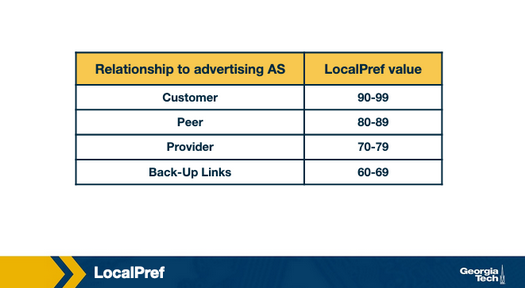

## Influencing the Route Decision using MED Attribute 

**MED (Multi-Exit Discriminator)** value is used by ASes connected by multiple 
links to designate which links are preffered for inbound traffic.

*Example*: 
he network operator of AS B will assign different MED values to its routes advertised to AS A through R1 and different MED values to its routes advertised through R2. As a result of different MED values for the same routes, AS A will be influenced to choose R1 to forward traffic to AS B, if R1 has a lower MED value, and if all other attributes are equal.

AS often **does not have an economic incentive to export routes that it learns 
from providers or peers to other providers or peers.**

An AS can reflect this by tagging routes with a MED value to "staple" the 
type of business relationship. 

AS filters routes with specific MED values before exporting them to other ASes.

Influencing the route exports will also affect how the traffic enters an AS 

**Where/How are the attributes controlled?**

Attributes are set either 

**A.** Locally by the AS (like LocalPref)
**B.** By the neighboring AS (like MED)
**C.** Or by the protocol (like if a route is learned through eBGP or iBGP)

## Quiz 4 

### Question 1 

A router within an AS decides which route to export by first applying import 
policies to exclude routes entirely from further consideration. 

- True
- False

### Answer 

- True

### Question 2 

The LocalPref attribute is used to prefer routes learned through a specific 
AS over other ASes for ________ traffic. 

- Inbound
- Outbound

### Answer 

- Outbound

### Question 3 

Assume that AS X learns of a route to the same destination a via AS Y and AS Z. 
If X prefers to route its traffic through Z due to peering or business, it can 
assign a ________ LocalPref value to routes it learns from Z, and thus using 
LocalPref, AS X can control where traffic exits the AS. 

- Lower
- Higher

### Answer 

- Higher

### Question 4 

The MED (Multi-Exit Discriminator) value is used by ASes connected by multiple links to designate with of those links are preferred for ________ traffic. 

- Inbound
- Outbound

### Answer 

- Inbound

### Question 5 

Assume that AS X prefers routes advertised to AS Y to go through R1 as opposed to R2. For AS Y to be influenced to choose R1 to forward traffic to AS X, R1 must have a _________ MED value, assuming that all other attributes are equal. 

- Lower
- Higher

### Answer 

- Lower

# Challenges with BGP Scalability and Misconfiguration

Misconfiguration errors can result in an excessively large number of updates 
which creates route instability, router processor and memory overload. These
lead to ourages, and router failures. 

ASes can help reduce this by limiting the routing table size and limiting 
the number of route changes.

#### Limiting Route Table Size 

ASes can use filtering to limit route table size.

*Example:* For example, long, specific prefixes can be filtered to encourage 
route aggregation. In addition, routers can limit the number of prefixes 
advertised from a single source on a per-session basis. Some small ASes also 
have the option to configure **default routes** into their forwarding tables. 
ASes can likewise protect other ASes by using route aggregation and 
exporting less specific prefixes where possible.

#### Limiting Route Changes 

ASes can limit the number of route changes by limiting the propagation 
of unstable routes by suing a mechanism known as **Flap Dumping**

To apply this technique, AS will track the number of updates to a specific 
prefix over a certain about of time. if the tracked value reaches a configurable 
value, the AS ca suppress that route until a later time.

Because this can affect reachability, an AS can be strategic about how 
it uses this technique for certain prefixes.

This can be tuned to be **more aggressive by suppressed (lower thresholds)**
while known destinations that require high availability could be allowed 
higher thresholds.

# Peering IXPs

ASes can either peer with one another directly or at 
**Internet Exchange Points (IXPs)**

### What Are IXPs?

Physical infrastructure that provides the ability for ASes to interconnect 
and exchange traffic directly. 

ASes that interconnect at IXp are called participant ASes. 

The Physical infrastructure of an IXP is usually a network of switches 
located either in the same physical location or distributed over a region 
or even at a global scale.

Usually the infrastructure has a fully redundant switching fabric that provides 
fault tolerance. This is usually located in data centers which provide 
reliability, failover power reserves and physical security.

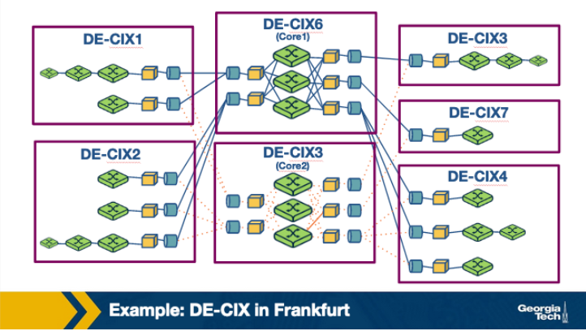

### Why have IXPs become increasingly popular? Why are they important?

1. IXPx are interconnection hubs handling large traffic volumes
    - 50,000 actively used peering links in Eurpoe.
    - Daily traffic can reach size of Tier 1 ISP 

2. An important role in mitigating DDoS attacks 
    - IXPs have become increasingly popular interconnection hubs 
    - They observe the traffic to/from an increasing number of participant ASes 
    - With this data, they can play a role as a **shield** to mitigate DDoS attacks 
    and stop DDoS traffic before it reaches tie participant AS 
  
3. "Real-World" infrastructures with a plethora of research opportunities
    - They serve an important role in the modern internet infrastructure
    - The end-to-end flow of network traffic, and the traffic that traverses these 
    facilities help us understand how the internet landscape is changing.
    - IXPs are an excellent "playground" for multiple applications and Readers and Development
    - EX: **BGP Blackholing for DDoS mitigation ro applications for Software Defined Networking**

4. IXPs are active marketplaces and technology innovation hubs 
    - IXPs are active marketplaces especially in North America and Europe.
    - Provide expanding list of services that go beyond interconnection.
      - Noteably: DDoS mitigation, SDN-based services
    - Transforming into tech innovation hubs

### What are the steps for an AS to peer at an IXP? 

Each participant must have: 

- A public ANS 
- Bring router to the IXP facility and connect one of its ports to the IXP switch 
  - or one of its locations f the IXP has infrastructure in multiple data-centers
- Must be able to run BGP since the exchange of routes across the IXP is via BGP only 
- Must agree to the IXP's General Terms and conditions

Two networks may public ally peer IXP by sing the IXP infrastructure to establish a connection 
for exchanging traffic according to their own requirements and business relationships.

- Each network incurs a one-time cost to establish a circiot from the premise to IXP 
- There are monthly chrages for using a chosen IXP ports 
  - higher port speeds are more expensive 
- Entity that owns and operates the IXp might also charge an annual mebership fee 

### Why do networks choose to peer at IXPs? 

- They keep their local traffic local 
- Lower costs 
- Network performance is improved due to reduced delay 
- Incentives 
  - Critical players in the modern internet "incentivize" other networks to connect at IXPs

### What services are offered at IXPs? 

1. Public Peering 

- This is the most well-known service 
- Two networks use the IXP's network infrastructure to establish a connection to exchange traffic 
based on their bilateral relationships and traffic requirements.
- The cost required to setup this connection are on-time cost, monthly charges are set depending on 
which port is used at the IXPs
- IXPs do not usually charge based on the amount of exchanged volume.
- IXPs do not usually interfere with bilateral relations between participant unless it violates their 
Terms and Conditions: (GTP)

2. Private Peering 

- Most operation IXPs provide private peering.
  - Private interconnects, or PIs 
  - Allows direct traffic exchange between two parties 
  - Doesn't use the IXPs infrastructure 
  - Dedicated link capable of handling high volume, bidirectional, mostly stable

3. Route servers and service level agreements 

- Many IXPs have SLAs: Service Level agreements
- Allows for free use of the IXPs route servers for particiapnts
- Common at Co-Located participant networks. Basically single agreement/BGP sessions

4. Remote peering through resellers 

- 3rd part IXP ports wherever they have infrastructrure connected to the IXP can offer 
a remote connection/service.

5. Mobile peering 

- Scalable solution for interconnection of mobile GPRS/3G Networks

6. DDos Blackholing 

- Few IXPs support customer-triggered blackholing 
- This alleviates teh effects of DDoS attacks against a network 

7. Free value-added services

- Internet Routing Registry (IRR)
- consumer broadband speed tes9
- DNS rot name servers 
- Country code top level domain (ccTLD) name servers
- Distribution of official local time through NTP

## Quiz 4 

### Question 1 

One of the services offered by IXPs is protection against ________ attacks. 

- BGP Hijacking
- DDoS
- Malware
- Phishing

### Answer 

- DDoS

### Question 2 

Participation of an AS in an IXP is free. 

- True
- False

### Answer 

- False

### Question 3 

IXPs handle large volumes of traffic. 

- True
- False

### Answer 

- True

### Question 4 

One of the reasons why networks choose to peer at IXPs is because critical players 
in today’s Internet ecosystem often “incentivize” other networks to connect at IXPs. 

- True
- False

### Answer 

- True

### Question 5 

Private peering PIs do not use the IXP’s public peering infrastructure. 

- True
- False

### Answer 

- True

### Question 6 

IXPs users may use route servers for an additional cost. 

- True
- False

### Answer

- False

# Peering at IXPs: How Does a Route Server Work?

2 ASes exchange traffic through thw switching fabric and utilize a two way BGP session 
called a **bilateral BGP session**. Since many ASes are peering at an IXP, it is 
challenging accommodating the number of BGP sessions. 

It doesn't scale with many participants. To mitigate this, some IXPs operate a route 
server, which helps make the peering more manageable. 

**Route Servers** can do the following: 

- Collect and share routing information from its peers or participants of the IXP to 
the Routing Server 
- Execute its won BGP decision process and re-advertise the resulting information 
to all RS's peer routers 

The figure shows **Multi-lateral BGP Peering Session**

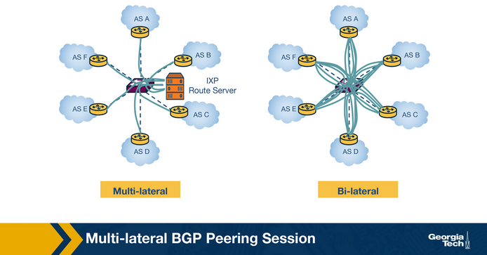

### How does a route server maintain Multi-lateral peering sessions?

A normal routing daemon maintains *Routing Information Base (RIB)* which contains all BGP paths 
that it receives from it's peers - ***the Master RIB***

Route Servers also maintain AS-specific RIBs to keep track of the individual BGP sessions they 
maintain with each participant. 

Router servers maintain two types of router filters: 
- Important filters 
    - are applied to ensure that each member AS only advertises routes that it should

- Export filters 
    - typically trigger by the IXP members to restrict the set of other IXP member ASes that 
receive their routes.

1. AS `X` advertises a prfix `p1` to the Routing Server, which is added to the 
route server's RIB specific to AS `X`

2. The route server uses the peer specific import filter to check whether AS `X` 
is allowed to advertise `p1`. 
  - If it passes the filter, the prefix `p1` is added to the **Master RIB**

3. The route server applied the peer specific export filter to check 
if AS `X` allows for AS `Z` to receive `p1` 
  - If true, it adds that route to the AS `Z` specific RIB 

4. Lastly, the route server advertises `p1` to AS `Z` with AS `X` as the next hop 

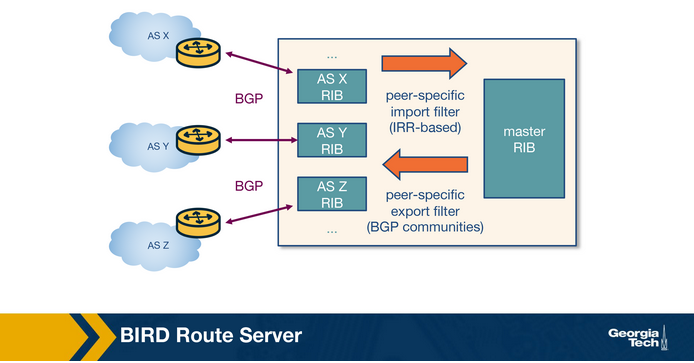

## Quiz 5 

### Question 1 

Route Servers keep track of the BGP sessions they maintain with each participant 
AS through RIBs. 

-True
-False

### Answer 

- True

### Question 2 

_________ filters are applied to ensure that each member AS only advertises routes 
that it should advertise. 

- Import
- Export

### Answer 

- Import

# OPTIONAL: Remote Peering 

### What is remote peering?

Remote peering (RP) is peering at the peering point without the necessary physical presence. The remote peering provider is an entity that sells access to IXPs through their own infrastructure. RP removes the barrier to connecting to IXPs around the world, which in itself can be a more cost-effective solution for localized or regional network operators. 

### How to detect remote peering? 

An interesting problem is how we can tell if an AS is directly connected to an IXP 
or connected through remote peering. Researchers have studied this problem and identified 
methodologies to detect remote peering with high accuracy by performing experiments with 
many IXPs.

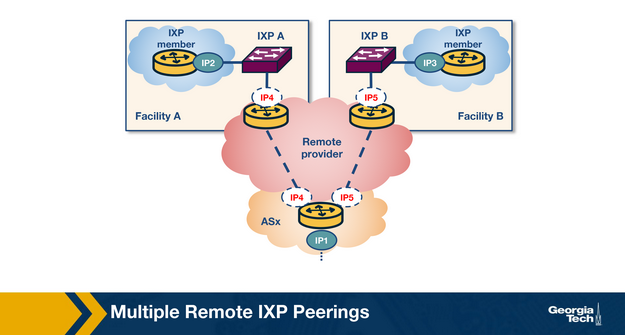

The primary method of identifying remote peering is to measure the round-trip time (RTT) between a vantage point (VP) inside the IXP and the IXP peering interface of a member. However, this method fails to account for the changing landscape of IXPs today and even misinfers latencies of remote members as local and local members as being remote. Instead, a combination of methods can achieve detection of remote peering in a more tractable way, some of which include:

1. Information about the port capacity: One way to find reseller customers is via port capacities. The capacity of the peering port for each IXP member can be obtained through the IXP website or PeeringDB. IXPs offer ASes connectivity to ports with capacity typically between 1 and 100 Gbit/s. But resellers usually offer connectivity through their virtual ports with smaller capacities and lower prices. 
2. Gathering colocation information: An AS needs to be physically present (i.e., actually deploy routing equipment) in at least one colocation facility where the IXP has deployed switching equipment. It should be easy to locate the colocation facilities where both AS and IXPs are colocated, though this information is imperfect in practice.  
3. Multi-IXP router inference: An AS can operate a multi-IXP router, which is a router connected to multiple IXPs to reduce operational costs. Suppose a router is connected to multiple IXPs, and say, we infer the AS as local or remote to one of these IXPs from a previous step. In that case, we can extend the inference to the rest of the involved IXPs based on whether they share colocation facilities or not.
4. Private connectivity with multiple existing AS participants: If an AS has private peers over the same router that connects it to an IXP, and the private peers are physically colocated to the same IXP facilities, it can be inferred that the AS is also local to the IXP. 

# OPTIONAL: BGP Configuration Verification 

Control of BGP configuration is complex and easily misconfigured both at the eBGP configuration level and within an AS, at the iBGP level, where route propagation happens in a full mesh or via “route reflectors”. In addition, configuration languages vary among routing manufacturers and may not be well-designed. Adding to the complexity is the distributed nature of BGP’s implementation.

Two main aspects of persistent routing define BGP correctness. They are path visibility and route validity.

- Path visibility means that route destinations are correctly propagated through the available links in the network.
- Route validity means that the traffic meant for a given destination reaches it.

The router configuration checker, or rcc, is a tool researchers propose that detects BGP configuration faults. rcc uses static analysis to check for correctness before running the configuration on an operational network before deployment. The rcc analyzes router configuration settings and outputs a list of configuration faults. 

In order to analyze a single router or a network-wide BGP configuration, the rcc will first “factor” the configuration to a normalized model by focusing on how the configuration is set to handle route dissemination, route filtering, and route ranking.

Although rcc is designed to be used before running a live BGP configuration, it can be used to analyze the configuration of live systems and potentially detect live faults. While analyzing real-world configurations, it was found that most Path Visibility Faults were the result of:

1. problems with “full mesh” and route reflector configurations in iBGP settings leading to signaling partitions
2. Route reflector cluster problems 
3. Incomplete iBGP sessions where an iBGP session is active on one router but not the other

Route Validity Faults were determined to stem from filtering and dissemination problems. The specific filtering behaviors included legacy filtering policies not being fully removed when changes occur, inconsistent export to peer behavior, inconsistent import policies, undefined references in policy definitions, or non-existent or inadequate filtering. Dissemination problems included unorthodox AS prepending practices and iBGP sessions with “next-hop self”. These issues suggest that routing might be less prone to faults if there were improvements to iBGP protocols when it comes to making updates and scaling.

Because rcc is intended to run prior to deployment, it may help network operators detect issues before they become major problems in a live setting, which often go undetected right away. rcc is implemented as static analysis and does not offer either completeness or soundness; it may generate false positives, and it may not detect all faults.

