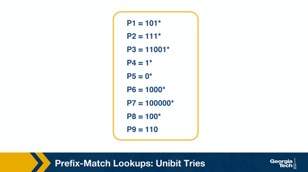

# Lesson 5 Router Design and Algorithms 1 

A critical part of Internet physical infrastructure is the router.

When a packet arrives at an input link, the router looks up the destination
IP address in the forwarding table to determine the output link interface 
to send the packet to.

This task becomes a challenge as networks grow in scale and different applications
on the network require different levels of security and/or service guarantees. 

# What is a Router? What's Inside a Router?

## Basic Components

The main job/function is to implement the forwarding plane functions and control
plane functions

#### Forwarding (switching) Function

The action of transferring a packet from input link interface to the appropriate 
output link interface. This occurs in short timescales (nanoseconds) implemented 
at the hardware level.

**Main Components**: input/output ports, switching fabric, routing processor


#### Input Ports 

1. Physically terminate the incoming links to the router 
2. The data link processing unit decapsulates the packets 
3. The input ports perform the lookup function

#### Switching Fabric 

Moves the packets from input to output ports. Makes connections between input and 
output ports. 3 types:

- Memory
- Bus
- Crossbar

#### Output Ports 

The important function of the **Output Port** is to receive and queue the packets 
from the switching fabric and send to the outgoing link.


### Router Control Plane Function 

Control Plane Function refers to 

- implementing the routing protocols
- maintaining routing tables
- computing the forwarding table.


# Router Architecture 


A router has input links and output links. Its main task is to **switch a packet from 
an input link to the appropriate output link** based on the destination address.

*When a packet arrives at an input link,* the most **time-sensitive** tasks are lookup, 
switching, and scheduling.

#### Lookup 

When a packet arrives at input link, the router looks up the destination IP address 
and determines the output link by consulting the forwarding table (also known as 
**FIB Forwarding Information Base**).

The FIB provides a mapping between destination prefixes and output links.

Routers use the longest prefix matching algorithms to resolve any disambiguates 
(**tie breaker**).

Another type of "lookup" is **Packet Classification** where the lookup is based on the 
destination or source IP address, port and other criteria.

#### Switching 

After lookup, the switching system takes over to transfer the packet from input link to 
output link.

Modern optimized routers use **crossbar switches** for this task. This can cause problems 
for scheduling (matching available inputs to available outputs)

#### Queuing 

After switching, the packet will be queued (if the link is congested). The queue may have 
multiple implementations like FIFO (First in First out), or more complex (weighted queuing 
to increase 'fairness').

### Time Sensitive Tasks 

#### Header Validation and Checksum

The router checks the packet's version umber, decrements TTL, and recalculates header 
checksum.

#### Route Processing 

The router builds their forwarding tables using routing protocols: RIP, OSPF, and BGP.
These protocols are implemented in the routing processors.

#### Protocol Processing 

The routers need to implement the following protocols to implement their functions: 
- Simple Network Management Protocol (SNMP)
  - for a set of counters for remote inspection 
- TCP and UDP
  - for remove communication with the router 
- Internet Control Message Protocol (ICMP)
  - for sending error messages e.g. TTL expired

# Different Types of Switching 

The switching fabric if the "brain" of the router. It performs the main task of 
switching/forwarding packets from input port to an output port.

This can be accomplished via: 

#### Switching via Memory 

Input/Output ports operate as I/O devices in an operating system, controlled by the 
routing processor. 

When an input receives a packet, 

1. It sends an interrupt to the routing processor, and the packet is copied to 
the processor's memory.

2. The processor extracts the destination address and looks up the value in the 
forwarding table to find the output port.

3. The packet is copied into the output port's buffer for processing.


#### Switching via Bus 

The routing processor does not intervene like *Switching via Memory*.

Instead, when the **Input Port** receives a packet, it puts an internal header 
designates the **Output Port** and sends the packet to the **Shared Bus**.
All the **Output Ports** will receive the packet.

Only one packet can cross the Bus at a time. The speed of the Bus is limited
by the speed of the router.


#### Switching via Interconnection Network 

A crossbar switch is an interconnection network that connections `N` **Input Ports**
to `N` **Output Ports** using `2N` **Buses**.

Horizontal buses meet the vertical buses at cross-points controlled by the switching 
fabric.

**Example:** Suppose a packet travels at **Port A** that will be forwarded to **Output Port Y**
the switching fabric closes the cross-point where the two buses intersect so that **Port A**
will need to be forwarded to **Output Port Y**. **Switching Fabric** closes the cross-point 
where the two buses intersect so that **Port A** can send packets onto the bus. and then 
the packet can only be picked up by **Output Port Y**

Crossbar network can carry multiple packets at the same time as long as they are using 
different input and output ports.


# Quiz 1 

### Question 1 

The data plane functions of a traditional router are implemented in _______________. 

- hardware
- software

### Answer 

- Hardware

### Question 2 

The control plane functions of a traditional router are implemented in _______________.

- hardware
- software

### Answer 

- Software

### Question 3 

Which plane operates on a shorter timescale?

- Control
- Data
- Management
- All planes operate on the same timescale.

### Answer 

- Data

### Question 4 

Classify each function as an operation of either the data plane or control plane.

(Specify either <Control Plane> or <Data Plane> for each)

A. Computing paths based on a protocol = \
B. Forwarding packets at Layer 3 = \
C. Switching packets at Layer 2 = \
D. Running protocols to build a routing table = \
E. Running the Spanning Tree protocol = \
F. Decrementing Time To Live (TTL) = \
G. Computing an IP header checksum = \
H. Running a protocol/logic to configure a middle box device for load balancing = \
I. Forwarding packets according to installed rules in a middlebox device =  \

### Answer 

A. Control \
B. Data \
C. Data \
D. Data \
E. Control \
F. Data \
G. Data \
H. Control \
I. Data

### Question 5 

Which, if any, of the following types of switching can send multiple packets across 
the fabric in parallel?  

- Memory
- Bus
- Interconnection Network / Crossbar
- None of the above

### Answer 

- Interconnection Network / Crossbar

# Challenges Routers Face

The fundamental problems:

1. Bandwidth and Internet Population Scaling
    - These are caused by:
      - An increasing number of devices that connect to to the internet 
      - Increasing volumes of network traffic due to new applications
      - New technologies such as optical links that can accommodate higher volumes of traffic 
2. Services at High Speeds 
    - New applications require services such as protection against delays in presence
    of congestion and protection during attacks or failures
    - Offering these services at very high speeds is a challenge for routers.


### Longest Prefix Matching 

Routers need to lookup packet's destination addresses for forwarding purposes.

The increasing number of internet hosts and networks has made this impossible for routers 
to have explicit entries for all possible destinations. 

**Instead, routers group destinations into prefixes.**

This causes a problem of more complex algorithms requires for efficient longest prefix matching.

### Service Differentiation

Routers can offer **Service Differentiation**, meaning that they can support different 
*quality-of-service* to different packets.

This requires routers to classify packets based on more complex criteria, beyond just 
destination.

It may require source or applications/services associated with the packet.

### Switching Limitations 

A fundamental operation of routers is **packet switching**.

A way to deal with *high-speed* traffic is to use **Parallelism** by ***crossbar switching***.

These high speeds introduce additional problems and limitations (e.g. *head of line blocking*)

### Bottlenecks about Services

Providing performance guarantees/quality-of-service at high speeds is hard.

Providing support for new services like measurements or security guarantees is also hard.

Solutions for bottlenecks will be discussed later.

# Prefix-Match Lookups

#### Problem 

As the internet grows in number of Networks, AS numbers, and IP addresses, problems from the 
scalability become more *pronounced*.

One way to mitigate such problems is to **group** multiple IP addresses by prefixes.

### Prefix Notation/Shorthand

#### 1. Dot Decimal 

**Example:**
- 16-bit prefix 
  - `123.234`
- Binary of First Octet
  - `10000100`
- Binary of Second Octet 
  - `11101010`
- Binary prefix of `123.234`
  - `1000010011101010*`

Where `*` indicates wildcard character to say that the remaining bits can be 
anything/trivial/do not matter

#### 2. Slash Notation 
  - Standard notation: A/L 
    - Where A -> Address, L -> Length 

**Example:**
- `132.238.0.0/16`
  - Here, 16 denotes that only the first 16 bits are relevant for prefixing.

#### 3. Masking
  - We can use a mask instead of prefix length 

**Example:**
- The prefix `123.234.0.0/16` can be converted to: `123.234.0.0` with mask `255.255.0.0`


### Why Variable Length Prefixes? 

In early days of the Internet, IP addressing model was based on classes (fixed-length 
prefixes)

IP address space (IPv4) was running out, thus in 1993, the *Classless Internet Domain
Routing (CIDR)* came into effect.

**CIDR** assigns IP addresses using arbitrary length prefixes. CIDR helps decrease 
the router table sizes.

**Problem with CIDR**: longest matching prefix lookup.

### Why do we need [better] Lookup Algorithms?

To forward/switch incoming packets, routers must leverage their forwarding table
The router faces challenges when doing lookups quickly in regards to lookup speed, onboard 
memory, and update time.

The diagram below highlights the "inference" that motivates and impacts the design of prefix 
lookup algorithms for every observation.

1. Measurement studies on network traffic show that there is an increasing amount of 
concurrent flows of traffic. **Caching solutions will not work efficiently**

2. The important element of any lookup is **Lookup Speed**. 
  - A large part of the cost of computation for lookup is **accessing memory**

3. Unstable routing protocol may adversely impact the update time in the table 
  - add, delete, or replace a prefix. 
  - Inefficient routing protocols increase this value up to additional milliseconds

4. Vital trade-off is memory usage. We can use expensive fast memory 
  - which is cache in software, SRAM in hardware. 
  - cheaper/slower solutions are DRAM, SDRAM


# Quiz 2 

### Question 1 

Consider a router with the following forwarding table:

| Preix Match | Output Link |
|-------------- | -------------- |
| 101* | A |
| 111* | B |
| 1100 1* | C |
| Otherwise | D |


Given that the router uses longest prefix matching. Determine the output link 
for packet with given destination IP address. Type the letter of the output link.

1. 11100001 10000000 0001 0001 0111 1001

2. 1111 0001 1111 0000 1010 0001 0111 0111

3. 1010 1010 1010 1010 1010 1010 1010 1010

4. 1100 1001 1000 0000 0001 0001 0111 0111

### Answer

1. B
2. B
3. A
4. C

### Question 2 

Determine the mask for the address 192.168.0.1/24.  

- 255.255.255.0
- 255.255.0.0
- 255.0.0.0
- 192.168.0.24

### Answer 

- 255.255.255.0

# Unibit Tries

The diagram shows a prefix database with 9 prefixes 



**Unibit Trie** is one of the simplest techniques for prefix matching.


#### Explanation 

**Setup:**

Every node has a 0 or 1 pointer.

Starting with the root, `0-pointer` points to a *subtrie* for all prefixes that begin 
with `0`. 

Similarly `1-pointer` points to a subtrie for all prefixes that begin with `1`.

Follow this pattern to allocate all remaining bits in the prefix.

**Prefix Matching:**

Follow the path from the root node down to the trie.

#### Example 


1. Assume we are doing the longest prefix match for `P1=101*` (from our prefix database). 
We start at the root node and trace a `1-pointer` to the right, then a `0-pointer` to the left, 
and then a `1-pointer` to the right.

2. For `P7=100000*`, we start at the root node and trace a `1-pointer` to the right, 
then five `0-pointers` on the left.

These are the steps we follow to perform a prefix match:

1. We begin the search for a longest prefix match by tracing the trie path.
2. We continue the search until we fail (no match or an empty pointer).
3. When our search fails, the last known successful prefix traced in the path is 
our match and our returned value.


Two final notes on the unibit trie:

1. If a prefix is a substring of another prefix, the smaller string is stored in the 
path to the longer (more specific prefix). For example, P4 = 1* is a substring of P2 = 111*, 
and thus P4 is stored inside a node towards the path to P2.

2. One-way branches. There may be nodes that only contain one pointer. 

For example, let’s consider the prefix P3 = 11001. After we match 110 we will be 
expecting to match 01. But in our prefix database, we don’t have any prefixes that 
share more than the first 3 bits with P3. So if we had such nodes represented in our 
trie, we would have nodes with only one pointer. The nodes with only one pointer 
each are called one-way branches. For efficiency, we compress these one-way branches 
to a single text string with 2 bits (shown as node P9).

# Quiz 3 

### Question 1 

Consider the following Unibit trie. Nodes in blue represents stored prefixes.


For each prefix look up, determine the node we return.

1. `0*`
2. `1*`
3. `01*`
4. `00*`
5. `0000*`
6. `00011*`

### Answer 

1. a
2. b
3. c
4. e
5. g
6. h

**Hint:** Recall that we remember the longest prefix matched so far.

# Multibit Tries 

### Why?

While **Unibit Tries** are very efficient and offer advantages like: 
- Fast Lookup 
- Easier updates 

The largest problem with **Unibit Tries** is the number of memory accesses required 
to perform a lookup.

For 32 bit addresses, we can see that looking up the address in a **Unibit Trie** might 
require 32 memory accesses (in the worst case). Assuming 60 nanoseconds of latency, the worst 
case search time would be `1.92` microseconds. This is inefficient. 

Instead, we can implement lookups using a **Stride**. The **Stride** is the number of bits 
we need to check at each step. 

An alternative to **Unibit Tries** are **Multibit Tries**.

**Multibit Tries** are a trie where each node has `2^k` children. Where `k` is 
the next stride.

This can be implemented as **fixed length stride tries** and **variable length stride tries**.

# Prefix Expansion 

Consider prefix: `101*`. This has a length of `3` and a stride length of `2` bits.
If we search in 2-bit lengths, we will miss out on prefixes like `101*`

To combat this, we can use a technique called ***Controlled Prefix Expansion***.

Where we expand a given prefix to more prefixes. Ensure that the expanded prefix is a multiple 
of the chosen stride length. Remove all lengths that are not multiples of the chosen stride length.

We end with a new database of prefixes, which can be larger (in terms of number of prefixes) but 
fewer lengths.

Expansion results in more speed with increase cost of the database size.

The diagram below shows the original database of prefixes 
then shows the translation when considering a stride length of 3.


In the figure, we have expanded our original database of prefixes while considering a stride 
length of three. Initially, we had five different prefix lengths (1, 3, 4, 5, and 6), 
but now we have more prefixes but only two lengths (3 and 6).  

For example, we substitute (expand) `P3 = 11001* with 110010* and 110011*`. 

When we expand our prefixes, there may be a collision, i.e., when an expanded 
prefix collides with an existing prefix. In that case, that expanded prefix 
gets dropped. For example, in the figure, we see that the fourth expansion of 
`P6=1000*` collides with `P7` and thus gets removed.

# Quiz 4 

### Question 1 

Consider the following prefix database.  
```
P1   =>   101*  
P2   =>   0*  
P3   =>   1*  
P4   =>   10101*  
```
Consider expanding each prefix with stride length 3, so that we construct a fixed length multibit trie. 

Which of the following prefixes are associated with P3? Select all that apply.   

- 110*
- 10*
- 100*
- 101*
- 001*
- 011*
- 111*

### Answer 

- 101*
- 100*
- 111*


# Multibit Tries: Fixed Stride 

### Key Points 

1. Every element in a trie represents two pieces of information: a pointer and a prefix value.
2. The prefix search moves ahead with the preset length in n-bits (3 in this case) 
3. When the path is traced by a pointer, we remember the last matched prefix (if any).
4. Our search ends when an empty pointer is met. At that time, we return the last matched 
prefix as our final prefix match.

# Multibit Tries: Variable Stride 

### Why? 

We can examine different number of bits every time.

- We encode the stride of the trie node using a pointer to the node.
- The root node Stats the same (like with Fixed Stride)
- The rightmost node still needs to examine 3 bits because of `P7 `.
- The leftmost node only needs to examine 2 bits because `P3` has 5 bits in total.
We can rewrite the leftmost node as in the figure
- Now we have 4 fewer entries than the fixed stride scheme


### Key Points 


1. Every node can have a different number of bits to be explored.
2. The optimizations to the stride length for each node are all done 
to save trie memory and the least memory accesses.
3. An optimum variable stride is selected by using dynamic programming.

# Quiz 5 

Consider the following prefix database that provides a mapping between nodes 
`(a,b,c,..)` and prefixes `(eg 0*,1*, etc)`.

```
a => 0* 
b => 01000* 
c => 011* 
d => 1* 
e => 100* 
f => 1100* 
g => 1101* 
h => 1110* 
i => 1111*
```

Construct the following variable-stride Multibit trie. Based on the above database, 
fill in the nodes `(eg n1, n2, n3, etc.)` with the corresponding nodes from the database 
`(a, b, c, etc.)`.  If the node does not have a corresponding node in the database, answer 
"none",  without the quotation marks.


| n1  | n2 | n3 |
|-------------- | -------------- | -------------- |
| Item1    | Item1     | Item1     |
| n4  | n5 | n6 |
|-------------- | -------------- | -------------- |
| Item1    | Item1     | Item1     |
| n7  | n8 | n9 |
|-------------- | -------------- | -------------- |
| Item1    | Item1     | Item1     |
| n10  | n11 | n12 |
|-------------- | -------------- | -------------- |
| Item1    | Item1     | Item1     |
| n13  | n14 | n15 |
|-------------- | -------------- | -------------- |
| Item1    | Item1     | Item1     |
| n16  | n17 |
|-------------- | -------------- |
| Item1    | Item1     |

### Answer 

| n1  | n2 | n3 |
|-------------- | -------------- | -------------- |
| none | a | a |
| n4  | n5 | n6 |
|-------------- | -------------- | -------------- |
| d | none | none |
| n7  | n8 | n9 |
|-------------- | -------------- | -------------- |
| none | c | c |
| n10  | n11 | n12 |
|-------------- | -------------- | -------------- |
| e | none | f |
| n13  | n14 | n15 |
|-------------- | -------------- | -------------- |
| g | h | i |
| n16  | n17 |
|-------------- | -------------- |
| b | none |

### Question 2 

A Multibit trie is _____ than a Unibit trie representing the same prefix database 
and requires _____ memory accesses to perform a lookup.

- Taller/Shorter 
- More/Fewer

### Answer 

- Shorter 
- Fewer

### Question 3 

Fixed-length Multibit tries can support an arbitrary number of prefix lengths. 

- True
- False

### Answer 

- False
