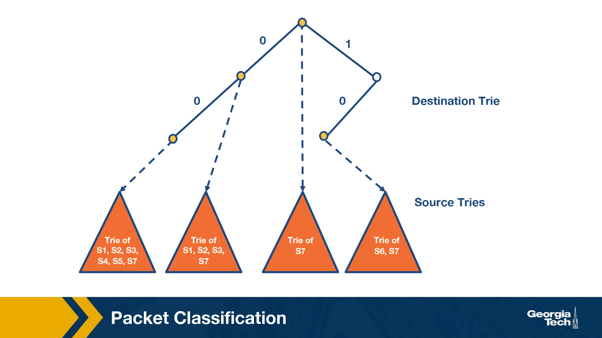
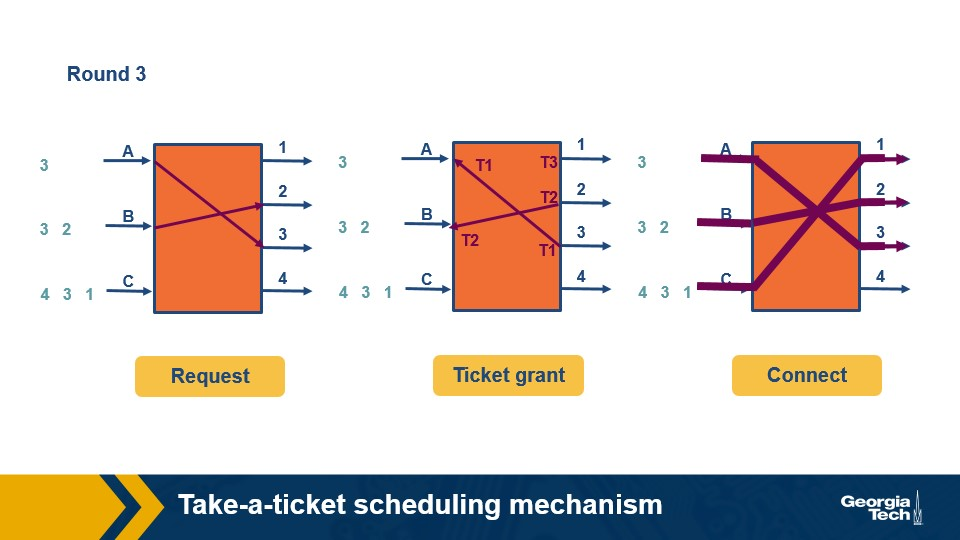
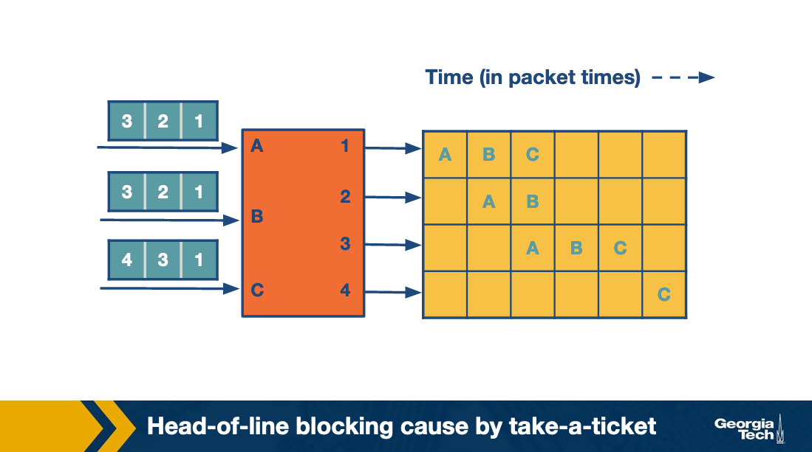

# Lesson 6 Router Design 2 

# Packet Classification

### Why?

Networks require quality-of-service and security guarantees for their traffic.
Packet forwarding based on the longest prefix matching of destination IP address
is insufficient.

Sometimes, longest prefix matching of destination IP address is **NOT ENOUGH**, 
this is where **Packet Classification** comes into play. Where we handle packets
on multiple criteria like 

- TCP Flags
- Source Address 
- and more...

Some variants already exist: 

- Firewalls
  - Routers implement firewalls at the entry and exist points of the network and 
  filter out unwanted traffic, or enforce security policies
- Resource Reservation Protocols
  - DiffServ as been used to reserve bandwidth between a source and destination
- Routing based on Traffic Type
  - Routing based on specific traffic helps avoid delays for time-sensitive
  applications


### Example: Time Sensitive Routing 

The above figure shows an example topology where networks are connected through 
router R. Destinations are shown as S1, S2, X, Y, and D. L1 and L2 denote 
specific connection points for router R. The table shows some examples of 
packet classification rules. The first rule is for routing video traffic from 
S1 to D via L1. The second rule drops all traffic from S2, for example, in 
the scenario that S2 was an experimental site. Finally, the third rule 
reserves 50 Mbps of traffic from prefix X to prefix Y, which is an example 
of a rule for resource reservation.

# Packet Classification: Simple Solutions / Approaches

### Linear Search

Firewall implementations perform linear search of the rules database and 
keep track of best-match rule. 

This solution is reasonable with a small amount of rules. It doesn't scale 
well.

### Caching 

Another solution is to cache results to return the response quickly on 
future searches/queries.

Problems with caching: 
1. Cache-hit rate can be high (80-90%)
  - cache searches are done on **cache-misses**

2. Even with 90% cache hit rate, a slow linear search of the space
is performed to retrieve the data.
  - Assume a cache hit takes 100 ns, while a linear search of 10,000
  rules takes 1,000,000 ns (1 ms). The average search time with 90% 
  cache hit rate is still 0.1 ms 
  - Still somewhat slow

### Passing Labels 

Multiprotocol Label Switching (MPLS) and DiffServ use this technology.

MPLS is useful for traffic engineering. Assume a path is traversable from 
A to B: 
- Before traffic leaves A, the router performs **Packet Classification**
and maps the Web Traffic into MPLS header.
- Intermediate routers apply the label without having to redo **Packet
Classification**

DiffServ follows a similar approach: 
- Applying **Packet Classification** at the edges to mark packets for 
special **quality-of-service**

# Fast Searching Using Set Pruning Tries

Assume a two dimensional rule. We want to classify packets using 
both the source and destination IP addresses.


A solution to this mapping is to construct a **trie** on the destination 
prefixes in the database, for every leaf node at the destination trie
to "hang" source tries 

Trie of Tries.



S1 is denoted by the source prefix of rule R1, S2, of rule R2.
Thus for every destination prefix D in the destination trie, we "prune"
the set of rules to those compatible with D. 

We first match the destination IP address in a packet in the destination 
trie. Then we traverse the corresponding source trie to find the longest 
prefix match for the source IP. The algorithm keeps track of the 
lowest-cost matching rule. Finally, the algorithm concludes with the 
least-cost rule.

### Challenge

The problem that we need to solve now is which source prefixes to store 
at the sources tries? For example, let's consider the destination 
D = 00*. Both rules R4 and R5 have D as the destination prefix. So the 
source tries for D will need to include the source prefixes 1* and 11*. 

But if we restrict to 1* and 11*, this is not sufficient. Because 
the prefix 0*, also matches 00*,  and it is found in rules R1, R2, 
R3, R7. So we will need to include all the corresponding source prefixes. 

Moving forward, the problem with the set pruning tries is memory explosion. 
Because a source prefix can occur in multiple destination tries.

# Reducing Memory Using Backtracking

Set Pruning Tries are a high cost in memory to reduce time of processing.

Backtracking is the opposite: memory efficient but slow.

Start at Destination prefix: `D` and work backwards, backtracking 
until a source trie which stores the rules. Find the longest 
prefix of ancestors that match `D`

# Grid of Tries

***Set Pruning*** and ***Backtracking*** are to approaches to the 
two dimensional problem. Each offer optimizations for different things.

The **Grid of Tries** approach reduces the wasted time in backtracking 
search by using precomputation. When there is a failure point in a source 
trie, we *precompute a switch pointer*

### Switch Pointers

Usually take us directly to the next possible source trie containing a 
matching rules.

### Example 

Consider search of packet with *destination address:* `001` and *source address:*
`001`.

Start with the destination trie, `D = 00` as best match.

The search at that point for the source trie fails. Instead of *backtracking*, 
the grid of tries has a switch pointer (labeled 0) that 
points to `x`. 

It fails again. We follow another switch pointer to `y`. Then algorithm terminates.

The precomputed switch pointers allow us to make shortcuts and avoid backtracking
to find an ancestor node and traverse the source trie.


# Schedule and Head of Line Blocking

### Scheduling

Assume that we have an `N x N` crossbar switch with `N` input lines, 
`N` output lines, and `N^2` crosspoints.

Each crosspoint needs to be controlled (on/off) and we need to make sure 
each input link is connected with at *most* 1 output link.

We want to maximize the number of input/output pairs that communicate in 
parallel for better performance.

### Take a Ticket Algorithm 

A simple scheduling algorithm.

Each output line maintains a distributed queue for all input lines that
want to send packets to it. When an input line intends to send a packet to 
a specific output line it requests a ticket. 

The input line waits for the ticket to be served. At that point, the input 
line connects to the output line. The crosspoint is turned on and the 
input line sends the packet.

#### Example of Take a Ticket 




- In the first round, the input lines make ticket requests.
  - `A` requests a ticket for output link `1`. 
  - `B` and `C` also request an output for link `1`.
  - Output link `1` grants 3 tickets, and will process them first come first 
  served / queue style.
  - Input `A` ticket is served first, so it connects to output link `1` and 
  sends its packet
- In the second round, `A` repeats the process to request a ticket and connect 
with link 2. Also `B` uses its ticket `T2` from round `1` to connect with 
output link `1`.
- In the third round, `A` and `B` move forward, repeating these steps for 
their next connection.
  - `C` gets the chance to make its first request and connect with link `1`
  - During the previous steps, `C` was blocked, waiting for `A` and `B`.



# Avoiding Head of Line Blocking

### Avoiding Head of Line Blocking via Output Queuing

Suppose `N x N` crossbar switch. *Can we send the packet to an output link 
without queueing?* If so, then assuming the packet arrives at an output 
link, it can only block packets sent to the same output link.

This approach should run `N` times faster than the input links. We can do 
this by implementing a Knockout Scheme.

***Knockout Scheme***: relies on breaking up packets into fixed sizes called 
cells 

Suppose the same output rarely receives `N` cells, and the expected number 
is much smaller: `k` where `k < N`. We can have the fabric running `k` times 
as fast as an input link instead of `N`.

There are many instances where this "happy path" or expected case fails.

To accommodate failures, we have one or more of a primitive switching 
element that randomly picks the chosen output

- `k = 1` and `N = 2`. Randomly pick the output that is chosen. The switching 
element is called a *concentrator*.

- `k = 1` and `N < 2`. One output is chosen out of `N` possible outputs.
We can use the same strategy of multiply `2 x 2` concentrators in this case

- `k` needs to be chosen out of `N` possible cells, with `k` and `N` 
arbitrary values. We create `k` **knockout trees** to calculate the 
first `k` winners.

The downside to the **Knockout Scheme** is that its complicated to implement.

### Avoiding Head of Line Blocking by using Parallel Iterative Matching 

We can still allow queuing for the input lines, but the best way to 
avoid the *head of line blocking* is with this approach.

We schedule both the head of queue and more packets so that the queue makes 
progress in case the head is blocked. 

**How?** suppose we have a single queue at an input line. We break down 
the single queue into virtual queues, with one virtual queue per output link.

Consider the diagram which has `A, B, C` input links and `1, 2, 3, 4` output 
links. 

The algorithm runs in 3 rounds: 

1. **Request Phase**: The scheme works by having all inputs send 
requests in parallel to all outputs they want to connect with.

2. **Grant Phase**: the outputs that receive multiple requests pick 
a random input, so the output link `1` randomly chooses `B`. Similarly
the output link `2` randomly chooses `A` between `A` and `B`.

3. **Accept Phase**: inputs that receive multiple grants randomly pick an 
output to send to.


**Result** we have two output ports `2, 3` that have chosen the same input 
`A`. `A` randomly chosen port `2`. `B` and `C` choose `1, 4` respectively.

In the second round, the algorithm repeats by having each input send to 
**two** outputs. Finally, the third row repeats by having each input send to 
**one** output.

All traffic is sent in for cell times. During this example, the 4th cell 
was barley used and could've been leveraged to send even more traffic 
alleviating bottlenecks.

This is more efficient than ***Take a Ticket***.

# Scheduling Introduction 

Busy routers rely on scheduling to handle updates, management queries, 
and data packets.

**Example:** scheduling enables a router to allow certain types of data 
packets to get to different services from other types. Scheduling must be 
done in real-time. With high speeds (40 gigabit speeds), these scheduling 
decisions need to be made with **minimum** time between packets.

### FIFO with Tail Drop 

This is the simplest routing schedule. 

- Packets inter a router on input links. 
- They are then looked up using the address lookup component.
- The router matches an output link number.
- The switching system within the router places the packet in the corresponding
output port. 

*(In this case, the output port is a FIFO, first in first out, queue)

- **IF** The output buffer is a completely full
  - incoming packets to the tail of the queue are dropped.

This results in fast scheduling decisions but has a potential to lose 
important data packets.

### Need for Quality of Service (QoS) 

There are additional scheduling techniques like: *priority, round robin, etc.* 
These methods are useful in providing quality of service (**QoS**) which 
guarantees to a flow of packets on measures such as delay and band witch.

A **flow of packets** refers to a stream of packets that travel from the 
same destination and request the same level of service at each intermediate 
router and gateway.

**Flows of Packets** must be identifiable with packet headers.

Reasons to make scheduling decisions more complex than **FIFO with Tail Drop:**

#### Router Support for Congestion

Congestion on the internet is increasingly common/possible as we 
increase the number of users and offer faster link speeds.

Most traffic is TCP (which has its own congestion control), additional 
support on the router can improve throughput of sources by helping handle 
congestion.

#### Fair Sharing of Links among Competing Flows 

During periods of congestion, packets tend to flood the buffers at the 
output links. If we use **FIFO with Tail Drop** this blocks other *Flows**, 
resulting in important connections on clients' end freezing.

This provides a sub-optimal experience to the user, indicating change is 
required!!!

#### Providing QoS Guarantees to Flows

One way to enable **fair sharing** is to guarantee certain bandwidths 
to a **Flow**.

Another way is  to guarantee the delay through a router for a **Flow**

This noticeably important for **Video Flows** without a bound on delays, 
the live video streaming will not work well.

Finding time-efficient scheduling algorithms that provide guarantees for 
bandwidth and delay is important.

# Deficit in Round Robin 

Round Robin is a solution to **FIFO Tail drop**. It introduces more 
**Fairness** in servicing different **Flows**. 

If we alternate between packets from different Flows, the difference 
in packet sizes could result in some flows getting serviced more 
frequently and hogging the service.

### Bit by Bit Round Robin 

Is a solution to larger packets in flows hogging service.

Its not possible to split up real world packets bit by bit.

Instead, we consider an imaginary **bit by bit** system to calculate 
the *packet-finishing* time and send a packet as a whole.

Let `R(t)` be the current round number at a time `t`. If the router 
can send `u` bits per second and the number of active flows is `N`, 
the rate of increase in round number is given by 
```
dR / dt = u / N
```
The rate of increase is inversely proportional to the active flows. 
**The number of rounds required to transmit a packet does not depend 
on the number of backlogged queues.**
```
S(i) = MAX{ R(t), F(i-1) }
```
`R(t)` is the current round number and `F(i-1)` is the round at which 
the packet ahead of it finishes. The round number at which a packet 
finishes, which depends ONLY on the size of the packet is calculated with: 
```
F(i) = S(i) + p(i)
```
Where `p(i)` is the size of the i-th packet in the flow.

Using the equations, every packet in a queue can be calculated.

### Packet Level Fair Queuing 

This is similar to **bit by bit fair queuing** because it sends the 
packet with the smallest **finishing round number**.

At any round, the packet chosen to be sent is chosen fromt he previous round 
of the algorithm.

The packet which has been **starved** the most while sending out the previous
packet from any queue is chosen.

**Example:**


The figure above shows the state of the packets along with their finishing numbers (F) in their respective queues, waiting to be scheduled.


The packet with the smallest finishing number (F=1002) is transmitted. This represents the packet that was the most starved during the previous round of scheduling.


Similarly, in the next round (above figure), the packet with F=1007 is transmitted, and in the subsequent round (below figure), the packet with F=1009 is transmitted.


Although this method provides fairness, it also introduces new complexities. We will need to keep track of the finishing time at which the head packet of each queue would depart and choose the earliest one. This requires a priority queue implementation, which has a time complexity that is logarithmic in the number of flows! Additionally, if a new queue becomes active, all timestamps may have to change – an operation with time complexity linear in the number of flows. Thus, the time complexity of this method makes it hard to implement at gigabit speeds.

### Deficit in Round Robin (DRR)

Although **bit by bit round robin** gave bandwidth and delay guarantees,
the time complexity is bad.

DRR is a constant time Round Robin technique with a modification to ensure 
fairness.

For each Flow: 

- Assign a quantum size: `Qi`
    - determines the share of bandwidth allocated to the Flow
- Assign a deficit counter: `Di`


For each turn of round-robin, the algorithm will serve as many packets 
in the flow i with size less than `(Qi + Di)`. If packets remain in the 
queue, it will store the remaining bandwidth in Di for the next run. 

However, if all packets in the queue are serviced in that turn, it will 
clear `Di` to 0 for the next turn.

**Example:**


In this router, there are four flows – F1, F2, F3, and F4. The quantum size for all flows is 500. Initially, the deficit counters for all flows are set to 0. Initially, the round-robin pointer points to the first flow. The first packet of size 200 will be sent through. However, the funds are insufficient to send the second packet of size 750. Thus, a deficit of 300 will remain in D1. For F2, the first packet of size 500 will be sent, leaving D2 empty.

Similarly, the first packets of F3 and F4 will be sent with D3 = 400 and D4 = 320 after the first iteration. For the second iteration, the D1+ Q1 = 800, meaning there are sufficient funds to send the second and third packets through. Since there are no remaining packets, D1 will be set to 0 instead of 30 (the actual remaining amount).

# Traffic Scheduling: Token Bucket

We can also set bandwidth guarantees for flows in the same queue without 
separating them.

EX: We want to limit a specific type of traffic in the network to no more than 
X Mbps without putting this traffic into ta separate queue.

### Token Bucket Shaping 

This technique can limit the "burstiness" of a **Flow** by: 

- Limiting the average rate
- Limiting the maximum burst size


The **Bucket Shaping** technique assumes a bucket per Flow that 
fills with tokens at a rate of `R` per second. it can have up to 
`B` tokens at a given time.

- IF the bucket is full with `B` tokens, additional tokens are all dropped.

When a packet arrives, it can go through if there are enough tokens 
(equal to the size of the packet in bits)

- IF NOT, the packet needs to wait until neough toknes are in the bucket.

Given max size of `B`, burst is limited to `B` bits per second.

This is usually implemented using a counter with a max value of `B` and gets 
decremented when a bit arrives. A timer is used to increment the value of `R`.

**There is a problem:** there is only one queue per flow. A Flow may have 
a full token bucket, whereas other Flows may have an empty token bucket, 
and will nee to wait.

We use a modified version of the token bucket shaper to maintain one queue, called token bucket policing. Here, if a packet arrives and there are no tokens in the bucket, it is dropped.

# Traffic Scheduling: Leaky Bucket

***What is the difference between policing and shaping? 
What is a leaky bucket? 
How is it used for traffic policing and shaping?***

- Traffic policing and traffic shaping are mechanisms to limit 
the output rate of a link.
- The output rate is controlled by identifying traffic descriptor 
violations and then responding to them in two different ways. 


### Policer 

When the traffic rate reaches the maximum configured rate, 
excess traffic is dropped, or the packet's setting or **"marking"** is 
changed. The output rate appears as a saw-toothed wave.


### Shaper 

- A shaper typically retains excess packets in a queue or a buffer
- The excess is scheduled for later transmission. 

**The result is that excess traffic is delayed instead of dropped.**

Thus, the *Flow is shaped or smoothed when the data rate is higher than 
the configured rate.* Traffic shaping and policing can work in tandem.

The above figure shows the difference in the appearance of the output 
rate in the case of traffic policing and shaping.

Leaky Bucket is an algorithm that can be used in both traffic policing 
and traffic shaping.

## Leaky Bucket 

The **Leaky Bucket Algorithm** is similar to *water flowing into a leaky 
bucket where the water is at a constant rate*

- The bucket has capacity `B`
  - Representing the size of the buffer that holds packets 
  - The incoming water is incoming packet of data.

- The leak rate is `r`
  - The rate at which the packets are allowed to enter the network 
  - This is a constant rate regardless of the rate at which packets arrive / 
  water comes in. 

#### Conforming 

If a packet does not overflow when entering/arriving in the bucket is is known 
as **Confirming**.

#### Non Conforming 

When a packet arrives and it overflows the bucket.

These packets are discarded.

If the bucket is full, all new packets are dropped.

#### Constant rate 

Remember, the output rate is constant regardless of the input rate. 
This leads to a **uniform distribution of packets sent to the network**

This algorithm can be implemented as a single server queue.


The above figure shows the analogy between a leaky bucket of 
water and an actual network. In this figure, the faucet corresponds 
to the unregulated packet sending rate into the bucket. The output 
from the bucket, as a result of the applied algorithm, is a constant 
flow of packets (droplets).


