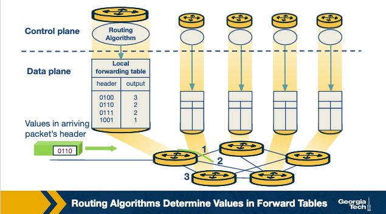
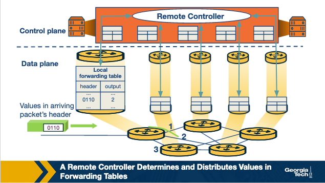
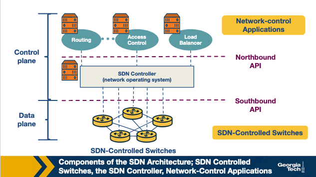
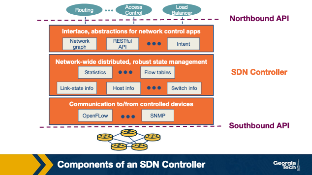
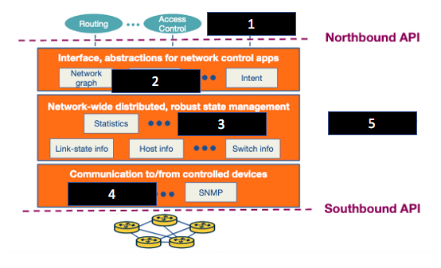

# Software Defined Networking (SDN)
### Part 1

# What led us to SDN?

Software Defined Networking (SDN) were created to **make computer networks more programmable**.

Computer Networks are difficult/complex for 2 reasons:

- Diversity of equipment on networks
- Proprietary technologies for equipment on said networks

### Diversity of Equipment

Routers, Switches, Middleboxes: Firewalls, Network Address Translators (NATs), 
Server Load Balancers, Intrusion Detection Systems (IDSs), etc.

Each equipment may implement separate protocols in order to interact with. Very complex.

### Proprietary Technologies

Routers and Switches tend to run software that is closed source and proprietary.

Configuration interacts vary/differ between vendors. Sometimes they differ from the same vendor.
It is hard to manage these devices in a central manner.

### Complexity

These characteristics of networks made things complex, slow for innovation, and increased 
operating costs of networks.

**SDN offers a new way to redesign networks to make them more manageable**. It employs a simple idea: 
***separation of tasks*** 

In programming, this can be seen as making modular functions/libraries. Easy to manage individually, 
when combined able to build/design/solve complex problems.

SDN divides the network into two planes: 

- Control Plane
- Data Plane

Separation is used to simplify management and increase innovation speed.

# Quiz 1

### Question 1
The main reason why SDNs were created was because of the increase of internet users. 
  
- True
- False

### Answer 
- False

### Question 2
SDNs divide the network in two planes: control plane and data plane, to ease management and speed up innovation. 

- True
- False

### Answer
- True

---

# History of SDN

The history can be broken into 3 phases:

1. Active Networks
2. Control and Data plan Separation
3. OpenFlow API and Network Operating Systems

## Active Networks

Took place during mid 1990's to early 2000's, the internet grew at a rapid pace during this time. From 
infancy to adolescence.

Researchers were keen on testing new ideas to improve network services. Although these ideas required
standardization of new protocols from the **Internet Engineering Task Force** (IETF).

Active Networking aimed to open up network control. Initially an API was envisioned to expose 
resources/network nodes and supported customization of functionalities for subsets of packets
passing through the network nodes.

The simplicity of the networking core was successful for the internet's success.

in the 1990's networking was primarily IP or ATM (Asynchronous Transfer Mode). Active networking 
became one of the first clean slate approaches to network architecture.

1. Capsule Model
    - Carried in-band data packets
2. programmable Router/Switch Model
    - Established out-of-band mechanisms

Carrying code in data packets brings new data-play functionalities across networks.
Able to use caching to make code distribution more efficient.

### Technology Push

- Reduction in computation cost 
- Advancement in programming languages
    - Platform portability (java), code execution safety and VM tech protect 
    an active node in the instance of bad program/processes
- Advances in rapid code compilation and formal methods.
- Funding from agencies like DARPA (US Defense Advanced Research Projects Agency)

### Use Pull

- Network service provider frustration concerning the long timeline to develop new network services
- Third part interests add value by implementing control at a more individualistic nature.
    - Able to meet dynamic network needs
- Researchers interest in having a network that would support large-scale experimentation
- Unified control over Middleboxes

**Active Networks in the 1990's had similar pull reasons as SDNs now!!!**

1. Programmable functions in the network to lower the barrier of innovation 
    - Early SDN focussed on **Control-Plane**
    - Active Networks focussed on the programmability of **Data-Plane**

2. Network virtualisation and the ability to demultiplex to software programs on packet 
headers
    - Active networking created a framework that described a platform that would support 
    experimentation with different programming models.
    - This lead to network virtualisation

3. The vision of a unified architecture for Middlebox orchestration
    - Unified control over middleboxes never fully came to fruition in the era of Active Networking
    - Network Function Virtualization (NFV) took a lot of influence from Active Networks

### Downfall of Active Networking

One of the largest downfalls of Active Networking is that it was **too ambitions**
Required end users to write Java code, far removed from average IT/Sys/Network Admin. 
Not trusted to be network safe in a lot of cases.

Network architecture has an emphasis on performance and security. Hard for widespread adoption.

## Control and Data Plane Separation

2001 - 2007 

Steady increase in traffic volumes and in turn: network reliability, predictability and performance.
Network Admin were looking for better network management functions like
- control over paths to deliver traffic (traffic engineering)

Researchers began development of short term approaches deploying existing protocols

### Technology Push

- Higher link speeds in backbone networks led vendors implement **packet forwarding directly in hardware**
separating it from the **control-plane software**.
- Internet Service Providers (ISPs) found it hard to meet the demands for greater reliability
and new services (like VPNs)
- Servers had substantially more memory an processing power than just 1-2 years ago
    - A single server could store all routing states and compute all routing decisions for a large ISP 
    network
- Open source routing software lowered the barrier to creating prototype implementation of centralized 
routing controllers

#### Pushes Inspired 2 Innovations

1. Open interface between control and data planes
2. Logically centralized control of the network

#### Different from Active Networking in 3 Ways

1. Focused on spurring innovation by and for networking admins rather than end users and Researchers
2. Emphasised programmability in the control domain rather than data domain
3. Worked towards network wide visibility and control rather than device level configurations

### Use Pulls 

- Selecting between network paths based on the current traffic load 
- Minimizing distributions during planned routing changes
- Redirecting/dropping suspected attack traffic 
- Allowing customer networks more control over traffic flow 
- Offering value added services for VPN customers 

Most work during this phase tried to manage routing with single ISP. Some proposals to enable 
flexible route control across many administrative domains

***To separate the control and data planes*** results in a few concepts in SDN design: 

- Logically centralized control using an open interface to the data plane
- Distributed state management 

Initially, many people thought separating the control and data planes was a bad idea. Since 
there was no clear idea as to how these networks would operate if a controller failed.

Skepticism about moving away from a simple network where there was a common Network State to one 
where the router only had a local view of the outcome of route selection.

However... this separation helped researchers think clearly about distributed state management.
Several projects exploring clean slate architecture commenced and laid the foundation for 
OpenFlow API

## OpenFlow API and Network Operating Systems

2007 - 2010

OpenFlow was created from interest of idea of network experimentation at a scale. It was able to balance 
the vision of fully programmable networks and the practicality of ensuring real world deployment.

OpenFlow built on existing hardware and enabled more functions that earlier router controllers. The 
dependency on hardware limited flexibility, it also enabled immediate deployment

### Technology Push

- Before OpenFlow, switch chipset vendors had already started to allow programmers to control some 
forwarding behaviors
- Allowed more companies to build switches without having to design and fabricate their own data plane
- Early OpenFlow versions built on technology that the switches already supported. 
    - Enabling OpenFlow was as simple as a Firmware Upgrade!!!

### Use Pulls

- OpenFlow came to meet the need of large scale experimentation on network architectures
- OpenFlow was useful in data-center networks: managing traffic at a large scale
- Companies started investing ore in programmers to write control programs 
    - instead of proprietary switches that could not be supported new features easily
    - allowed many smaller players to become competitive in the market by supporting OpenFlow 

### Key Effects OpenFlow had

- Generalizing network devices and functions
- The vision of a network operating system 
- Distributed state management techniques

# Quiz 2 

### Question 1 

The Active Networks phase consisted mainly of creating a programming interface that exposed 
resources/network nodes and supported customization of functionalities for subsets of 
packets passing through the network. 

- True
- False

### Answer 

- True 

### Question 2 

One of the main differences between the Active Networks phase and the separation of the
Control and Data plane phase is that the former is focused on network-wide visibility and 
control and the latter is focused on device-level configurations. 

- True
- False

### Answer 

- False

### Question 3 

An OpenFlow switch has a table of packet-handling rules, and whenever it receives a packet, 
it determines the highest priority matching rule, performs the action associated with it 
and increments the respective counter. 

- True
- False

### Answer 

- True 

### Question 4 

One of the downfalls of OpenFlow when it was first created was that it was hard to 
deploy and scale it easily. 

- True
- False

### Answer 

- False

# Why Separate Data and Control Plane?

SDN differentiates from traditional approaches by separating these things.

The **Control Plane** contains the logic that controls the forwarding behaviour of routers such as 
- routing protocols 
- network middlebox configurations

The **Data Plane** performs the actual forwarding as dictated by the control plane.
  - IP forwarding and Layer 2 switching are functions of the data plane

### Reasons for separation

1. Independent evolution and development

    - traditionally, routers were responsible for both routing and forwarding of traffic.
        - this means that a change to this requires upgrade of hardware.
    - now, routers only focus on forwarding 
        - this allows innovation to continue independently, easier development 

2. Control from high level software program 
    - SDN we use software to compute the forwarding tables 
    - decoupling of functions makes debugging and checking behavior of networks easier 

Separation of Control and Data Planes allows for independent evolution/innovation of each area. 

Software can evolve independently from hardware.

### Separation Leads to Opportunities in Different Areas 

1. Data Centers 
    - Management of large networks is easier with SDN 

2. Routing 
    - Intradomain protocol uses BGP contrains routes
    - Limited controls over inbound and outbound traffic 
    - Set procedure is required for route selection 
    - Hard to make route decisions with multiple criteria
    - SDN allows more accessible updates to router's state 
    - SDN allows for more control over path selection 

3. Enterprise Networks 
    - SDN can improve security applications for enterprise networks
    - SDN can protect a network from volumetric  attacks like DDoS

4. Research Networks
    - SDN allows research networks to coexist with production networks

# Control Plane and Data Plane Separation 

## Forwarding 

One of the most common and important functions of network layer.

When a router receives a packet at it's input link, it must determine which output link the packet 
should be sent through.

Routers *may* do other operations: 
- Block packets if it was sent by a known malicious router.
- Duplicate the packet and send it to multiple output links.

Forwarding is a local function of routers. Takes place on a *nanosecond* timescale.

**Forwarding is a function of the data plane**

#### Example 

A router looks at the header of an incoming packet, and consults its forwarding table to determine 
the outgoing link to send the packet to.

## Routing 

Routing involves determining the path from sender to the receiver across the network. Routers 
rely on routing algorithms to perform this task.

This is an end-to-end process for networks.

Takes place on *seconds* timescale.

**Routing is a function of the control plane**

### Traditionally 

Traditionally, routing algorithms (control plane) and forwarding functions (control plane) are 
closely coupled.

The router constructs the forwarding table which consults it for the forwarding function

### SDN 

In the SDN approach, there is a remote controller that computes and distributes the forwarding tables to 
be used by every router.  

The controller is physically separate from the router. 

There is separation of functionalities. **Routers are solely responsible for forwarding, Remote Controllers 
are solely responsible for computing and distributing the forwarding tables.**

The controller is implemented in software: thus, the network is ***software-defined***

Software implementations are increasingly open and publicly available, increases innovation speed

# Quiz 3 

### Question 1 

SDNs use ________________ to control the routers’ behavior (e.g., the path selection process). 

- Software
- Hardware 

### Answer 

- Software

### Question 2 

With the separation of the control plane and the data plane, any change to the forwarding 
functions on a router is independent from the routing functions of the control plane.

- True 
- False 

### Answer 

- True 

### Question 3 

In the SDN approach, the controller that computes and distributes the forwarding tables to 
be used by the routers is  _______________________. 

- Located within each router
- Physically separate from the routers

### Answer 

- Physically separate from the routers 

### Question 4 

Software implementations in SDN controllers are increasingly open and publicly 
available, which _______________ innovation in the field. 

- Speeds up
- Slows down

### Answer 

- Speeds up

# The SND Architecture 

Main components 

### SDN Controlled Network Elements 

SDN controlled network elements are sometimes known as the **"Infrastructure Layer"**

Responsible for forwarding traffic in a network based on rules computed by the SDN Control Plane.

### SDN Controller 

SDN controller is a logically centralized entity that acts as an interface between 
network elements and network control applications.

### Network Control Applications 

Network Control applications are programs that manage the underlying network by collecting 
information about the network elements with the help of SDN controller 

Features of SDN Architecture: 

1. Flow based forwarding 
    - Rules for forwarding packets in SDN controlled switches 
    - Can be computed based on any number of headers 
        - Differs from traditional approach where destination IP address determines the forwarding
        of the packet
    - OpenFlow allows up to 11 header fields to be considered in forwarding

2. Separation of data plane and control plane
    - SDN switches operate on the data plane and they only execute rules in the flow tables 
    - Rules are computed, installed, managed by software that runs on different Servers

3. A Programmable Network 
    - Network controlled applications act as the ***"Brain"*** of SDN control Plane by managing the network
    - Examples:
        - Applications that can include network management: 
            - Network Engineering 
            - Security
            - Automation 
            - Analytics

        - Application that determines the end-to-end path between sources and destinations on a network: 
        Dijkstra's Algorithm 

# Quiz 4 

### Question 1 

The network-control applications use the information about the network devices and elements, 
provided by the controller, to monitor and control the network devices. 

- True 
- False 

### Answer 

- True 

### Question 2 

In an SDN, the controller is responsible for the _______________ of the traffic, 
and the SDN-controlled network elements such as the switches are responsible 
for the _______________ of the traffic. 

- Forwarding, routing
- Routing, forwarding

### Answer 

- Routing, forwarding

### Question 3 

Traffic forwarding can be based on any number of header field values in various layers 
like the transport-layer, network-layer and link-layer. 

- True
- False

### Answer 

- True 

### Question 4 

SDN controllers operate on the _____________ plane. 

- Control
- Data

### Answer 

- Control

# The SDN Controller Architecture 

SDN Controller is a part of the SDN Control Plane and acts as an interface between network 
elements and network controlled applications 

### SDN Controller can be Broadly Split into 3 Layers:

1. Communication Layer 

    - Communication between the controller and the network elements 

2. Network Wide State Management Layer 

    - stores information of network state 

3. Interface to the Network Control Application Layer 

    - Communicating between controller and applications 

Top to bottom view 

- Communication Layer 

    - Consists of a protocol through which SDN controller and Network Controlled Elements communicate 
    - Devices send locally observed events to the SDN Controller providing the Controller 
    with a view of the network state 
    - Communication between SDN Controller and controlled devices is known as the **"Southbound"** 
    interface.
    - Examples
        - Events can be new device joining the network 
            - Heartbeat indicating device is live
        - Another example is OpenFlow itself
            - Broadly used by SDN Controllers today

- Network Wide State Management Layer 

    - Network State maintained by the controller 
    - Contains information about the state of the hosts, links, switches and other controlled 
    elements on the network
    - Stores copies of the Flow Tables of the switches
    - Network State information is needed by the SDN control plane to configure Flow Tables 

- The Interface to the Network Control Application Layer

    - Known as the controller's **"Northbound"** interface which the SDN controller interacts with 
    network controlled applications 
    - Network Controlled applications can read/write network state flow tables in controller's 
    - SDN Controller notifies applications of changes in network state (event notifications)
    state management layer 
    - REST interface is an example of Northbound API 

  SDN controller, although it is a *monolithic service*, it is implemented by distributed 
  servers to achieve fault tolerance, high availability and efficient. 

  Many modern controllers like OpenDayLight and ONOS has solved its 
  synchronization problems and prefer distributed controllers to provide highly scalable 
  services.

# Quiz 4 

### Question 1 

Match the number of the missing components in the following image with their respective name/example.

Choices: 
- OpenFlow
- RESTful API 
- Flow Tables 
- SDN Controller 
- Load Balancer

1
2 
3 
4 
5 

### Answer 

1 Load Balancer
2 RESTful API
3 Flow Tables
4 OpenFlow 
5 SDN Controller

### Question 2 

The northbound interface is used by the controller and the network-control applications to 
interact with each other. 

- True
- False

### Answer 

- True

### Question 3 

A REST interface is an example of a southbound API. 

- True
- False

### Answer 

- False 

### Question 4 

SDN controllers that are implemented by centralized servers are more likely to achieve fault 
tolerance, high availability and efficiency. 

- True
- False

### Answer 

- False

