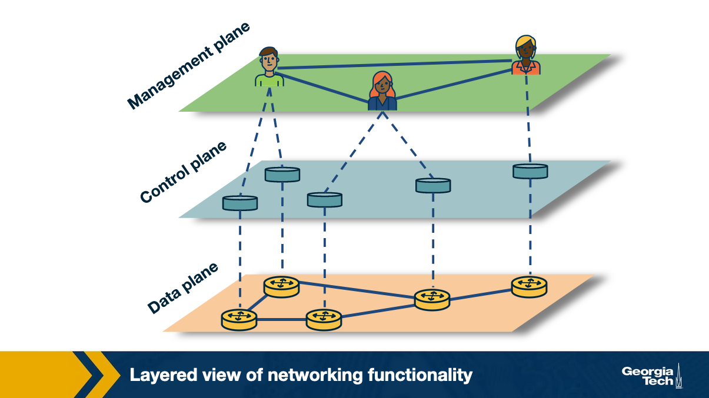
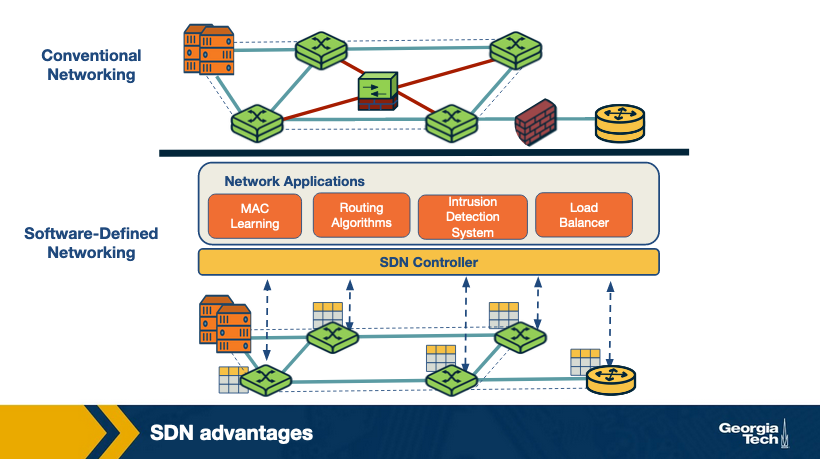
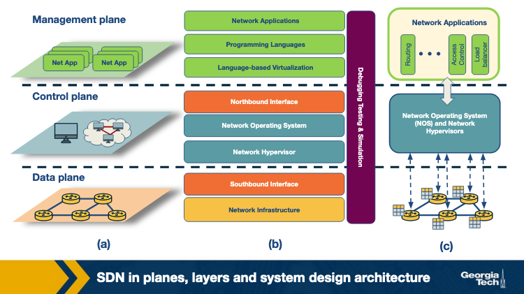
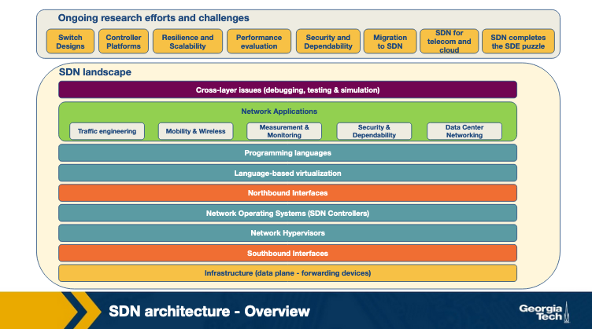

# Lesson 8 SDN Architecture Part 2
# Revisiting SDN Motivations

### Handling Increasing Complexity and Dynamic Nature of Networks

Implementation of network polies required changes all the way down to individual devices. This was handled 
by each vendor, requiring manual configuration.

There was a lot of overhead managing/maintining these devices. 

Traditional IP networks are far away from automatic response mechanisms to dynamic network environmental
changes.

### Tightly Coupled Architecture

Traditional IP networks had Control Plane and Data Plane bundled together: 
- Control Plane
	- Handles network traffic
- Data Plane
	- Forwards traffic based on control plane decisions

These components are inside the devices and not very accessible. New protocols updated every 10+
years because of the accessiblility.

## Software Defined Networking

Paradigm shift to overcome the limitations of legacy IP networking. 

Begins with separating control logic: control/data planes from eachother. With separation, network 
switches simply forward traffic. Control logic is purley implemented ina logically centralized controller
(or network OS). This allws innovation to occur in areas of the network just by a difference in 
polocy implementation.

Production level SDNs need a physically distributed control plane to achieve performance, reliability, and 
scalability.

Separation of control/data plane was acheived by using a programming interface between the SDN controller 
and the switches. SDN controller control data plane elements via API. Ex: 
- OpenFlow is an API to practice/implement SDN
	- A switch is managed via OpenFlow
	- Has one or more tables for packet handling rules
	- Each rule matches a set of network traffic and performs actions like
		- Dropping
		- Forwarding
		- Modifying
	- OpenFlow can be engineered to implement various technologies like: Firewalls, Switch, Router, Load-
Balancing, etc.

SDN principles allow for a separation of concerns introduced between
- defining network policies
- implementation of hardware
- forwarding table

The separation that allows for networking control problems to be viewed as tractable pieces, 
allowing for newer networking abstractions and simplifying networking management, allowing innovation. 

- **Data Plane**
	- Functions and prcoesses that forward data in the form of packets/frames
- **Control Plane**
	- Functions and processes that determine which path to use by using protocols to populate
forwarding tables of data plane elements
- **Management Plane**
	- services that are used to monitor and configure control functionality: SNMP-based tools

If a network policy is defined in the management plane, the control plane enforces the policy and 
the data plane executes the policy by forwarding the data accordingly.

# Quiz 1

### Question 1

In a software defined networking, every device (switch, router, middlebox, etc.) must be able 
to make decisions in the forwarding process.

- True
- False

### Answer

- False

### Question 2

The transition to IPv6 would be faster with a software defined networking paradigm compared to a 
conventional networking paradigm.

- True
- False

### Answer

- True

### Question 3

An OpenFlow switch may also be used for routing.

- True
- False

### Answer

- True

### Question 4

The management plane ___________ a network policy.

- Defines
- Enforces
- Executes
- Ignores

### Answer

- Defines

### Question 5

The control plane ___________ a network policy.

- Defines
- Enforces
- Executes
- Ignores

### Answer 

- Enforces

### Question 6

The data plane ___________ a network policy

- Defines
- Enforces
- Executes
- Ignores

### Answer

- Executes

# SDN Advantages

### Conventional Networks

Tightly coupled data and contorl planes. Making networking components embedded. In order to make updates
or changes, one has to manually updates all control planes on all devices.
	- installing new firmware, version upgrades

To avoid manual updates/installations per device, specialized equiptment was created: Middlebox.
concepts and features like load balancers, IDS, Firewalls were introduced.

Middleboxes were required to carefully placed in network topology, much header to reconfigure afterwards.

### SDN 

SDN decouples control and data places. It isolates itself as an external entity (SDN Controller).
With this, middlebox serices can be viewed as an SDN controller application.
Advantages: 

1. Shared Abstractions
	- middlebox services/functionalities can be programmed easily
	- abstractions controlled by platform and network programming languages, can be shared
2. Consistency of same network infromation
	- all network applications have the same global network information view
	- leading to consistent policy decisions while reusing control plane modules
3. Locality of functionality placement
	- location of middleboxes was strategic and could be a huge constraint during refactor
	- with SDN, middlebox applications can take actions from anywhere in the network
4. Simpler integration
	- integration of networking applications are smoother
	- load balancing and routing applications can be combined sequentally

# Quiz 2

### Question 1

Load balancing is only possible with software defined networking.

- True
- False

### Answer 

- False

### Question 2

In software-defined networking, integrations of networking applications are smoother. 
For example, load balancing and routing applications can be combined sequentially.

Describe a scenario where routing would take precedence over load balancing, and vice versa

### Answer

For example, in a network with high traffic volume and complex routing requirements, 
routing policies may take precedence over load balancing. Conversely, in a network with 
high availability requirements, load balancing may be a higher priority.

### Question 3

In conventional networking, which device can implement an intrusion detection system (IDS)?

- Switches
- Routers
- Middleboxes
- All of the above

### Answer

- Middleboxes

# SDN Landscape

Each layer performs its own functionalities through different technlofies. The figure as 3 perspectices

1. A plane oriented view
2. SDN layers
4. System design perspective 

1. Infrastructure
	- similar to traditional networks, SDN infrastricture consists of networking equipemnt 
		- routers, switches, other middlebox hardware
	- what is different here is that these physical networing equiptment are merely forwarding
	elements that do simple forwarding tasks
	- logic to operate them is directed to the centralized control system 

2. Southbound interfaces
	- connecting bridges between control and forwarding elements
	- these sit between control and data planes
	- play a curcial role in separating control and data plane functionalities
	- APIs are tightly coupled with forwarding elements of the underlying physical/virtual infra

3. Network virtualization
	- complete virtualization of the network requires network infra to provide support 
for arbitrary network topologies and addressing schemes similar to computing layer
	- exisint virtualization constructs like VLAN NAT MLPS are able to provide full network
virtulization

4. Network Operating Systems
	- NOS: network operating systems can solve problems SDNs have of being a fully centralized controller
	- NOS provides abstractions, essential services, common APIs.

5. Northbound interfaces
	- The two core abstractions of an SDN ecosystem are Southbound and Northbound interfaces
	- Southbound interfaces are already widley accepted (OpenFlow)
	- Standard Northbound interfaces are supposed to be mostly software ecosystems
		- This abstraction guaraneteees programming language and controller independence

6. Lanugage based virtualization
	- Important component of virtulization is the ability to express modularity and allowing
different levels of abstraction
	- Virtualization we can view a single physical device in different ways.
		- takes away the complexity from application developers without compormising
on security

7. Networking programming languages
	- Network programmability can be acheived using low level or high level languages
	- Low level languages are more difficult to write modular code with
	- high level languages generally lead to more error-prone development
	- high level languages in SDNs provide abstrations, modularity, code reusability in control plane, 
generally faster development, etc.

8. Network Applications
	- functionalities that implement the control plane logic and translate to commands in the data plane
	- SDNs can be deployed on traditional networks, and find itself in 
		- home area networks, data centers, IXPs, etc.
	- due to wide variety there are network applications like 
		- routing, load balancing, security, end to end QOS, power consumption, etc.

examples of these elements can be see on the slides: https://gatech.instructure.com/courses/356044/pages/the-sdn-landscape?module_item_id=3650400

# Quiz 3

### Question 1

The northbound interfaces separate the...

- Management plane and control plane
- Management plane and data plane
- Data plane and control plane

### Answer 

- Management plane and control plane

### Question 

The southbound interfaces separate the...

- Management plane and control plane
- Management plane and data plane
- Data plane and control plane

### Answer 

- Data plane and control plane

### Question 

OpenFlow is used in the ____ plane, and it is an example of a ____ interface.

- Data
- Control
- Management

- Southbound
- Northbound

### Answer 

- Data
- Southbound

# SDN Infrastructure Layer

SDN infra layer composed of networking equiptment. Performs simple forwarding tasks. Does not have
imbedded intelligence/control.

Network intelligence is instead centrally located at a NOS.

Netwoks build on top of open and standard libraries/interfaces, offer configuratoin/communication/com
patability accross different data plane devices.

In SDN, hardware or software entitiy that forwards packets while a controller is software stack running 
on commodity hardware, a model derived from OpenFlow is currently the most widely accepted from of SDN,
data plane devices.

Each flow table has
	- matching rule
	- actions to be executed on matching packets
	- counters that keep statistics of matching packets

SDN enabled forwarding device specifications include: 
	- Protocol Oblivious Forwarding: (POF)
	- Negotiable Datapath Models: (NDMs)

Possible actions for a packet: 
1. Forward the packet to outgoing port
2. Encapsulate the packet and forward to the controller
3. Drop the packet
4. Send the packet to normal processing pipeline
5. Send the packet to next flow table

# SDN Southbound Interfaces

***Southbound interfaces are basically APIs***, or a separation between control and data planes.

Development of a switch on averages takes 2 years to reach the market. This factors in upgrade cycles,
time requred to software development for new product. 

Southbound APIs represent one major barrier for introduction and acceptance of any new networking tech
API proposals like OpenFlow have a good reception because of the berrier to entry. This approach 
allows for networks to achieve vendor-agnostic reliance.

OpenFlow is the most widely adopted Soutbound standard for SDNs. Provides specification to implement
OpenFlow enabled forwarding devices fo rthe communication channel between data and control plane 
devices. There are information sources provided by OpenFlow: 

1. Event based messages that are sent by forwarding devices to controller when there is a 
link or port chanve
2. Flow statistics are generated by forwarding devices and collected by controller
3. Packet messages are sent by forwarding devices to controllers when they do not know 
what to do with new incoming flows

These 3 channels are key to provide flow level information to the NOS

There are other Southbound Interface/API choices for SDN besides OpenFlow: 
	- ForCES
	- OVSDB
	- POF
	- etc. listed here: https://gatech.instructure.com/courses/356044/pages/sdn-southbound-interfaces?module_item_id=3650406

These other opetions can have specifics that are better suited for ceratin situatoins.

# Quiz 4

### Question 

What action does an OpenFlow device take when an incoming flow does NOT match any rules in any 
of the flow tables in the pipeline?

- Drops the packets
- Creates a new rule for the packets
- Holds the packet until the controller is updated with a rule to handle it
- Sends a message to the controller

### Answer

- Sends a message to the controller

### Question 

Which type of message sent by an OpenFlow device to the network OS allows for quality 
of service (QoS) policies to be implemented?

- An event-based message
- Flow statistics
- A packet message
- None of the above

### Answer

- None of the above

### Question 

Which type of message would be sent by an OpenFlow device to the network OS in when 
it receives new routing information? 

- An event-based message
- Flow statistics
- A packet message
- None of the above

### Answer

- A packet message

# SDN Controllers: Centralized vs Decentralized

Traditional networking's largest drawback is that the devices use low level device/vendor specific
instruction sets and run on proporetary networking operating systems. This challenges the ability 
to be vendor/device agnostic development and abstraction. Two things that are key to solving 
networking problems.

SDN offers ligically centralized control. A controller is a critical element in an SDN architecture
as it is the key supporting peice for control logic applications to generate networkd configuratoin
based on the policies defined by the network operator

There is a broad range of architecturs when it comes to controllers and control platforms

-----------------------< HERE IS WHERE I STOPPED TAKING GOOD NOTES >--------------------

### Core Controller Functions

Basic functions: topology, statistics, notifications, dvice management, shortest path forwarding, 
security mechanisms

### Centralized Controllers

Single entity that manages all forwarding devices in the network and can be a single point of failure
and can have scaling issues

Enterprise, data centers, cloud providers, etc.

### Distributed Controllers

Can scale to meet the requirements of potenially any environment

1. Weak consistency semantics
2. Fault Tolerance

