# Lesson 9 Internet Security

Security was an afterthought in the design of the internet. This was in response to 
malicious actors/users abusing internet services and infrastructure. Each protocol in the 
OSI layer had vulnerabilities that were exploited at one point.

This lesson will focus on 
- The abuse of DNS protocol, DNS infrastructure, BGP abuse and DOS. 
IXPs have provided techniques for combatting DOS/DDOS.
- DNS uses Round Robin DNS (RRDNS) and Content Distribution Networks (CDNs) which are vulnerable 
to DOS and DDOS. 
- Fast Flux networks operate in ways that maintain multiple IP addresses for a single domain name 
and rapidly changes them.
- We can examine network abuse patterns to infer the probability that abuse will occur. Examine 
interconnection patterns, likelihood of data breaches, possible weaknesses in networks.
- BGP hijacking attacks and migration techniques like Prefix deaggregation and Mitigation 
with Multiple Origin AS (MOAS)
  - "Linktel Incident" to understand BGP hijacking
- Distributed Denial of Service (DDoS) which overloads a server and network resources making
it unavailable for other users
  - Different types of DDoS attacks
  - Mitigation techniques of DDoS
    - Filtering, scrubbing, FlowSpec at IXPs, BGP blackholing, etc

# Properties of Secure Communication

### Confidentiality

Ensure that the messages sent from sender to receiver are only available and known to these
two parties. 

Ensuring a bad actor cannot eavesdrop on a communication channel, or sniff/record network 
traffic in plaintext.

### Integrity

Ensure messages in transit have not been modified. Ensure bad actors have not tampered with data, 
like inserting, deleting parts of messages. We can check for data integrity with checksums, etc.

### Authentication

Ensure each party is actually who they say/claim they are. Ensure that a bad actor is not impersonating
another, otherwise they can steal valuable information.

### Availability

Ensure that communication channels remain available. Communication is not useful if its not working
or unreliable.

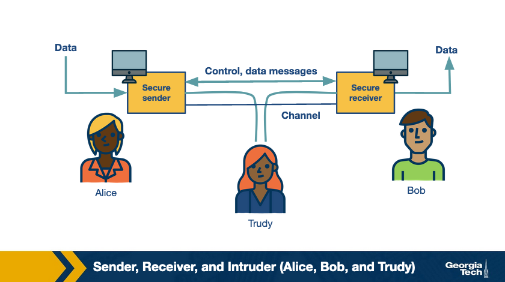

# Quiz 1 

### Question 1

Which property of secure communication ensures that people are who they say they are when 
communicating over the internet? 

- Confidentiality
- Integrity
- Authentication
- Availability

### Answer

- Authentication

### Question 2

Which property of secure communication ensures that a message is not modified before 
it reaches the receiver? 

- Confidentiality
- Integrity
- Authentication
- Availability

### Answer

- Integrity

### Question 3

Which property of secure communication is protected by encrypting the messages exchanged? 

- Confidentiality
- Integrity
- Authentication
- Availability

### Answer

- Confidentiality

# DNS Abuse

Attackers have developed techniques abusing DNS to extend uptime of domains that are used 
for malicious purposes
  - command and control hosting
  - infrastructure
  - phishing
  - spam domains
  - hosting illegal businesses
  - hosting illegal Content

### Round Robin DNS (RRDNS)

Distributes the load of incoming requests to several servers at a single physical location.
Responds to DNS requests with a list of DNS A records, which then cycles through in RR.

DNS client chooses a record using different strategies:
  - choose the first record
  - closest record in network proximity
  - etc.

Each A record has a Time To Live (TTL) specifies the number of seconds the response is valid.
If the lookup is repeated while mapping is still active, the DNS client will receive the 
same set of records.

### DNS Based Content Delivery

CDNs also use DNS based techniques to distribute content but with more complex strategies.

**Example:** CDNs distribute load over multiple servers at a single location but also 
distribute these servers across the world. When accessing a service via DNS, the CDN 
computes the "Nearest Edge Server" and returns its IP address to the DNS client. Sophisticated
techniques are used based on network topology and current link characteristics to determine the 
nearest server.

The result of CDNs is that the content is moved 'closer' to the DNS client, which increases
responsiveness and availability. CDNs can react quickly to changes in link characteristics
as their TTL is lower than that in Round Robin DNS.

### Fast Flux Service Networks (FFSN)

RRDNS and CDNs provide reliability, scalability and resilience, which is great for larger 
websites and applications. These improvements can be leveraged by spammers/bad actors.

A DNS request receives multiple A records, containing IP addresses of multiple servers. This 
makes it harder to shit down online scammers because if one IP address remains operational, the scam 
can keep going.

This can make online crime harder to shut down and regulate. 

Fast Flux Service Networks are an extension of the ideas behind RRDNS and CNDs. It is based on 
Rapid change in DNS answers, with a TTL lower than that of RRDNS and CDN. 

One difference between FFSN and other methods is that after the TTL expires, it returns 
a different set of A records from a larger set of compromised machines. These compromised machines 
act as proxies between the incoming request and control node/mothership forming a resilient, robust,
one-hop overlay network.

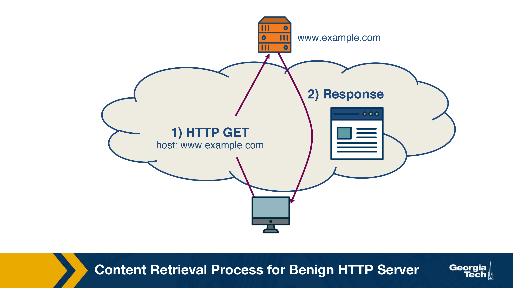

The figure above shows the content retrieval process of a benign HTTP server. DNS lookup returns 
the IP address of the control node of that domain, and the request HTTP GET is sent to this 
control node. The control node responds directly to the incoming request with the content of 
the domain.

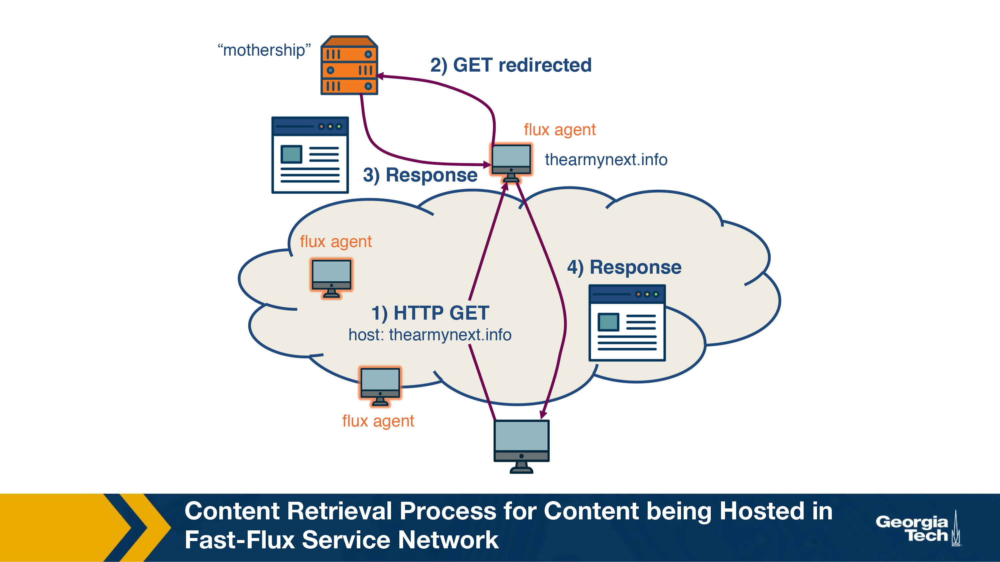

The figure above shows the content retrieval process for content hosted in a FFSN.
The domain `www.thearmynext.info` was found in a spam email. Here, the mothership is the control node
where the actual content of the scam is hosted. DNS lookup retrieves several different IP addresses, 
all belonging to compromised machines in the network (fast flux agents).

Each time the TTL expires, the lookup returns a completely different IP addresses. The flux agent 
relays the request it recives (HTTP GET) to the control node, which sends content to the flux agent.
Lastly, the content is delivered to the client. It is interesting to note that these flux agents are 
usually located in different countries and belong to different Autonomous Systems.

Attackers need Internet infrastructure to support illegal content hosting, CC infrastructure hosting.
Next, we will discuss approaches to infer network reputation and hence the likelihood that a network
will be abused to facilitate attacks.

# Quiz 2

### Question 1

Attackers tend to keep the uptime of domains used for malicious purposes as short
as possible in order to avoid being detected.

- True
- False

### Answer

- False

### Question 2

Round Robin DNS is a mechanism used by large websites to distribute the load of
incoming requests to several servers at a single physical location.

- True
- False

### Answer

- True

### Question 3

DNS-based content delivery aims to distribute the load amongst multiple servers at a single
location, but also distribute these servers across the world.

- True
- False

### Answer

- True

### Question 4

DNS-based content delivery determines the nearest server, which results in increased
responsiveness and availability.

- True
- False

### Answer

- True

# How to Infer Network Reputation Evidence of Abuse

FIRE: Finding Rogue nEtworks

A system that monitors the Internet for rogue networks. Rogue Networks are networks whose purpose 
is malicious activity like phishing, hosting spam pages, hosting pirated software, etc.

3 main data sources to identify hosts that likely belong to rogue networks:

**1. Botnet Command and Control Providers**

Some botnets still rely on a centralized command and control server. A bot-master would prefer to host 
their CC on a network where is it unlikely to be taken down. Two main types of botnets this system 
considers are IRC-based botnets and HTTP based botnets.

**2. Drive-by-Download Hosting Providers**

Drive-by-Download is a method of malware installation without interaction with the user. It 
commonly occurs when the victim visits a web page that contains an exploit for their 
vulnerable browser

**3. Phish Housing Providers**

Data source contains URLs of servers that host phishing pages. Phishing pages usually mimic authentic 
sites to steal login credentials, credit card numbers and other personal information. These pages 
are hosted on compromised servers and usually are up for only a short period of time.

---

The key difference between rogue and legitimate networks is the longevity of malicious behaviour.
Legit networks are able to remove the malicious content within a few days, whereas rogue networks 
may let the content be up for weeks to more than a year.

Rogue networks disregard IP addresses that have been active for a short period of time. Ignore phishing 
attacks hosted on legitimate networks and web servers that were temporarily based for botnet 
communication.

Each of these data sources produces a list (Li) of malicious IP addresses daily. FIRE combines the 
information from these 3 lists to identify rogue AS (organizations are considered equivalent to ASes)
The approach is to identify the most malicious networks as those that have the highest ration of 
malicious IP addresses compared to the total number of owned IP addresses within the AS.

# How to Infer Network Reputation: Interconnection Patterns 

Data plane monitoring only works if the network has a large enough saturation of malicious IP addresses.
A network is flagged as malicious only after we have observed indications of malickous behaviour for a 
long period of time. 

**Example:** Given access to a blacklist and we observe a large number of IPs that belong to an AS 
to be blacklisted for spamming, phishing, hijacking.

In practice, its not feasible to monitor the traffic of all networks to detect malicious 
behaviours from the data plane. In addition, the disadvantage of this approach is that it may take 
a long time until a very large fraction of IPs make it to a blacklist. Furthermore, the method struggles
to distinguish between legit networks that are misused and potentially operated by malicious actors.

### ASwatch

ASwatch is a complementary approach which uses information exclusively from the control plane (routing 
behaviour) to identify malicious netowrks. This approach aims to detect networks that are likely run by 
bad actors, or are "bulletproof" providers.

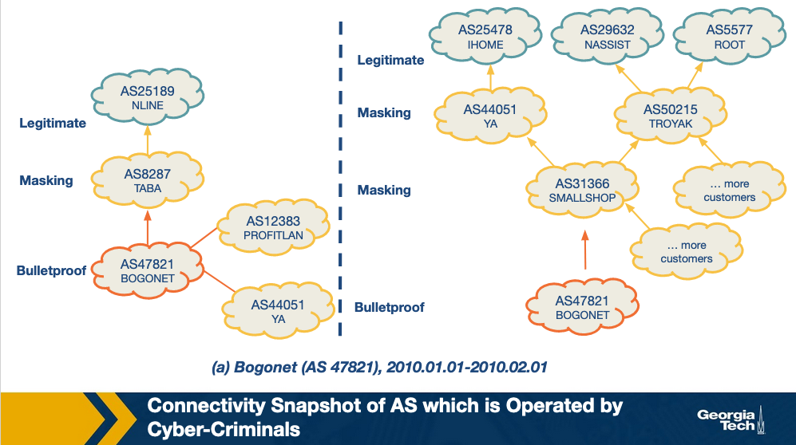
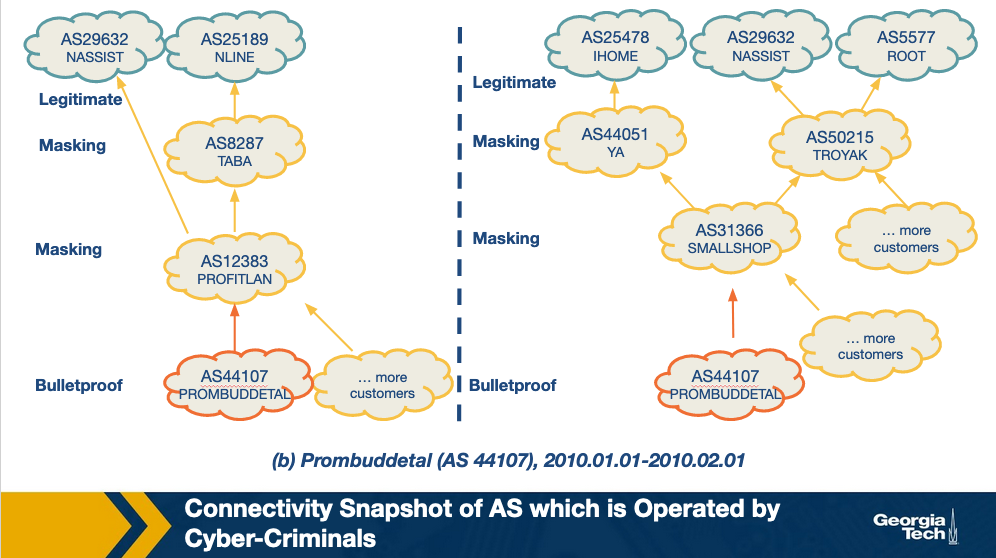
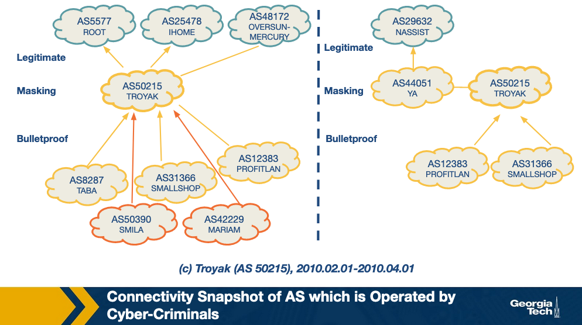

This approach is based on the observation that bulletproof ASes have distinct interconnection 
patterns and overall different control plane behaviour from most legit networks.

**Example:** Given snapshots of a topology around known bulletproof networks that are 
taken a few months apart, one can see that these networks shown in the figures 
are found to be changing upstream providers more aggressively than most legit networks.
Also, they are found to have a customer-provider or peering relationship with other 
shady networks rather than connecting directly with legit networks. 

These behaviours help bulletproof networks remain unnoticeable for longer periods of time, 
when complaints start from clients, the bulletproof network can change an upstream provider.

---

The design of ASwatch is based on monitoring global BGP routing activity to learn the control 
plane behaviour of a network. The system has two phases: 

### 1. Training Phase

The system learns control plane behaviour typical of both legit and malicious ASes. The system 
is given a list of known malicious and legit ASes. Then tracks the behaviour of these ASes over time
to track their business relationships with other ASes and their BGP update and withdrawal patterns.

ASwatch then computes the statistical features of each AS. There are 3 main families of features:

**A. Rewiring Activity**: some examples of sus behaviour include frequent changes in customer/providers, 
connecting with less popular providers, and extended periods of downtime

**B. IP Space Fragmentation and Churn**: Determined from the advertised prefixes. Malicious ASes are 
likely to use small BGP prefixes to partition their IP address space. Then only advertise a small 
section of these to avoid all of them being taken down at once if detected.

**C. BGP Routing Dynamics**: BGP announcements and withdrawals from malicious ASes follow different 
patterns from legitimate ones, like periodically announcing prefixes for short periods of time.

The system then uses supervised learning to capture the known behaviours and atterns with trained 
model.

### 2. Operation Phase 

Given an unknown AS, it then calculates the features for this AS. It then uses the model to assign a 
reputation score to the AS. If the system assigns the AS a low reputation score for several days in a 
row (indicating sus behaviours) it identifies it as malicious.

# Quiz 3 

### Question 1
Legitimate networks may let malicious content be up for weeks to more than a year. 

- True
- False

### Answer

- False

### Question 2
How does FIRE identify the most malicious networks? 

- Looking for suspiciously short connections within ASes in the network.
- Analyzing the information given by data sources and looking for suspicious websites within an AS.
- Analyzing the information given by data sources and searching for ASes with a large 
percentage of malicious IP addresses.

### Answer

- Analyzing the information given by data sources and searching for ASes with a large 
percentage of malicious IP addresses.

### Question 3
ASwatch uses information exclusively from the data plane to infer network reputation.

- True
- False

### Answer

- False

### Question 4 
ASwatch relies on the premise that “bulletproof” ASes have ______________ 
interconnection patterns and overall different ___________ plane behavior from most 
legitimate networks.

- Similar, data.
- Similar, control.
- Distinct, data.
- Distinct, control.

 ### Answer 

- Distinct, control.

# How to Infer Network Reputation: Likelihood of Breach 

We will analyze a system that can determine a figure that represents the likelihood of a 
breach within an organization (like JP Morgan, Chase, etc.) by using externally observable 
features of the network. 

This is important because it allows the model to be scalable to all organizations! This system uses 
features to train a Random Forest and predict the likelihood. 

There are 3 classes of features used in the model:

### 1. Mismanaged Symptoms

If there are misconfigureations in the organization's network, it indicates that there may 
not be policies in place to prevent such attacls or may not have the technological capability 
to detect these failures. This increases the likelihood of a breach. The features are: 

**1. Open recursive Resolvers:** misconfigured open DNS resolvers 
**2. DNS Source Port Randomization:** Many servers still do not implement this 
**3. BGP Misconfiguration:** Short lived routes can cause unnecessary updates to the Global Routing Tables
**4. Untrusted HTTPS Certification:** Can detect the validity of certificate by TLS handshake
**5. Open SMTP Mail Relays:** servers should filter messages so that only those in the same domain 
can send mails/messages

### 2. Malicious Activities

Another factor is the level of malicious activities that are seen to originate from the organizatoin's 
network and infrastructure. We can determine this suing spam traps, darknet monitors, DNS monitors, etc.
We create blacklist of the IP addresses that are involved in some malicious activities. There are 3 
such types of malicious activities: 

**1. Capturing Spam Activity:** CBL, SBL, SpamCop
**2. Cpaturing Phishing Activity and Malware Activities:** PhishTank, SURBL
**3. Capturing Scanning Activities:** Dshield, OpenBL

### 3. Security Incident Reports

Data based on actual security incidents give the system truth on which to train our model on.
The system sues 3 collections of such reports to ensure a wider coverage area: 

**1. VERIS Community Database:** Public effort to collect cyber security incidents in a common format
maintained by Verizon RISK team. Contains more than 5000 incident reports
**2. Hackmageddon:** Independently maintained blog that aggregates security incidents on a monthly
basis
**3. The Web Hacking Incidents Database:** This is an actively maintained repository for 
cyber security incidents.

---

This system uses Random Forest (RF) classifier and compares it to a baseline provided by a Support 
Vector Machine (SVM). It uses 258 features. 

The features described above (divided into features based on the timespan for which they are valid)
secondary features based on statistics from the other features, and the size of the organization. 
These inputs are processed then fed to an RF which produces a **risk probability**. 

By thresholding this value, we obtain the binary class label. The data is sequential, the training 
testing splits of the data are strictly based on time of each data point. The best combination of 
parameters gives this model an accuracy of **90%!!!**

# Traffic Attraction Attacks: BGP hijacking

BGP Hijacking can be classified into groups:

### 1. Classification by Affected Prefix 

In this class of hijacking attacks, we are primarily concerned with IP prefixes that are advertised by BGP.
There are different ways the prefix can be targeted, such as: 

**A. Exact Prefix Hijacking:** When two ASes (one legit, the other fraudulent) announce a path 
for the same prefix. This disrupts routing in such a way that traffic is routed towards the 
hijacker where ever the AS path route is shortest, thereby disrupting traffic.

**B. Sub-prefix Hijacking:** Extension of exact prefix hijacking, except that in this case, the 
hijacing AS works with a sub-prefix of the gunine prefix of the real AS. This exploits the 
characteristic of BGP to favor more specific prefixes. Resulting routes hijacking 
a large portion or all of the legit AS traffic.

  ***Example:*** A given hijacking AS labelled AS2 announces that it has a path to prefix 10.10.0.0/24 which is a part of 10.10.0.0/16 owned by AS1.

**C. Squatting:** The hijacking AS announces a prefix that has not yet been announced by the owner AS.

### 2. Classification by AS Path Announcement

Illegitimate AS announces the AS path for a prefix for which it doesn't have ownership rights. There 
are different ways this can be achieved:

**A. Type 0 Hijacking:** Simply an AS announcing a prefix not owned by itself

**B. Type N Hijacking:** Counterfeit AS announcing a prefix not owned by itself.

**C. Type U hijacking:** Hijacking AS does not modify the AS Path but may change the prefix.

### 3. Classification by Data Plane Traffic Manipulation

The intention of the attacker is to hijack the network traffic and manipulate the redirected network 
traffic on its way to the receiving AS. There are three ways the attack can be realized under this 
Classification

**A. Dropped:** it never reaches the intended destination. AKA **Blackholing Attack (BH)**.

**B. Eavesdropped or Manipulated:** before it reaches the receiving AS. AKA **Man in the Middle (MITM)**.

**C. Impersonated:** The network traffic of the victim AS is impersonated and the response to this 
network traffic is sent back to the sender. This attack is called **Imposture Attack (IM Attack)**.

# Traffic Attraction Attacks: Motivations

Causes or motivations behind BGP Hijacking Attacks: 

**1. Human Error:** accidental routing misconfiguration due to manual errors. Can lead to large 
scale exact prefix hijacking 

  ****Example:** China Telecom accidentally leaked a full BGP table tat led to a large scale 
  Type 0 Hijacking

**2. Targeted Attack:** Hijacking AS usually intercepts network traffic (MITM Attack) 
while operating in stealth mode to remain inder the radar on the control plane (Type N and 
Type U Attacks)

  ***Example:*** Visa and Mastercard's traffic were hijacked by Russian networks using this method 
  in 2007

**3. High Impact Attack:** The attacker is obvious in their intent to cause widespread disruption
of services

  ***Example:*** Pakistan Telecom in Type 0 sub prefix hijacking, essentially blackholing 
  all YouTube's services worldwide for nearly 2 hours

In summary, motivation behind every hijacking attempt is different. Hijackers can apply a 
combination of methods/approaches to facilitate the attack

# Example BGP Hijacking Attacks

1. AS1 announces a new prefix `10.10.0.0/16`
2. AS2, AS3, AS4, and AS5 that receive an announcement from the previous / neighboring AS 
check whether this entry is present in the RIB, if new, add it, and send it to all neighboring 
ASes
3. As the announcements are made by AS2, AS3, AS4; AS5 eventually receives the full path and new prefix 
from AS4 (4,2,1)
4. If multiple routes exist for a prefix, then the selected route is highlighted. Also, this route is 
selected for announcement to the neighbors.

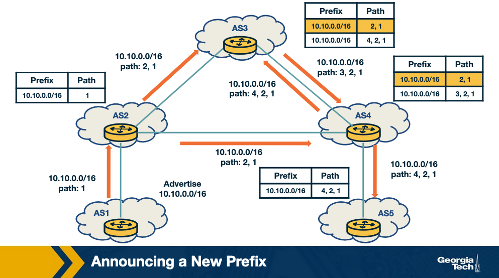

### Attack Scenario: Hijacking a Prefix 

1. The attacker uses a router to annouce the prefix `10.10.0.0/16` that belongs to AS1, with a 
new origin AS4, pretending that the prefix belongs to AS4.
2. This new announcement causes a conflict of origin for the ASes that recieve it 
(Multiple Origin AS or MOAS)
3. As a result of the new announcement, AS2, AS3, and AS5 receive the false advertisement and they compare 
it with the previous entires in their RIB.
4. AS2 will not select teh route as the best route as it has the same path length with an existing 
entry.
5. AS3 and AS5 will belie the new advertisement, and they will update their entries `10.10.0.0/16`
with path 4,2,1 to `10.10.0.0/16` with path 4. Therefore AS5 and AS3 will send all traffic 
for prefix `10.10.0.0/16` to AS4 instead of AS1.

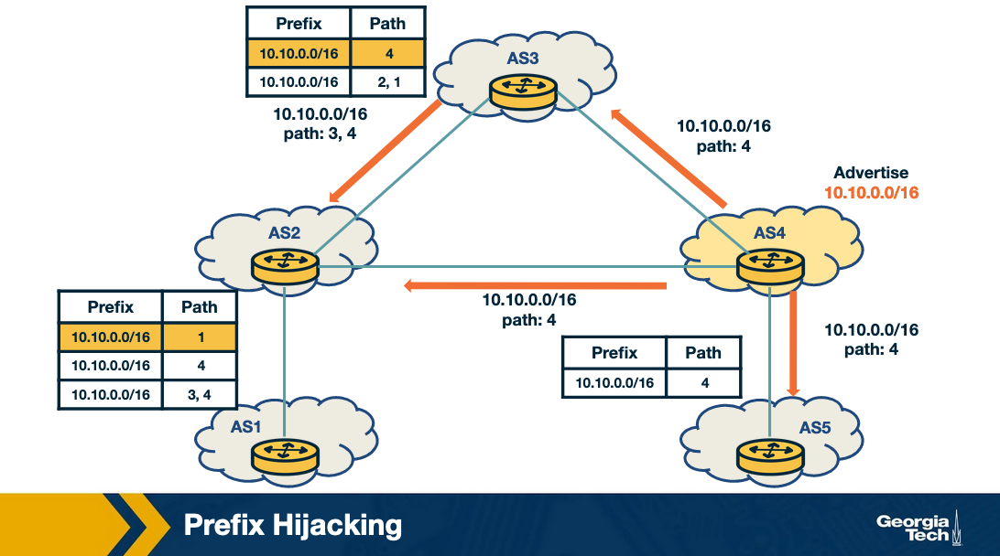

### Attack Scenario: Hijacking a Path

The attacker manipulates received updates before propagating them to neighbors

1. AS1 advertises the prefix `10.10.0.0/16`
2. AS2 and AS3 receive and propagate legitimately the path for the prefix
3. At AS4, the attacker compromises the update for the path by changing it to 4,1 
and propagates it to the neighbors AS3, AS2, and AS5. Therefore if claims that it has 
direct link to AS1 so that others belive the new false path.
4. AS5 receives the false path (4,1) "belives" the new false path and adopts it. But the rest 
of the ASes don't adopt th enew path because they either have a shorter path already or an 
equally long path to AS1 for the same prefix.

The key here is that the attacker does not need to announce a new prefix but rather it 
manipulates an advertisement before propagating it.

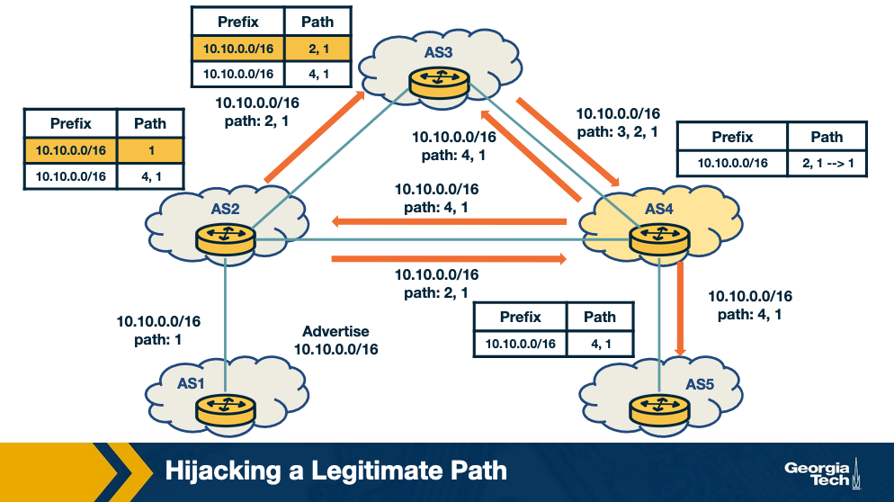

# Defending Against BGP Hijacking: An Example Detection System 

This section will look high level ideas behind detecting BGP hijacking. ARTEMIS is 
a system that is run locally by network operators to safeguard its own prefixes 
against malicious BGP hijacking attempts. The authors of ARTEMIS paper describe a self
operating manner of prefix hijacking detection.

Key Ideas:

1. **Configuration File:** all prefixes owned by the network are listed for 
reference. This file is populated/managed by the network operator.

2. **Mechanism for Receiving BGP Updates:** Built in system to receive 
updates from local routers and monitoring systems.

ARTEMIS can check for prefixes as AS PATH fields and trigger alerts when 
there are anomalies.

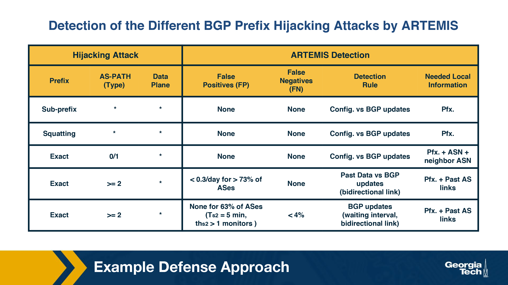

A point of consideration in BGP hijacking is the **Performance of False 
Positive (FP)** and **False Negative (FN)** rates when we use different 
detection criteria. We ideally want a system with the least number of 
FPs and FNs that are inconsequential. ARTEMIS system also allows the 
network operator to choose between 

A. Accuracy and speed 
B. FN which are inconsequential for less FP

# Defending Against BGP Hijacking: Example Mitigation Techniques

ARTEMIS uses to automated techniques to mitigate BGP Hijacking attacks:

### 1. Prefix Deaggregation

In a BGP attack scenario, the victim/affected network can either
- Contact other networks
- Deaggregate the prefixes that were targeted by announcing more specific 
prefixes of a certain prefix.

**Example:** Recall the real world example with YouTube's services being attacked by 
Pakistan Telecom. The target prefix was 208.65.153.0/24. Within 90 minutes, 
YouTube started announcing 208.65.153.128/25 and 208.65.153.0/25, 
thereby counteracting the attack. Although the event required a long 
term solution, an immediate mitigation was required for services to 
come back online.

### 2. Mitigation with Multiple Origin AS (MOAS)

Third party organizations and service providers do BGP announcements
for a given network. When a BGP hijacking event occurs, the following steps 
happen: 

A. Third party receives a notification and immediately announces from their 
locations the hijacked prefixes.

B. Network traffic across the world is attracted to the third party 
organization which scrubs it and tunnels to the legit AS.

Two main findings in ARTEMIS:

***1. Outsource the task of BGP announcements to third parties***
  - To combat against BGP hijacking attacks, having even just one single 
  external organization to mitigate BGP attacks is highly effective against 
  BGP attacks

***2. Comparison of outsourcing BGP announcements vs prefix filtering***
  - When compared against prefix filtering, the current industry standard 
  defense technique, the research work found that filtering is less optimal 
  when compared against BGP announcements

# Quiz 4 

### Question 1
In order to stop a prefix or AS-Path announcement attack, 
we need access to the ___________________, such as IP 
prefixes and AS-paths. 

- Control Plane data
- Data Plane data

### Answer 

- Control Plane data

### Question 2
In attacks where network traffic is dropped, manipulated or impersonated, 
the data accessed is located at the ___________________. 

- Control Plane
- Data Plane

### Answer 

- Data Plane

### Question 3
Which attack disrupts the BGP characteristic to favor more specific prefixes? 

- Exact prefix hijacking
- Sub-prefix hijacking
- Squatting

### Answer 

- Sub-prefix hijacking

### Question 4
ARTEMIS uses a configuration file and a mechanism for receiving BGP updates 
from routers and monitoring services to detect BGP hijacking attacks. 

- True
- False

### Answer 

- True

# DDoS Background and Spoofing

**Denial of Service Attack (DoS)**. Attackers can amplify DoS by abusing 
**Spoofing**

A Distributed Denial of Service (DDoS) attack is an attempt to compromise 
a server or network resources with a flood of traffic. To achieve this, the 
attacker first compromises and deploys flooding servers (slaves).

Later, when initiating the attack, the attacker instructs these flooding 
servers to send high volume of traffic to the victim. This results in the host 
either becoming unreachable or in exhaustion of its bandwidth.

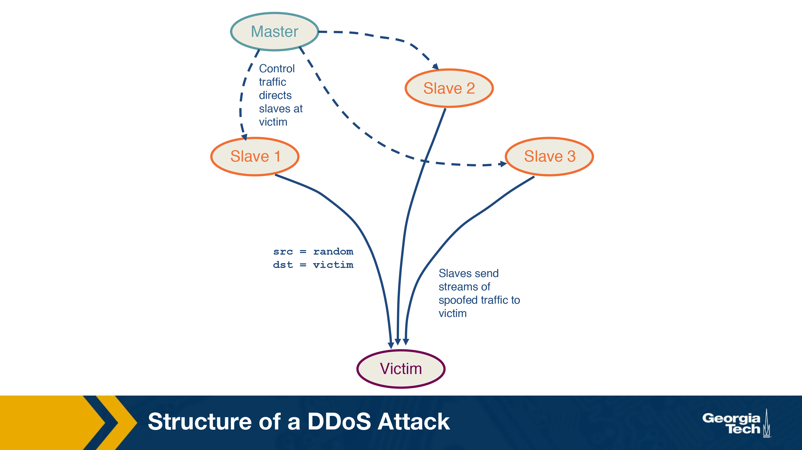

In the figure, the master host which is controlled by the attacker, sends 
control messages to the three compromised slave hosts directing them to send 
a huge amount of traffic to the victim. The packets sent from the slave
contain the source address as a random IP address and the destination as 
the victim's IP address. 

This master slave configuration amplifies the intensity of the attack while also 
making it difficult to protect against it. The attack traffic sent by the slaves
contained spoofed source addresses making it difficult for the victim to track
the slaves. Additionally, since the traffic is sent from multiple sources, its 
harder for the victim to isolate traffic and block it.

### Spoofing

IP spoofing is the act of setting a false IP address in the source field 
of a packet with the purpose of impersonating a legit server. In DDOS, this 
can happen in two forms.

1. The source IP address is spoofed, resulting in the response of the server 
sent to some other client instead of the attacker's machine. This results 
in wasted network resources and the client resources while causing a DoS to 
legit users/clients.

2. The attacker sets the same IP address in both the source and destination 
fields. This results in the server sending the replies to itself, causing 
a crash.


# DDoS: Reflection and Amplification

This examines additional DoS techniques.

### Reflection and Amplification Attacks

In a reflection attack, attacker uses a set of reflectors to innate the 
attack on the victim. A **reflector** is any server that sends a response 
to a request. 

**Example:** any web server or DNS server that returns a SYN ACK in response 
to a SYN packet as part of a TCP handshake.

**Other Examples:** Query responses sent by a host or Host Unreachable responses 
to a particular IP 

The master directs slaves to send spoofed requests to a LOT of reflectors
(around 1 million or more). The slaves set the source address of the packets 
to the **victim IP**, thereby redirecting the response of the reflectors to 
the victim. Thus, the victim receives responses from millions of reflectors 
resulting in exhaustion of resources and or bandwidth.

Victim is wasted in processing responses. It is unable to serve legit requests.

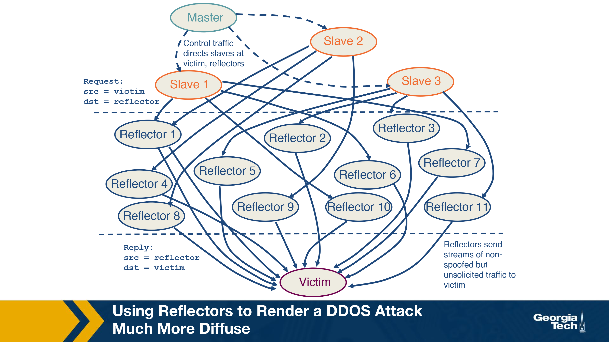

The master commands the 3 slaves to send spoofed requets to the reflectors, 
which in turn sends traffic to the victim. This is in contract with the 
convention DDOS attack we saw before, where slaves directly send traffic 
to the vimctim. Note that the vimctim can easily identify the reflectors 
from the response packets. However, the reflector cannot identify the slave
sending the spoofed requests.

If the requests are chosen in such a way that the reflectors send large 
responses to the victim, it is a **reflection amplification attack**

Not only would the victim receive traffic from millions of servers, the response 
sent would be large in size, making it difficult for the victim to handle 
the incoming requests.

# Quiz 5 


### Question 1
A Distributed Denial of Service Attack consists on the attacker 
sending a large volume of traffic to the victim through servers 
(slaves), so that the victim host becoming unreachable or in 
exhaustion of its bandwidth. 

- True
- False

### Answer
- True

### Question 2
IP spoofing is the act of setting a false IP address in the source 
field of a packet with the purpose of impersonating a legitimate server. 

- True
- False
### Answer
- True

### Question 3
In a reflection attack, the attackers use a set of reflectors to 
initiate an attack on the victim. 

- True
- False

### Answer
- True

### Question 4
During a Reflection and Amplification attack, the slaves set the source 
address of the packets to the ________________ IP address. 

- Attacker’s
- Slaves’
- Reflectors’
- Victim’s

### Answer
- Victim’s

### Question 5
What is the difference between a conventional DDoS and a 
Reflection and Amplification attack? 
- In a DDoS attack, the volume of traffic sent to the victim is much larger.
- In a DDos attack, the slaves send traffic directly to the victim as 
opposed to a reflector sending the traffic to the victim.
- In a Reflection and Amplification attack, there are no slaves.

### Answer
- In a DDos attack, the slaves send traffic directly to the victim as 
opposed to a reflector sending the traffic to the victim.

# Defense Against DDoS Attacks 

### Traffic Scrubbing Services

Scrubbing service diverts the incoming traffic to specialized server. 
The traffic is "*scrubbed*" into clean or unwanted traffic. The clean traffic 
is sent to its original destination. 

Although this offers find-grained filtering of packets, there are monetary 
costs required for an in-time subscription, setup and other reoccurring costs.
The other limitations include reduced effectiveness per packet processing and 
challenges in handling Tbps-level attacks.

There is also a possibility of decreased performance as the traffic can be 
routed and become susceptible to evasion attacks.

### ACL Filters

Access Control List filters are deployed by ISPs or IXPs as their AS border 
routers to filter out unwanted traffic. These filters whose implementation 
depends on vendor specific hardware, are effective when the hardware is 
homogeneous, and the deployment of the filters can be automated. The drawbacks 
of these filters include limited scalability and since the filtering does 
not occur at the ingress points it can exhaust the bandwidth to a neighboring AS

### BGP FlowSpec

Flow Specification, a feature of BGP. Helps mitigate DDoS Attacks by 
supporting the deployment and propagation of fine grained filters across AS 
domain borders.

It can be designed to match a specific flow or be based on packet attributes like 
length and fragment. It can also be based on the drop rate limit.

Popular in intra-domain environments. **not** popular in inter-domain environments 
as it depends on trust and cooperation among competitive networks.

BGP FlowSpec is an extension of BGP protocol, allowing rules to be created on 
the traffic flows and take corresponding actions. This feature of BGP can help 
mitigate DDoS attacks by specifying appropriate rules. The AS domain borders 
supporting BGP Flowspec are capable of matching packets in specific flow based 
on a variety of parameters such as 
- source IP
- destination IP 
- packet length 
- protocol used 
- etc.

This table shows the available components with an example for FlowSpec:

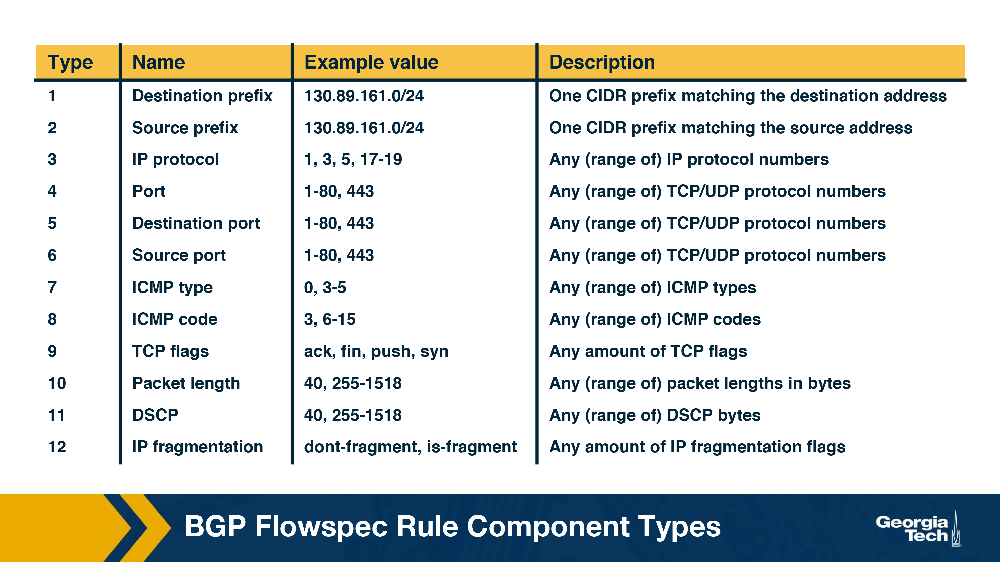

BGP Flowspec example: The following flow specification rule (specified here in a dictionary format) filters all HTTP/HTTPS traffic from port 80 and 443 to one of the Google servers with IP 172.217.19.195 from subnet 130.89.161.0/24. 
```json
{ 
   “type 1”: "172.217.19.195/32”
   “type 2": "130.89.161.0/24" 
   "type 3": [6], 
   "type 5": [80, 443], 
   "action": { 
      "type ": "traffic-rate", 
      “value ": "0" 
}
```
**Traffic Rate** actoin with value 0 discards the traffic. The other possible 
actions include rate limiting, redirecting or filtering. 

If no rule is specified, the default action is to accept the traffic.

In contrast to ACL filters, *FlowSpec* leverages BGP control plane, making it 
easier to add rules to all routers simultaneously.

FlowSpec is effective in *intra-domain* environments but **NOT** *inter-domain*.

It also **might not scale for large attacks** where the attack traffic originates 
from multiple sources. This would require multiple rules or combining sources into 
a single prefix.

# DDoS Mitigation Techniques: BGP Blackholing

A countermeasure to DDoS attacks.

All traffic to a targeted DDoS destination is dropped to a null location. 
**This approach tries to stop traffic closer to the source/origin**. 

***Effective for high volume attacks***.

This technique is implemented either with the help of upstream provider or 
with an IXP (if the network is already peering with an IXP). The victim AS 
uses BGP to communicate the attacked destination prefix to its upstream AS. 
The traffic heading towards the prefix is then dropped. 

Either the provider or IXP will 

